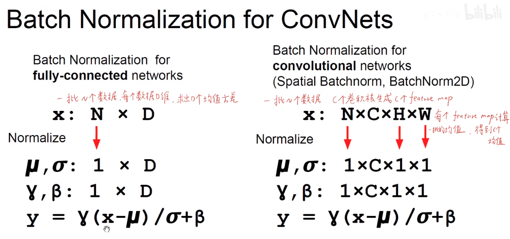

## 激活函数

非线性激活的作用：增加神经网络的非线性，使神经网络能拟合非线性边界

- **sigmoid**

sigmoid存在问题：

- 两端存在梯度消失
- 指数运算消耗资源
- 输出全为正，使梯度下降呈现z型路径

- **RELU**

## 数据预处理

对数据进行归一化，使其符合标准正态分布

## 权重初始化

如果每层神经元的权重全部初始化为同一个常数，会导致这层每个神经元前向传播和反向传播完全相同，等同于这层只有一个神经元。

## 批标准化

- **训练阶段**

通过batch normalization强行将输入变成符合标准正态分布，具体做法是在每个特征上进行标准化，求出batch中每个特征上所有数据的均值和方差，图中$\epsilon$是一个较小的数(如0.00)，防止分母为0，参数$\gamma$和$\beta$是需要学习的。

在训练阶段使用的均值和方差是一个batch的，每次都不同

- **测试阶段**

由于在测试、推断阶段不会每次都有一个batch，因此，测试时用的是训练时的总均值和总方差来代替batch的均值和方差，在pytorch中只需指定model.eval()

- **CNN中的BN**

这里我的理解是全连接时一个输出就是一个特征，算各个特征的均值和方差，D个特征算出D个均值和方差，逐个对每个特征上的数据做标准化。CNN时把一个通道当成一个整体特征，在通道上算均值和方差，C个通道算出C个均值和方差，逐个对每个通道上的数据做标准化。

- **BN的好处**

**CNN-BN-ACT几乎已经称为标注**

- **其他的标准化**

# 深度学习模型性能分析

推荐几篇深度好文：

[Roofline Model与深度学习模型的性能分析](https://zhuanlan.zhihu.com/p/34204282)

[深度学习模型大小与模型推理速度的探讨](https://zhuanlan.zhihu.com/p/411522457)

[让深度学习更高效运行的两个视角 | Paper Reading第二季第一期](https://zhuanlan.zhihu.com/p/33693725)

其他：

[神经网络模型的性能分析](https://zhuanlan.zhihu.com/p/427432309)

[如何优化深度学习模型以提升推理速度](https://zhuanlan.zhihu.com/p/417536087)（MACs)乘积累加运算

https://machinethink.net/blog/how-fast-is-my-model/

[CNN模型复杂度（FLOPs、MAC）、参数量与运行速度](https://blog.csdn.net/weixin_39833897/article/details/105807172)

## 计算平台性能指标

### 算力

Theoretical Peak FLOPS per instruction set on modern Intel CPUs：http://www.dolbeau.name/dolbeau/publications/peak.pdf

**算力$\pi$** ：也称为计算平台的**性能上限**、硬件**最大计算峰值**。算力一般用**`FLOPS`** **(floating point operations per second)**or **`FLOP/s`**表示，代表一个计算平台倾尽全力每秒钟所能完成的浮点运算次数。也可用**`OPS`**表示，代表计算平台每秒能执行的运算次数

**理论算力计算公式:**

算力计算参考：

https://www.bilibili.com/read/cv11578200/

https://zhuanlan.zhihu.com/p/28226956 (CPU)

英特尔处理器FLOPS查看：

https://www.intel.cn/content/www/cn/zh/support/articles/000005755/processors.html (不知道这是怎么来的，与计算得到的差距很大)

英特尔提供的性能评估库MKL(有计算FLOPS的示例)：

https://www.intel.cn/content/www/cn/zh/developer/articles/technical/a-simple-example-to-measure-the-performance-of-an-intel-mkl-function.html

- *算力 = 运算单元数量 (cores) \* 运算单元的时钟频率(hz) \* 每个时钟周期能进行的浮点运算数(fpc)*

- *fpc = 一个SIMD(Single Instruction Multiple Data，单指令多数据流)寄存器中的浮点数 \* SIMD操作数 \* 每个时钟周期的SIMD操作数*

  算力计算的水很深！

  频率：频率一般按基本频率算，但是实际上可能根本不是这个频率，比如有的英特尔CPU有四个频率，这里用到的应该是AVX Base频率，而一般我们只能找得到Base频率和Turbo频率，很难从参数表中找到AVX频率

  

  fpc：与芯片的微架构和指令集是有关的，主要关注寄存器的宽度、有没有FMA(融合乘加)、有几个FMA。AVX2有两个FMA，AVX512可能有一个也可能有两个FMA。比如从Intel官网查到i5-6300U@2.4GHz(基本频率，一共有2核心)有这些指令集扩展：

  

  AVX2寄存器中的浮点数为256，包含2个FMA(融合乘加)，每个FMA共做一次乘法一次加法，因此i5-6300Ud的fpc(单精度SP)就是：256/32\*2*2=32

  i5-6300U的单精度峰值浮点运算能力就是：2\*2.4\*32=153.6GFLOPS

**算力实测的工具**

由于系统损耗等原因，实测算力与理论算力会有所差距

一些benchmark软件:https://www.thetechlounge.com/best-benchmark-software/

Windows下的算力测算：**aida64**

Linux下的算力测算：

知乎：[浮点峰值那点事儿](https://zhuanlan.zhihu.com/p/28226956) github：[**cpufp**](https://github.com/pigirons/cpufp)：FMA

[**peakperf**](https://github.com/Dr-Noob/peakperf)：可显示实际频率，也可以算GPU的浮点峰值

aida64(收费，需要序列号)：Windows下可用，CUP、GPU都能算

### 带宽

**带宽$\beta$** ：也即计算平台的**带宽上限**，指的是一个计算平台倾尽全力每秒所能完成的内存交换量。单位是**`Byte/s`**。

**理论带宽计算公式:**

- *带宽 = 内存频率 \* 内存位宽 / 8*

  > 对于内存而言应该还要乘以通道数

**带宽实测的工具：**

[设备性能测试 : 内存带宽的测试](https://blog.csdn.net/pcokk/article/details/90733871)

- mbw:感觉测得不准，差了很多
- [bandwidth](https://zsmith.co/bandwidth.php)：编译出错，QT版也编译出错
- sysbench：这个也测小了
- [stream](https://www.cs.virginia.edu/stream/FTP/Code/stream.c)：这个貌似用的挺多的，但是也测小了
- **aida64**：windows下测得最准，linux下装不上

### 计算强度上限

**计算强度上限$I_{max}$** ：也称为**计算密度上限**，两个指标相除即可得到计算平台的计算强度上限。它描述的是在这个计算平台上，单位内存交换最多用来进行多少次计算。单位是**`FLOPs/Byte`**。

**当一个应用程序所需计算密度大与计算平台的密度上限，它的运行效率受平台的计算瓶颈限制，若小于计算平台的密度上限，则它的运行效率受平台的带宽瓶颈限制。**

> 注：这里的内存是广义上的内存，对CPU计算平台而言，指的就是内存；对GPU而言，指的是显存，对NPU而言，多指系统内存

### 计算示例

**1.Intel(R) Xeon(R) Silver 4210 CPU @ 2.20GHz**

以Intel(R) Xeon(R) Silver 4210 CPU @ 2.20GHz(睿频3.2GHz)为例，一共2块CPU，每块CPU10核心，每核心有一个AVX512，1个FMA。[数据在这](https://www.intel.cn/content/www/cn/zh/products/sku/193384/intel-xeon-silver-4210-processor-13-75m-cache-2-20-ghz/specifications.html) 

https://www.intel.com/content/dam/support/us/en/documents/processors/APP-for-Intel-Xeon-Processors.pdf 查得该处理器的性能为384GFLOPS(这个应该是在AVX2指令集上的DP(双精度)速度，10\*2.4\*256/64\*2\*2=384GFLOPS)

**理论算力：**

fpc：512/32*2=32

算力：2\*10\*1.5\*32=960GFLOPS

> 注：该CPU在AVX512上进行浮点运算时实际频率为1.50GHz(实测)，所以这里的频率按1.50GHz算

**实测算力：**

`cat /proc/cpuinfo`看CPU的参数

- peakperf测试

结果：939.63GFLOPS(取最大值)

测试时CPU频率维持在1.5GHz

- cpufp测试：946.83GFLOPS

> 注：图右边为测试时的实时频率

- aida64测试(Win10)：

CPU：938.3GFLOPS

GPU：36283GFLOPS

**理论带宽**

`cat /proc/meminfo`看内存配置为4个32G，4通道2400MHz

理论带宽：2.4*64/8=19.2GB/s

4通道就是19.2\*4=76.8GB/s

**实测带宽**

- mbw实测：最快的为6255MiB/s

  

- sysbench实测：9772MiB/s

  

- stream实测：54190MB/s

- aida64(Win10)实测：72245MB/s

**计算强度上限**

本实验平台CPU端理论计算能力上限：

$I_{max}=960/76.8=12.5FLOPs/Byte$ 

实测计算能力上限：

$I_{max}=938.3/73.2=12.8FLOPs/Byte$ 

**2.NVIDIA GTX 3090**

**理论算力：**

由nvidia官网提供的核心数、频率可算出：

https://www.nvidia.cn/geforce/graphics-cards/30-series/

对于GPU而言运算组数为2

- ***FLOPS=10496\*1.7\*2=35686.4GFLOPS=35.7TFLOPS***

**理论带宽：**

使用的是GDDR6X显存

- ***带宽 = 19.5Ghz(显存频率) \* 384bit(显存位宽) /8 = 936GB/s***

**理论计算强度上限：**

- $I_{max}=35686/936=38.13FLOPs/Byte$ 

## 模型性能指标

### 参数量(params)

参数量即模型中参数的总和，与模型在磁盘中所需的空间大小直接相关。

卷积参数量计算公式(不算偏置项)：

$K_{h}\times K_{w}\times C_{in}\times C_{out}$(即卷积核大小×卷积核通道数×卷积核个数)

### 计算量(FLOPs)

计算量是模型所需的计算次数，可以用**`OPs`**(Operations，计算次数)或**`FLOPs`**(Floating Point Operations，浮点计算次数)表示。

卷积计算量计算公式：

$K_{h}\times K_{w}\times C_{in}\times C_{out}\times H\times W$ (即**一次卷积乘法次数**($K_{h}\times K_{w}\times C_{in}$ ，一次卷积得到特征图上的一个元素)**×特征图上的元素个数**($C_{out}\times H\times W$))

### 访存量

访存量往往是最容易忽视的评价指标，但其实是现在的计算架构中对性能影响极大的指标。

访存量指的是输入单个样本，模型完成一次前向传播过程中所发生的内存交换总量。

在理想情况下（即不考虑片上缓存），模型的访存量就是模型各层权重参数的内存占用（Kernel Mem）与每层所输出的特征图的内存占用（Output Mem）之和。单位为**`Byte`**

卷积访存量计算(未计入输入特征图的内存占用)：

$C_{in}\times C_{out}\times K_{W}\times K_{H} +C_{out}\times H_{out}\times H_{in}$

### 内存占用

内存占用是指模型运行时，所占用的内存/显存大小。一般有工程意义的是最大内存占用，当然有的场景下会使用平均内存占用。这里要注意的是，内存占用 ≠ 访存量。

内存占用在论文里不常用，主要原因是其大小除了受模型本身影响外，还受软件实现的影响。例如有的框架为了保证推理速度，会将模型中每一个 Tensor 所需的内存都提前分配好，因此内存占用为网络所有 Tensor 大小的总和；但更多的框架会提供 lite 内存模式，即动态为 Tensor 分配内存，以最大程度节省内存占用（当然可能会牺牲一部分性能）。

和参数量一样，内存占用不会直接影响推理速度，往往算作访存量的一部分。但在同一平台上有多个任务并发的环境下，如推理服务器、车载平台、手机 APP，往往要求内存占用可控。可控一方面是指内存/显存占用量，如果占用太多，其他任务就无法在平台上运行；另一方面是指内存/显存的占用量不会大幅波动，影响其他任务的可用性。

### 模型的计算强度

**模型的计算强度I ：**也叫**计算密度**，由计算量除以访存量就可以得到模型的计算强度，它表示此模型在计算过程中，每`Byte`内存交换到底用于进行多少次浮点运算。单位是`FLOPs/Byte`。可以看到，模计算强度越大，其内存使用效率越高，越能充分利用计算平台的计算能力。

### 模型理论性能

**模型的理论性能P：** 也可以叫理论计算速度，即模型***在计算平台上所能达到的每秒浮点运算次数（理论值）**。单位是 **`FLOPS`** or **`FLOP/s`**。知道计算平台的算力和带宽及模型的计算量和访存量后，可以通过Roof-line模型求出模型的理论性能。

### Roof-line 模型

Roof-line模型提供了一种评估应用在不同计算平台上的性能表现的方法，论文发表于2009年，谷歌学术上的引用量已达2000+https://doi.org/10.1145/1498765.1498785，CS217机器学习硬件加速的公开课上也有提到https://cs217.stanford.edu/

横轴为模型的计算强度**I**，纵轴为模型的理论性能**P**(计算速度)，斜率为计算平台带宽**$\beta $** ，拐点处横坐标为计算强度上限$I_{max}$ ，纵坐标为计算平台性能上限$\pi$ 。$I_{max}$ 将Roof-line划分为左右两个半区，左半区为**带宽瓶颈区(Memory Bound)** ，右半区为**算力瓶颈区(Compute Bound)** 

- **带宽瓶颈区(Memory Bound)**:**(访存密集型)**

$I<I_{max}$ 时，模型理论性能**P**完全由计算平台带宽$\beta $ 和模型自身计算强度**I**决定，与平台算力无关，这时$\beta $ 越大或者**I**越大，模型的理论性能**P**就越高。

- **算力瓶颈区(Compute Bound)** :**(计算密集型)**

$I>I_{max}$ 时，模型的理论性能**P**只与计算平台的算力$\pi$ 有关，与平台带宽和模型的能量密度无关，算力$\pi$ 越大，模型的理论性能**P**就越高

知道计算平台的算力和带宽以及模型的计算量和访存量后，通过Roof-line模型就能算出模型的理论计算速度，计算量除以理论计算速度就能得到模型在该平台上的理论计算时间

### 模型理论推理时间

模型理论推理时间计算公式：

$计算时间=\frac{计算量}{计算时间}=\frac{计算量}{min(\frac{计算量}{访存量}\times 带宽，算力)}$ 

也就是：

$计算时间=\begin{cases}\frac{访存量}{带宽}，\frac{计算量}{访存量}<=\frac{算力}{带宽}(访存密集区)\\\frac{计算量}{算力}，\frac{计算量}{访存量}>\frac{算力}{带宽}(计算密集区)\end{cases}$ 

一句话总结：**对于运行在同一计算平台的模型，若模型属于访存密集型算子，推理时间跟访存量呈线性关系，若模型属于计算密集型算子，推理时间跟计算量呈线性关系**。

### 小结

在实际部署时我们更关心的可能是模型的推理时间，模型的理论推理时间其实可以通过模型的计算量、访存量及计算平台的算力、带宽求得

以计算量和访存量来评判模型性能，以往对于访存量的关注是很少的，但实际上访存量也是影响模型性能的一个关键因素

机器的两个主要指标算力和带宽都是速度方面的，与时间相关

模型的两个主要指标计算量和访存量都是数量方面的，要想评估模型的性能或速度，必须与运行模型的机器相联系

## 实例分析

CPU理论算力：$\pi=2*10*1.5*32=960GFLOPS$

内存理论带宽：$\beta=4*2.4*64/8=76.8GB/s$

CPU端理论计算强度上限：$I_{max}=960/76.8=12.5FLOPs/Byte$ 

GPU理论算力：$\pi=10496*1.7*2=35686.4GFLOPS$

显存理论带宽：$\beta=19.5Ghz* 384/8 = 936GB/s$

GPU端理论计算强度上限：$I_{max}=35686/936=38.13FLOPs/Byte$ 

用torchinfo进行统计

mobilenetv3small_yolo5s模型summary：

输入imgsz=640时：

> 参数量：3761437
>
> 计算量：3.25GFLOPs
>
> 访存量：316.26MB
>
> 计算强度：3.2/0.31626=10.28FLOPs/Byte

输入imgsz=224时：

> 参数量：3761437
>
> 计算量：398.71MFLOPs
>
> 访存量：51.97MB
>
> 计算强度：398.71/51.97=7.67FLOPs/Byte

yolov5s模型summary：

输入imgsz=640时：

> 参数量：7276605
>
> 计算量：8.48GFLOPs
>
> 访存量：442.74MB
>
> 计算强度：8.48/0.44274=19.15FLOPs/Byte

输入imgsz=224时：

> 参数量：7276605
>
> 计算量：1.04GFLOPs
>
> 访存量：79.78MB
>
> 计算强度：1.04/0.07978=13.04FLOPs/Byte

