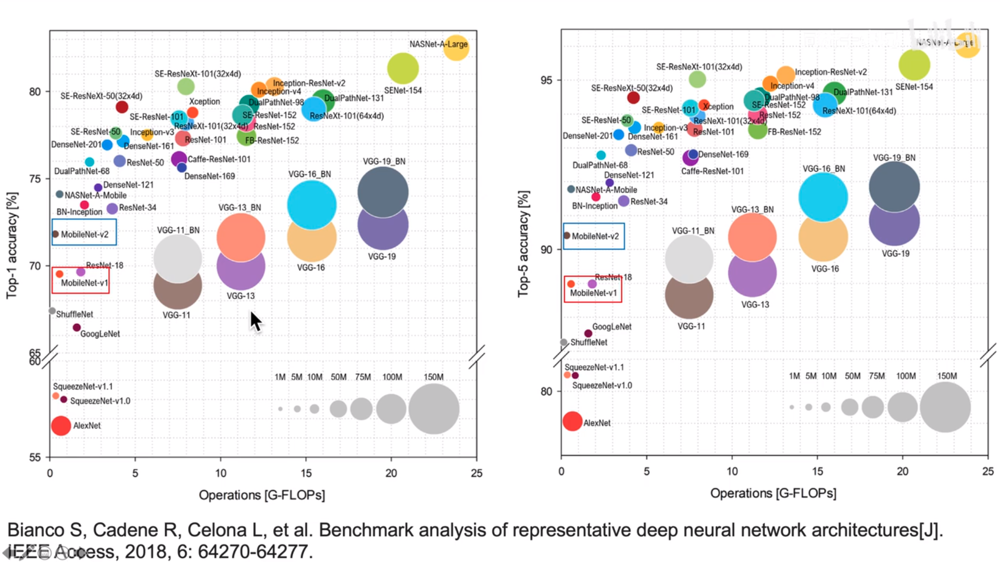
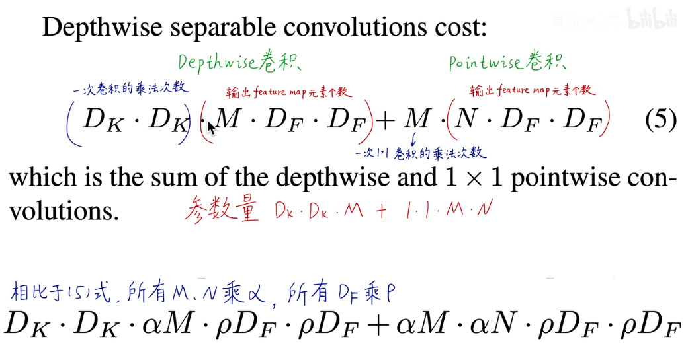
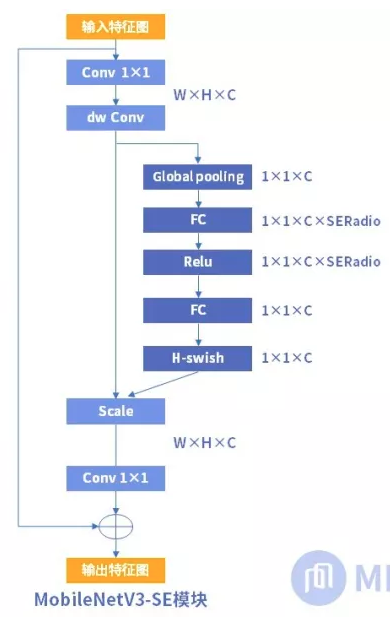

# MobileNet

背景：随着深度学习的发展，模型越来越复杂，参数越来越多，计算量越来越大，虽然模型的精度也越来越高，但对设备备的要求也也来越高，轻量化神经网络主要是用于解决本地、边缘设备的算力不足的问题，在保证精度的同时保证效率。针对小而高效的CNN模型，目前的研究总结来看分为两个方向：一是对训练好的复杂模型进行压缩得到小模型；二是直接设计小模型并进行训练。不管如何，其目标在保持模型性能（accuracy）的前提下降低模型大小（parameters size），同时提升模型速度（speed, low latency）。MobileNet属于后者，它是由谷歌提出的一种轻量化CNN，兼顾精度和速度。

前向推理运算耗时占比，卷积层占了大部分时间


运算能耗：


模型精度---参数量---运算次数




## 深度可分离卷积

MobileNet是基于**深度可分离卷积(Deepwise Separable Convolution)**对卷积运算进行改进，从而减少运算量，加速运算

**深度可分离卷积(Deepwise Separable Convolution)=深度卷积(depthwise convolution)+逐点卷积(pointwise convolution)**


一般卷积不同，Deepwise Conv.在每个通道上单独做卷积运算，卷积核都是二维的，并且一个卷积核只处理一个通道信息，每个二维卷积核输入单通道的二维矩阵，输出二维的feature map，

Deepwise Conv.只关注长宽方向的信息，不关心空间跨通道信息（提取长宽方向的空间信息）

Pointwise Conv.只关注跨通道信息，不关心长宽方向信息（提取跨通道信息），可以通过1*1卷积实现降维或升维


三种卷积的对比：(图中M代表通道数，N代表卷积核个数)


Deepwise Conv.可以看做是Group Conv.分组卷积的一个特例，Group Conv.一个卷积核处理一组通道，而Deepwise Conv.一个卷积核只处理一个通道


## 深度可分离卷积计算量与参数量

标准卷积：


深度可分离卷积：



二者对比：N通常较大，D~k~ 为3时，计算量和参数量约为原来的1/9


## MobileNet V1

网络架构


计算量和参数量占比：


将卷积运算转为矩阵运算，大大加快计算速度


## MobileNet V2


与V1对比，V2先通过1\*1卷积升维，ReLU6激活，再通过DW层，ReLU6激活，1\*1卷积降维，Linear激活


与ResNet对比，MobileNet V2先升维后降维，ResNet先降维后升维；MobileNet V2使用深度卷积，ResNet使用标准卷积；MobileNet V2使用ReLU6激活，ResNet使用ReLU激活；MobileNet V2降维后使用Linear激活，ResNet使用ReLU激活；MobileNet V2 shortcut连接低维，ResNet使用连接高维；


MobileNet V2网络结构


keras核心代码：


## MobileNet V3

```python
#pytorch中mobilenet的位置，可以找到正在使用的pytorch版本中的mobilenet实现的脚本文件
from torchvision import models
models.mobilenet
```

下面的链接可以看最新版，可能会有差异？

https://hub.fastgit.org/pytorch/vision/blob/master/torchvision/models/mobilenetv3.py

bneck模块

**注意只有in_channel=out_channel且stride=1时才有残差连接**


mobilenetv3 SE模块中第一个FC层的神经元个数是通道数的1/4，squeeze_factor=4

mobilenetv3 large

图中exp size是升维后的通道数

第一个bneck的输入通道与expand size相等，这一个bneck是没有1\*1卷积层的


small:


```python
# 定义在mobilenetv2.py中
def _make_divisible(v: float, divisor: int, min_value: Optional[int] = None) -> int:
    """
    This function is taken from the original tf repo.
    It ensures that all layers have a channel number that is divisible by 8
    It can be seen here:
    https://github.com/tensorflow/models/blob/master/research/slim/nets/mobilenet/mobilenet.py
    """
    if min_value is None:
        min_value = divisor
    new_v = max(min_value, int(v + divisor / 2) // divisor * divisor)
    # Make sure that round down does not go down by more than 10%.
    if new_v < 0.9 * v:
        new_v += divisor
    return new_v
```

BN可以用于一个神经网络的任何一个神经元上，文献中主要是把BN变换放在激活函数层的前面，所以前向传导的计算公式应该是：z=g(BN(Wu+b))，因为偏置参数经过BN层其实是不起作用的，因为也会被均值归一化（平移），所以这个参数就可以不要了，可以写成：z=g(BN(Wu))

```python
# 卷积层，包含了卷积、BN、激活，定义在mobilenetv2.py中
class ConvBNActivation(nn.Sequential):
    def __init__(
        self,
        in_planes: int,# 输入通道
        out_planes: int,# 输出通道
        kernel_size: int = 3,
        stride: int = 1,
        groups: int = 1,
        # Optional可选参数
        # Callable：
        """Callable type; Callable[[int], str] is a function of (int) -> str.

    The subscription syntax must always be used with exactly two
    values: the argument list and the return type.  The argument list
    must be a list of types or ellipsis; the return type must be a single type.

    There is no syntax to indicate optional or keyword arguments,
    such function types are rarely used as callback types.
    """
        norm_layer: Optional[Callable[..., nn.Module]] = None,
        activation_layer: Optional[Callable[..., nn.Module]] = None,
        dilation: int = 1,# 扩张
    ) -> None:
        padding = (kernel_size - 1) // 2 * dilation
        if norm_layer is None:
            norm_layer = nn.BatchNorm2d
        if activation_layer is None:
            activation_layer = nn.ReLU6
        super().__init__(
            # 这几个参数可以看pytorch的解释，因为后面使用了BN层，所以不用偏置bias
            # dilation为膨胀卷积的扩张率，默认为1，膨胀卷积可以增大感受野
            nn.Conv2d(in_planes, out_planes, kernel_size, stride, padding, dilation=dilation, groups=groups,
                      bias=False),
            # nn.BatchNorm2d(out_planes)输入通道数，在通道上做norm
            norm_layer(out_planes),
            activation_layer(inplace=True)
        )
        self.out_channels = out_planes
```

SE模块


1.压缩squeeze


2.激励Excitation


3.scale

通道权重相乘，原有特征向量为W×H×C，将SE模块计算出来的各通道权重值分别和原特征图对应通道的二维矩阵相乘，得出的结果输出。

这里我们可以得出SE模块的属性：？
参数量 = 2×C×C×SERatio
计算量 = 2×C×C×SERatio
总体来讲SE模块会增加网络的总参数量，总计算量，因为使用的是全连接层计算量相比卷积层并不大，但是参数量会有明显上升，所以MobileNetV3-Large中的总参数量比MobileNetV2多了2M。

**MobileNet中的SE模块**

MobileNetV3版本中SE模块加在了bottleneck结构的内部，在深度卷积后增加SE块，scale操作后再做逐点卷积，如上图右边所示。MobileNetV3版本的SERadio系数为0.25。使用SE模块后的MobileNetV3的参数量相比MobileNetV2多了约2M，达到5.4M，但是MobileNetV3的精度得到了很大的提升，在图像分类和目标检测中准确率都有明显提升。



```python
import torch

from functools import partial
from torch import nn, Tensor
from torch.nn import functional as F
from typing import Any, Callable, Dict, List, Optional, Sequence

from torchvision.models.utils import load_state_dict_from_url
from torchvision.models.mobilenetv2 import _make_divisible, ConvBNActivation


__all__ = ["MobileNetV3", "mobilenet_v3_large", "mobilenet_v3_small"]


model_urls = {
    "mobilenet_v3_large": "https://download.pytorch.org/models/mobilenet_v3_large-8738ca79.pth",
    "mobilenet_v3_small": "https://download.pytorch.org/models/mobilenet_v3_small-047dcff4.pth",
}

# SE模块
class SqueezeExcitation(nn.Module):
    # Implemented as described at Figure 4 of the MobileNetV3 paper
    def __init__(self, input_channels: int, squeeze_factor: int = 4):
        super().__init__()
        # 将输入通道数调整到离这个数最近的8的整数倍，利于计算
        squeeze_channels = _make_divisible(input_channels // squeeze_factor, 8)
        self.fc1 = nn.Conv2d(input_channels, squeeze_channels, 1)
        self.relu = nn.ReLU(inplace=True)
        self.fc2 = nn.Conv2d(squeeze_channels, input_channels, 1)

    def _scale(self, input: Tensor, inplace: bool) -> Tensor:
        scale = F.adaptive_avg_pool2d(input, 1)# 自适应平均池化，outputsize=1*1
        scale = self.fc1(scale)
        scale = self.relu(scale)
        scale = self.fc2(scale)
        return F.hardsigmoid(scale, inplace=inplace)

    def forward(self, input: Tensor) -> Tensor:
        scale = self._scale(input, True)
        return scale * input

# bneck配置
class InvertedResidualConfig:
    # Stores information listed at Tables 1 and 2 of the MobileNetV3 paper
    # 输入通道数，kernel_size，中间升维通道数，输出通道数，是否使用SE模块，激活函数，DWconv的步长，扩张率，宽度因子
    def __init__(self, input_channels: int, kernel: int, expanded_channels: int, out_channels: int, use_se: bool,
                 activation: str, stride: int, dilation: int, width_mult: float):
        self.input_channels = self.adjust_channels(input_channels, width_mult)
        self.kernel = kernel
        self.expanded_channels = self.adjust_channels(expanded_channels, width_mult)
        self.out_channels = self.adjust_channels(out_channels, width_mult)
        self.use_se = use_se
        self.use_hs = activation == "HS"# 激活函数为HS则返回true，赋值给use_hs
        self.stride = stride
        self.dilation = dilation

    @staticmethod
    def adjust_channels(channels: int, width_mult: float):
        return _make_divisible(channels * width_mult, 8)

# bneck模块
class InvertedResidual(nn.Module):
    # Implemented as described at section 5 of MobileNetV3 paper
    def __init__(self, cnf: InvertedResidualConfig, norm_layer: Callable[..., nn.Module],
                 se_layer: Callable[..., nn.Module] = SqueezeExcitation):
        super().__init__()
        if not (1 <= cnf.stride <= 2):# 步长只能为1或2
            raise ValueError('illegal stride value')

        # 如果步长为1且输入输出通道数相等，则代表使用残差模块
        self.use_res_connect = cnf.stride == 1 and cnf.input_channels == cnf.out_channels

		# 这里冒号是注释的意思
        layers: List[nn.Module] = []
        activation_layer = nn.Hardswish if cnf.use_hs else nn.ReLU

        # 如果输入通道与expand通道数不相等，则是一个完整的bneck模块(即包含1×1卷积升维层)
        # 1*1升维
        # expand
        if cnf.expanded_channels != cnf.input_channels:
            layers.append(ConvBNActivation(cnf.input_channels, cnf.expanded_channels, kernel_size=1,
                                           norm_layer=norm_layer, activation_layer=activation_layer))

        # 分成升维后的通道数个组卷积，也就是DWconv
        # depthwise
        stride = 1 if cnf.dilation > 1 else cnf.stride
        layers.append(ConvBNActivation(cnf.expanded_channels, cnf.expanded_channels, kernel_size=cnf.kernel,
                                       stride=stride, dilation=cnf.dilation, groups=cnf.expanded_channels,
                                       norm_layer=norm_layer, activation_layer=activation_layer))
        if cnf.use_se:
            layers.append(se_layer(cnf.expanded_channels))

        # 这里的激活是线性激活
        # project
        layers.append(ConvBNActivation(cnf.expanded_channels, cnf.out_channels, kernel_size=1, norm_layer=norm_layer,
                                       activation_layer=nn.Identity))

        # 列表前面加星号作用是将列表解开成多个独立的参数，传入函数。
		# 字典前面加两个星号，是将字典解开成独立的元素作为形参。
        self.block = nn.Sequential(*layers)
        self.out_channels = cnf.out_channels
        self._is_cn = cnf.stride > 1

    def forward(self, input: Tensor) -> Tensor:
        result = self.block(input)
        if self.use_res_connect:
            result += input
        return result


class MobileNetV3(nn.Module):

    def __init__(
            self,
            inverted_residual_setting: List[InvertedResidualConfig],
            last_channel: int,
            num_classes: int = 1000,
            block: Optional[Callable[..., nn.Module]] = None,
            norm_layer: Optional[Callable[..., nn.Module]] = None,
            **kwargs: Any
    ) -> None:
        """
        MobileNet V3 main class

        Args:
            inverted_residual_setting (List[InvertedResidualConfig]): Network structure
            last_channel (int): The number of channels on the penultimate layer
            num_classes (int): Number of classes
            block (Optional[Callable[..., nn.Module]]): Module specifying inverted residual building block for mobilenet
            norm_layer (Optional[Callable[..., nn.Module]]): Module specifying the normalization layer to use
        """
        super().__init__()

        if not inverted_residual_setting:
            raise ValueError("The inverted_residual_setting should not be empty")
        elif not (isinstance(inverted_residual_setting, Sequence) and
                  all([isinstance(s, InvertedResidualConfig) for s in inverted_residual_setting])):
            raise TypeError("The inverted_residual_setting should be List[InvertedResidualConfig]")

        if block is None:
            block = InvertedResidual

        if norm_layer is None:
            norm_layer = partial(nn.BatchNorm2d, eps=0.001, momentum=0.01)

        layers: List[nn.Module] = []

        # building first layer
        firstconv_output_channels = inverted_residual_setting[0].input_channels
        layers.append(ConvBNActivation(3, firstconv_output_channels, kernel_size=3, stride=2, norm_layer=norm_layer,
                                       activation_layer=nn.Hardswish))

        # building inverted residual blocks
        for cnf in inverted_residual_setting:
            layers.append(block(cnf, norm_layer))

        # building last several layers
        lastconv_input_channels = inverted_residual_setting[-1].out_channels
        lastconv_output_channels = 6 * lastconv_input_channels
        layers.append(ConvBNActivation(lastconv_input_channels, lastconv_output_channels, kernel_size=1,
                                       norm_layer=norm_layer, activation_layer=nn.Hardswish))

        self.features = nn.Sequential(*layers)
        self.avgpool = nn.AdaptiveAvgPool2d(1)
        self.classifier = nn.Sequential(
            nn.Linear(lastconv_output_channels, last_channel),
            nn.Hardswish(inplace=True),
            nn.Dropout(p=0.2, inplace=True),
            nn.Linear(last_channel, num_classes),
        )

        # 初始化权重，self.modules()返回网络中所有模块的迭代器
        for m in self.modules():
            if isinstance(m, nn.Conv2d):
                nn.init.kaiming_normal_(m.weight, mode='fan_out')
                if m.bias is not None:
                    nn.init.zeros_(m.bias)
            elif isinstance(m, (nn.BatchNorm2d, nn.GroupNorm)):
                nn.init.ones_(m.weight)
                nn.init.zeros_(m.bias)
            elif isinstance(m, nn.Linear):
                nn.init.normal_(m.weight, 0, 0.01)
                nn.init.zeros_(m.bias)

    def _forward_impl(self, x: Tensor) -> Tensor:
        x = self.features(x)

        x = self.avgpool(x)
        x = torch.flatten(x, 1)

        x = self.classifier(x)

        return x

    def forward(self, x: Tensor) -> Tensor:
        return self._forward_impl(x)


def _mobilenet_v3_conf(arch: str, width_mult: float = 1.0, reduced_tail: bool = False, dilated: bool = False,
                       **kwargs: Any):
    reduce_divider = 2 if reduced_tail else 1
    dilation = 2 if dilated else 1
	
    # partial()把一个函数的某些参数给固定住（也就是设置默认值），返回一个新的函数，调用这个新函数会更简单。
    bneck_conf = partial(InvertedResidualConfig, width_mult=width_mult)
    adjust_channels = partial(InvertedResidualConfig.adjust_channels, width_mult=width_mult)

    if arch == "mobilenet_v3_large":
        inverted_residual_setting = [
            # in_c,kernel_size,expanded_c,out_c,use_se,activation,stride,dilation
            bneck_conf(16, 3, 16, 16, False, "RE", 1, 1),
            bneck_conf(16, 3, 64, 24, False, "RE", 2, 1),  # C1
            bneck_conf(24, 3, 72, 24, False, "RE", 1, 1),
            bneck_conf(24, 5, 72, 40, True, "RE", 2, 1),  # C2
            bneck_conf(40, 5, 120, 40, True, "RE", 1, 1),
            bneck_conf(40, 5, 120, 40, True, "RE", 1, 1),
            bneck_conf(40, 3, 240, 80, False, "HS", 2, 1),  # C3
            bneck_conf(80, 3, 200, 80, False, "HS", 1, 1),
            bneck_conf(80, 3, 184, 80, False, "HS", 1, 1),
            bneck_conf(80, 3, 184, 80, False, "HS", 1, 1),
            bneck_conf(80, 3, 480, 112, True, "HS", 1, 1),
            bneck_conf(112, 3, 672, 112, True, "HS", 1, 1),
            bneck_conf(112, 5, 672, 160 // reduce_divider, True, "HS", 2, dilation),  # C4
            bneck_conf(160 // reduce_divider, 5, 960 // reduce_divider, 160 // reduce_divider, True, "HS", 1, dilation),
            bneck_conf(160 // reduce_divider, 5, 960 // reduce_divider, 160 // reduce_divider, True, "HS", 1, dilation),
        ]
        last_channel = adjust_channels(1280 // reduce_divider)  # C5
    elif arch == "mobilenet_v3_small":
        inverted_residual_setting = [
            bneck_conf(16, 3, 16, 16, True, "RE", 2, 1),  # C1
            bneck_conf(16, 3, 72, 24, False, "RE", 2, 1),  # C2
            bneck_conf(24, 3, 88, 24, False, "RE", 1, 1),
            bneck_conf(24, 5, 96, 40, True, "HS", 2, 1),  # C3
            bneck_conf(40, 5, 240, 40, True, "HS", 1, 1),
            bneck_conf(40, 5, 240, 40, True, "HS", 1, 1),
            bneck_conf(40, 5, 120, 48, True, "HS", 1, 1),
            bneck_conf(48, 5, 144, 48, True, "HS", 1, 1),
            bneck_conf(48, 5, 288, 96 // reduce_divider, True, "HS", 2, dilation),  # C4
            bneck_conf(96 // reduce_divider, 5, 576 // reduce_divider, 96 // reduce_divider, True, "HS", 1, dilation),
            bneck_conf(96 // reduce_divider, 5, 576 // reduce_divider, 96 // reduce_divider, True, "HS", 1, dilation),
        ]
        last_channel = adjust_channels(1024 // reduce_divider)  # C5
    else:
        raise ValueError("Unsupported model type {}".format(arch))

    return inverted_residual_setting, last_channel


def _mobilenet_v3_model(
    arch: str,
    inverted_residual_setting: List[InvertedResidualConfig],
    last_channel: int,
    pretrained: bool,
    progress: bool,
    **kwargs: Any
):
    model = MobileNetV3(inverted_residual_setting, last_channel, **kwargs)
    if pretrained:
        if model_urls.get(arch, None) is None:
            raise ValueError("No checkpoint is available for model type {}".format(arch))
        state_dict = load_state_dict_from_url(model_urls[arch], progress=progress)
        model.load_state_dict(state_dict)
    return model


def mobilenet_v3_large(pretrained: bool = False, progress: bool = True, **kwargs: Any) -> MobileNetV3:
    """
    Constructs a large MobileNetV3 architecture from
    `"Searching for MobileNetV3" <https://arxiv.org/abs/1905.02244>`_.

    Args:
        pretrained (bool): If True, returns a model pre-trained on ImageNet
        progress (bool): If True, displays a progress bar of the download to stderr
    """
    arch = "mobilenet_v3_large"
    inverted_residual_setting, last_channel = _mobilenet_v3_conf(arch, **kwargs)
    return _mobilenet_v3_model(arch, inverted_residual_setting, last_channel, pretrained, progress, **kwargs)


def mobilenet_v3_small(pretrained: bool = False, progress: bool = True, **kwargs: Any) -> MobileNetV3:
    """
    Constructs a small MobileNetV3 architecture from
    `"Searching for MobileNetV3" <https://arxiv.org/abs/1905.02244>`_.

    Args:
        pretrained (bool): If True, returns a model pre-trained on ImageNet
        progress (bool): If True, displays a progress bar of the download to stderr
    """
    arch = "mobilenet_v3_small"
    inverted_residual_setting, last_channel = _mobilenet_v3_conf(arch, **kwargs)
    return _mobilenet_v3_model(arch, inverted_residual_setting, last_channel, pretrained, progress, **kwargs)

```

