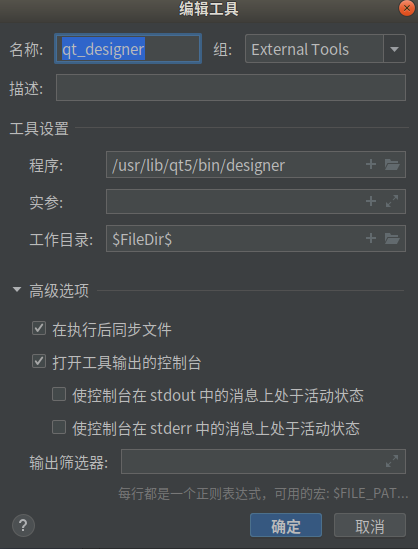
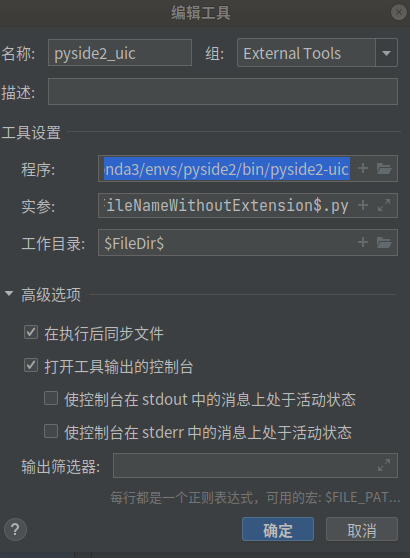
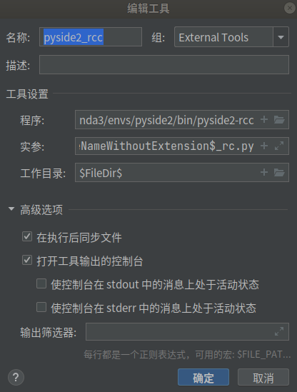

教程：https://www.byhy.net/tut/py/gui/qt_01/

## pyside2+linux+pycharm环境配置

PySide2官方文档：https://doc.qt.io/qtforpython-5/

参考：https://blog.csdn.net/qq_43540108/article/details/111176961

1.新建虚拟环境

`conda create -n pyside2 python=3.8`

2.安装pyside2

`pip install pyside2`

3.安装qt designer

`sudo apt-get install qttools5-dev-tools.`

4.配置pyside2

打开pycharm，`文件 --> 设置 --> 工具 --> 外部工具 --> 点击加号新建工具`

- 配置qt designer，作用是生成.ui文件(实际上是一个xml)

  ```
  qt designer的安装位置如下
  /usr/lib/qt5/bin/designer
  
  $FileDir$
  ```

  

  

- 配置pyside2-uic，作用是将.ui文件转化为.py文件

```
位置是pyside2安装位置bin目录下的pyside2-uic文件
/home/xl/anaconda3/envs/pyside2/bin/pyside2-uic
$FileName$ -o $FileNameWithoutExtension$.py
$FileDir$
```




- 配置pyside-rcc，作用是将.qrc文件转化为.py文件

  ```
  /home/xl/anaconda3/envs/pyside2/bin/pyside2-rcc
  $FileName$ -o $FileNameWithoutExtension$_rc.py
  $FileDir$
  ```

  

  

5.启动qt designer

可以直接在命令行输入designer启动；

也可以点击pycharm中的`工具-external tools`启动