【北京大学】Tensorflow2.0---学习笔记

[【北京大学】Tensorflow2.0]( https://search.bilibili.com/all?keyword=TensorFlow2.0&from_source=webtop_search&spm_id_from=333.851)

# Tensorflow版本选择及安装

[TensorFlow的版本选择和安装](https://www.cnblogs.com/suanai/p/14300090.html)

[CUDA与显卡驱动](https://docs.nvidia.com/cuda/cuda-toolkit-release-notes/index.html)

[TensorFlow与CUDA、cuDNN版本对应关系](https://tensorflow.google.cn/install/source_windows?hl=en#gpu)

**安装前要注意看自己的显卡支持cuda、cudnn哪个版本**，这里我的显卡是3090，安装TensorFlow2.5，cuda11.2，cudnn8.1

1.anaconda prompt输入`conda create -n TF2.5 python=3.8`新建TF2.5的环境

2.`conda activate TF2.5`进入TF2.5环境

3.`conda install cudatoolkit=11.2`安装英伟达SDK11.2

这一步可能会出现下图的报错

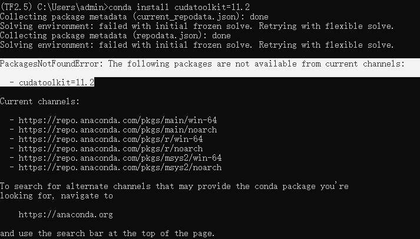

解决方法：输入`conda config --add channels conda-forge`

4.安装英伟达深度学习软件包

`conda install cudnn=8.1`

5.安装TensorFlow

`pip install tensorflow==2.5`指定2.5版本

6.验证是否安装成功

```python
import tensorflow.compat.v1 as tf
tf.compat.v1.disable_eager_execution()
sess = tf.Session()
a = tf.constant(10)
b= tf.constant(12)
sess.run(a+b)
```

输出结果为22，安装成功

# 第1讲 神经网络计算

先看一个用神经网络实现鸢尾花分类的例子

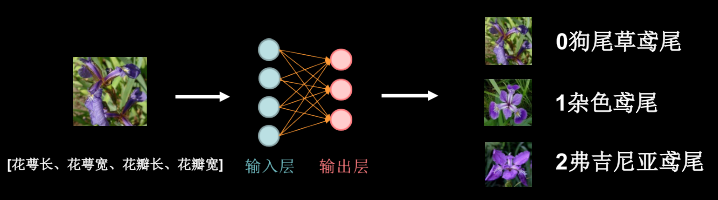

根据生物神经元简化的MP模型，输入特征乘以线上权重，求和，再通过一个非线性函数输出

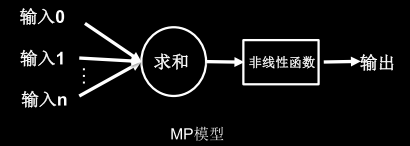

先不看这个非线性函数，进一步简化

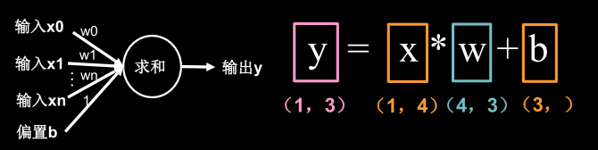

具体步骤：

1.搭建网络并随机初始化参数，这里里面每个神经元y~0~ 、y~1~ 、y~2~ 和前面的每一个结点x~0~ 、x~1~ 、x~2~ 、x~3~ 都有连接关系，称这样的网络结构为**全连接网络**

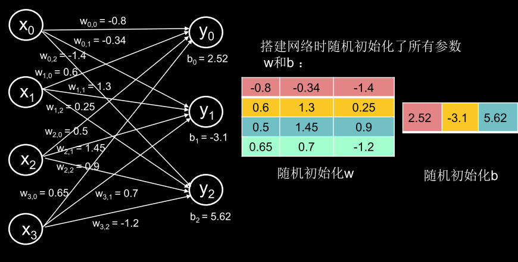

2.喂如输入特征和对应标签

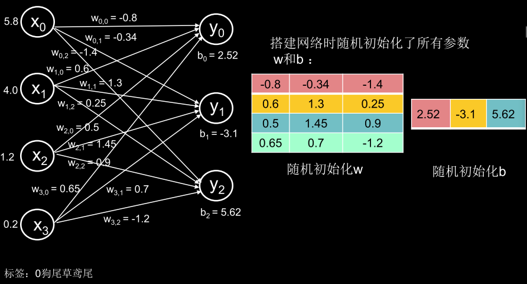

3.前向传播，根据公式代入数据，计算出y

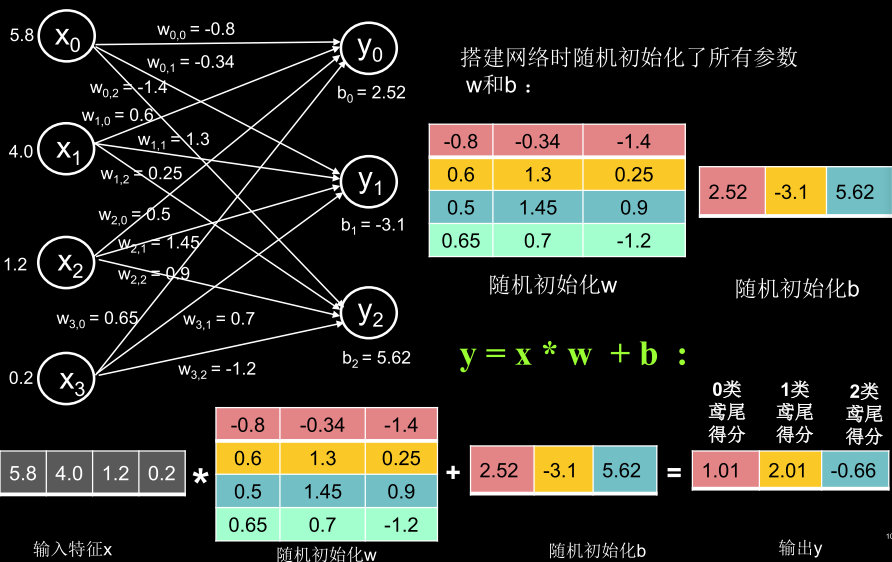

4.损失函数，表示前向传播计算的y与标准答案之间的差距

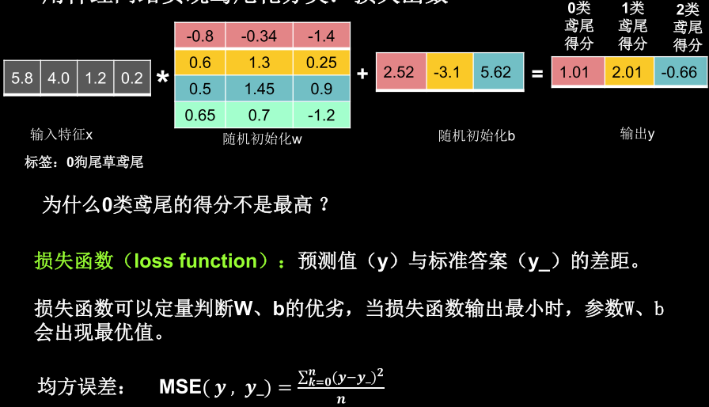

5.梯度下降

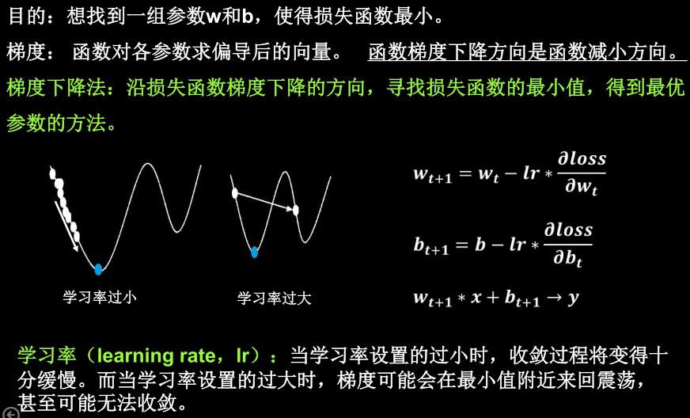

6.反向传播

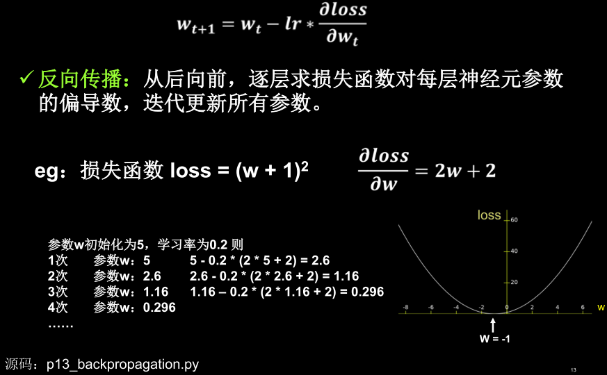

## TensorFlow2.x基本使用

### 数据类型

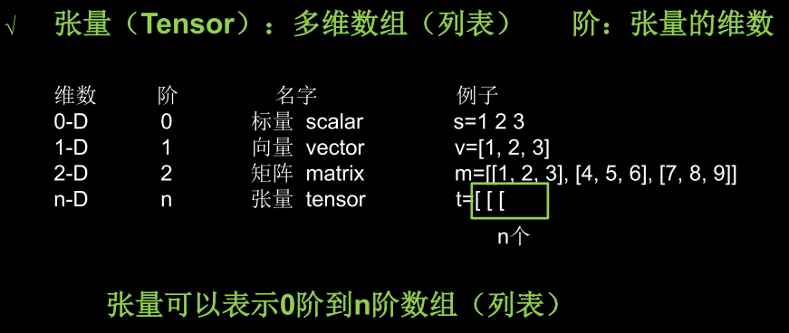

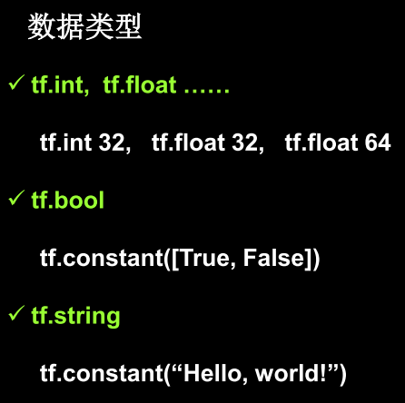

### 创建Tensor

#### 1. tf.constant

**tf.constant**(张量内容，dtype=数据类型(可选))

```python
import tensorflow as tf
a=tf.constant([1,5],dtype=tf.int64)
print(a)
print(a.dtype)
print(a.shape)
```

> 输出：
>
> a: tf.Tensor([1 5], shape=(2,), dtype=int64)
> a.dtype: <dtype: 'int64'>
> a.shape: (2,)

#### 2. tf. convert_to_tensor

**tf. convert_to_tensor**(数据名，dtype=数据类型(可选)),将numpy的数据类型转换为Tensor数据类型

```python
import tensorflow as tf
import numpy as np

a = np.arange(0, 5)
b = tf.convert_to_tensor(a, dtype=tf.int64)
print("a:", a)
print("b:", b)
```

> 输出：
>
> a: [0 1 2 3 4]
> b: tf.Tensor([0 1 2 3 4], shape=(5,), dtype=int64)

#### 3. tf.zeros/ones/fill

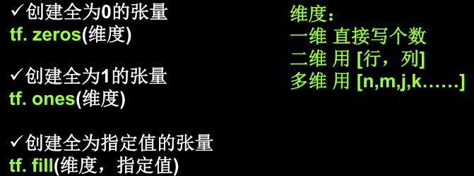

```python
import tensorflow as tf

a = tf.zeros([2, 3])
b = tf.ones(4)
c = tf.fill([2, 2], 9)
print("a:", a)
print("b:", b)
print("c:", c)
```

> 输出：
>
> a: tf.Tensor(
> [[0. 0. 0.]
>  [0. 0. 0.]], shape=(2, 3), dtype=float32)
> b: tf.Tensor([1. 1. 1. 1.], shape=(4,), dtype=float32)
> c: tf.Tensor(
> [[9 9]
>  [9 9]], shape=(2, 2), dtype=int32)

#### 4. tf.random

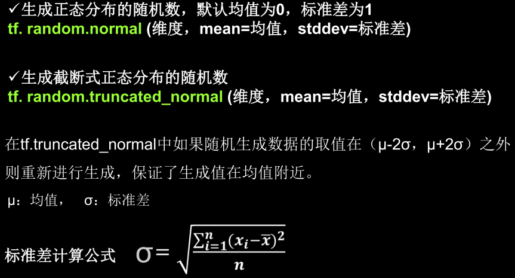

```python
import tensorflow as tf

d = tf.random.normal([2, 2], mean=0.5, stddev=1)
print("d:", d)
e = tf.random.truncated_normal([2, 2], mean=0.5, stddev=1)
print("e:", e)
```

> 输出：
>
> d: tf.Tensor(
> [[ 2.0808887 -0.5846902]
>  [ 2.8404007  0.1462099]], shape=(2, 2), dtype=float32)
> e: tf.Tensor(
> [[ 1.8202503  -0.20955426]
>  [ 1.4057683   0.5466141 ]], shape=(2, 2), dtype=float32)


```python
import tensorflow as tf

f = tf.random.uniform([2, 2], minval=0, maxval=1)
print("f:", f)
```

> 输出：
>
> f: tf.Tensor(
> [[0.3525442  0.39133584]
>  [0.63871145 0.6516905 ]], shape=(2, 2), dtype=float32)

### 轴的理解

**在二维张量中可以通过指定axis指定计算轴，如果不指定轴，则所有元素参与计算**

[**关于轴的理解**](https://www.cnblogs.com/monteyang/p/13091387.html)

一个多维列表,最外层是0轴,根据不同的函数,计算后该轴的维度**上升（如独热编码）**、**下降（如求和）**或**不变**

### 常用函数

#### 1. tf.cast、tf.reduce_min/max/mean/sum

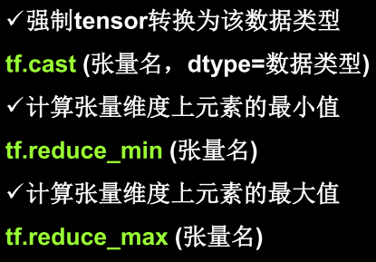

```python
import tensorflow as tf

x1 = tf.constant([1., 2., 3.], dtype=tf.float64)
print("x1:", x1)
x2 = tf.cast(x1, tf.int32)
print("x2", x2)
print("minimum of x2：", tf.reduce_min(x2))
print("maxmum of x2:", tf.reduce_max(x2))
```

> 输出：
>
> x1: tf.Tensor([1. 2. 3.], shape=(3,), dtype=float64)
> x2 tf.Tensor([1 2 3], shape=(3,), dtype=int32)
> minimum of x2： tf.Tensor(1, shape=(), dtype=int32)
> maxmum of x2: tf.Tensor(3, shape=(), dtype=int32)

-----

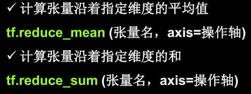

```python
import tensorflow as tf

x = tf.constant([[1, 2, 3], [2, 2, 3]])
print("x:", x)
print("mean of x:", tf.reduce_mean(x))  # 求x中所有数的均值
print("sum of x:", tf.reduce_sum(x, axis=1))  # 求每一行的和
```

> 输出：
>
> x: tf.Tensor(
> [[1 2 3]
>  [2 2 3]], shape=(2, 3), dtype=int32)
> mean of x: tf.Tensor(2, shape=(), dtype=int32)
> sum of x: tf.Tensor([6 7], shape=(2,), dtype=int32)

------

#### 2. tf.Variable

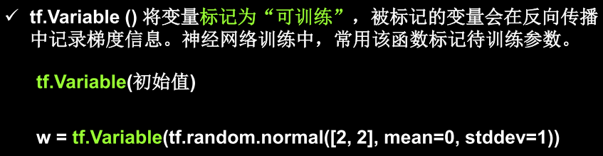

-----------------

#### 3. tf.add/subtract/multiply/divide

形状相同才能四则运算

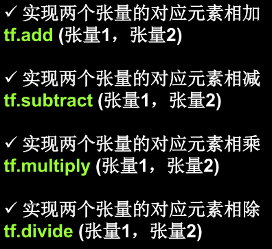

```python
import tensorflow as tf

a = tf.ones([1, 3])
b = tf.fill([1, 3], 3.)
print("a:", a)
print("b:", b)
print("a+b:", tf.add(a, b))
print("a-b:", tf.subtract(a, b))
print("a*b:", tf.multiply(a, b))
print("b/a:", tf.divide(b, a))
```

> 输出：
>
> a: tf.Tensor([[1. 1. 1.]], shape=(1, 3), dtype=float32)
> b: tf.Tensor([[3. 3. 3.]], shape=(1, 3), dtype=float32)
> a+b: tf.Tensor([[4. 4. 4.]], shape=(1, 3), dtype=float32)
> a-b: tf.Tensor([[-2. -2. -2.]], shape=(1, 3), dtype=float32)
> a*b: tf.Tensor([[3. 3. 3.]], shape=(1, 3), dtype=float32)
> b/a: tf.Tensor([[3. 3. 3.]], shape=(1, 3), dtype=float32)

-----------

#### 4. tf.square/pow/sqrt

平方、次方、开放操作对所有元素进行

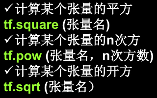

```python
import tensorflow as tf

a = tf.fill([1, 2], 3.)
print("a:", a)
print("a的立方:", tf.pow(a, 3))
print("a的平方:", tf.square(a))
print("a的开方:", tf.sqrt(a))
```

> 输出：
>
> a: tf.Tensor([[3. 3.]], shape=(1, 2), dtype=float32)
> a的立方: tf.Tensor([[27. 27.]], shape=(1, 2), dtype=float32)
> a的平方: tf.Tensor([[9. 9.]], shape=(1, 2), dtype=float32)
> a的开方: tf.Tensor([[1.7320508 1.7320508]], shape=(1, 2), dtype=float32)

----

#### 5. tf.matmul


```python
import tensorflow as tf

a = tf.ones([3, 2])
b = tf.fill([2, 3], 3.)
print("a:", a)
print("b:", b)
print("a*b:", tf.matmul(a, b))
```

> 输出：
>
> a: tf.Tensor(
> [[1. 1.]
>  [1. 1.]
>  [1. 1.]], shape=(3, 2), dtype=float32)
> b: tf.Tensor(
> [[3. 3. 3.]
>  [3. 3. 3.]], shape=(2, 3), dtype=float32)
> a*b: tf.Tensor(
> [[6. 6. 6.]
>  [6. 6. 6.]
>  [6. 6. 6.]], shape=(3, 3), dtype=float32)

--------

#### 6. tf.data.Dataset.from_tensor_slices

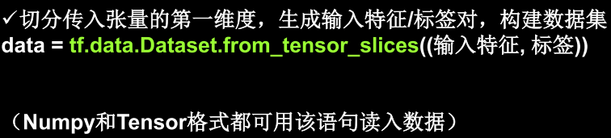

```python
import tensorflow as tf

features = tf.constant([12, 23, 10, 17])
labels = tf.constant([0, 1, 1, 0])
dataset = tf.data.Dataset.from_tensor_slices((features, labels))
for element in dataset:
    print(element)
```

> 输出：
>
> (<tf.Tensor: shape=(), dtype=int32, numpy=12>, <tf.Tensor: shape=(), dtype=int32, numpy=0>)
> (<tf.Tensor: shape=(), dtype=int32, numpy=23>, <tf.Tensor: shape=(), dtype=int32, numpy=1>)
> (<tf.Tensor: shape=(), dtype=int32, numpy=10>, <tf.Tensor: shape=(), dtype=int32, numpy=1>)
> (<tf.Tensor: shape=(), dtype=int32, numpy=17>, <tf.Tensor: shape=(), dtype=int32, numpy=0>)

-------

#### 7. tf.GradientTape

```python
tf.GradientTape(
    persistent=False, watch_accessed_variables=True
)
```

```python
x = tf.constant(5.0)
with tf.GradientTape() as g:
  g.watch(x)	# 监视可训练变量x
  with tf.GradientTape() as gg:
    gg.watch(x)
    y = x * x
  dy_dx = gg.gradient(y, x)  # dy_dx = 2 * x
d2y_dx2 = g.gradient(dy_dx, x)  # d2y_dx2 = 2
print(dy_dx)

print(d2y_dx2)
```

GradientTape默认在进行一次求导后就释放,如果要多次求导要将 `persistent`设为True,并手动释放`del g`


```python
import tensorflow as tf

with tf.GradientTape() as tape:
    x = tf.Variable(tf.constant(3.0))
    y = tf.pow(x, 2)
grad = tape.gradient(y, x)
print(grad)
```

> 输出：
>
> tf.Tensor(6.0, shape=(), dtype=float32)

------

#### 8. enumerate


----

#### 9. tf.one_hot

**默认对最内层计算**,计算后维度上升

```python
tf.one_hot(
    indices,        #输入的tensor，在深度学习中一般是给定的labels，通常是数字列表，属于一维输入，也可以是多维。
    depth,          #一个标量，用于定义一个 one hot 维度的深度
    on_value=None,  #定义在 indices[j] = i 时填充输出的值的标量，默认为1
    off_value=None, #定义在 indices[j] != i 时填充输出的值的标量，默认为0
    axis=None,      #要填充的轴，默认为-1，即一个新的最内层轴
    dtype=None,     
    name=None
)
```


可用 tf.one_hot(待转换数据，depth=几分类)函数实现用独热码表示标签， 在分类问题中很常见。标记类别为为 1 和 0，其中 1 表示是，0 表示非。如在鸢 尾花分类任务中，如果标签是 1，表示分类结果是 1 杂色鸢尾，其用把它用独热 码表示就是 0,1,0，这样可以表示出每个分类的概率：也就是百分之 0 的可能是 0 狗尾草鸢尾，百分百的可能是 1 杂色鸢尾，百分之 0 的可能是弗吉尼亚鸢尾。

```python
import tensorflow as tf

classes = 3
labels = tf.constant([1, 0, 2])  # 输入的元素值最小为0，最大为2
output = tf.one_hot(labels, depth=classes)
print("result of labels1:", output)
print("\n")
```

> 输出：
>
> result of labels1: tf.Tensor(
> [[0. 1. 0.]
>  [1. 0. 0.]
>  [0. 0. 1.]], shape=(3, 3), dtype=float32)

---------

#### 10. tf.nn.softmax

**默认对最内层维度计算**,计算后维度不变

```python
tf.nn.softmax(
    logits,
    axis=None,
    name=None,
    dim=None
)
```

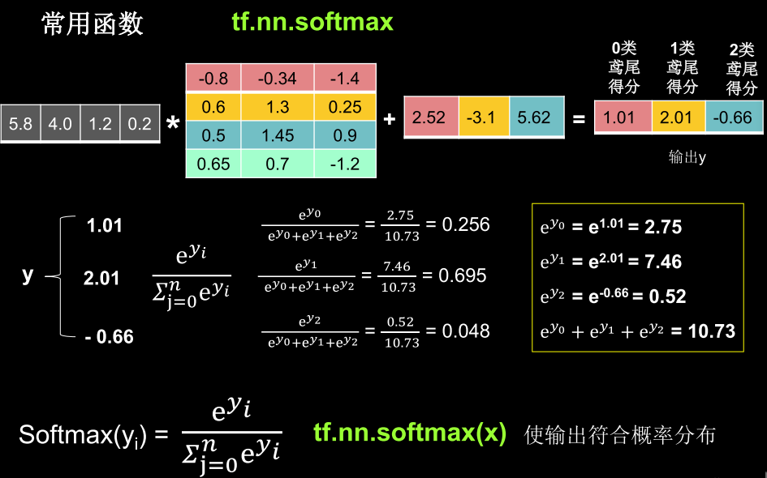

```python
import tensorflow as tf

x1 = tf.constant([[5.8, 4.0, 1.2, 0.2]])  # 5.8,4.0,1.2,0.2（0）
w1 = tf.constant([[-0.8, -0.34, -1.4],
                  [0.6, 1.3, 0.25],
                  [0.5, 1.45, 0.9],
                  [0.65, 0.7, -1.2]])
b1 = tf.constant([2.52, -3.1, 5.62])
y = tf.matmul(x1, w1) + b1
print("x1.shape:", x1.shape)
print("w1.shape:", w1.shape)
print("b1.shape:", b1.shape)
print("y.shape:", y.shape)
print("y:", y)

#####以下代码可将输出结果y转化为概率值#####
y_dim = tf.squeeze(y)  # 去掉y中纬度1（观察y_dim与 y 效果对比）
y_pro = tf.nn.softmax(y_dim)  # 使y_dim符合概率分布，输出为概率值了
print("y_dim:", y_dim)
print("y_pro:", y_pro)
```

> 输出：
>
> x1.shape: (1, 4)
> w1.shape: (4, 3)
> b1.shape: (3,)
> y.shape: (1, 3)
> y: tf.Tensor([[ 1.010945    2.0069656  -0.66328144]], shape=(1, 3), dtype=float32)
> y_dim: tf.Tensor([ 1.010945    2.0069656  -0.66328144], shape=(3,), dtype=float32)
> y_pro: tf.Tensor([0.2567434  0.6951293  0.04812736], shape=(3,), dtype=float32)

------

#### 11. (Tensor.)assign_sub


-------

#### 12. tf.argmax

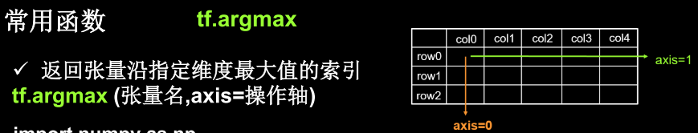

```python
import numpy as np
import tensorflow as tf

test = np.array([[1, 2, 3], [2, 3, 4], [5, 4, 3], [8, 7, 2]])
print("test:\n", test)
print("每一列的最大值的索引：", tf.argmax(test, axis=0))  # 返回每一列最大值的索引
print("每一行的最大值的索引", tf.argmax(test, axis=1))  # 返回每一行最大值的索引
```

> 输出：
>
> 每一列的最大值的索引： tf.Tensor([3 3 1], shape=(3,), dtype=int64)
> 每一行的最大值的索引 tf.Tensor([2 2 0 0], shape=(4,), dtype=int64)

## 鸢尾花分类实例

先导入数据集看一看

```python
from sklearn import datasets
from pandas import DataFrame
import pandas as pd

x_data = datasets.load_iris().data  # .data返回iris数据集所有输入特征
y_data = datasets.load_iris().target  # .target返回iris数据集所有标签
print("x_data from datasets: \n", x_data)
print("y_data from datasets: \n", y_data)

x_data = DataFrame(x_data, columns=['花萼长度', '花萼宽度', '花瓣长度', '花瓣宽度']) # 为表格增加行索引（左侧）和列标签（上方）
pd.set_option('display.unicode.east_asian_width', True)  # 设置列名对齐
print("x_data add index: \n", x_data)

x_data['类别'] = y_data  # 新加一列，列标签为‘类别’，数据为y_data
print("x_data add a column: \n", x_data)

#类型维度不确定时，建议用print函数打印出来确认效果
```

**具体步骤：**

- 准备数据
  - 数据集读入
  - 数据集乱序
  - 生成训练集和测试集（即 x_train / y_train；x_test / y_test）
  - 配成（输入特征，标签）对，每次读入一小撮（batch）

- 搭建网络
  - 定义神经网路中所有可训练参数

- 参数优化
  - 嵌套循环迭代，with结构更新参数，显示当前loss
- 测试效果
  - 计算当前参数前向传播后的准确率，显示当前acc
- acc / loss可视化

1.数据集读入

```python
# 导入所需模块
import tensorflow as tf
from sklearn import datasets
from matplotlib import pyplot as plt
import numpy as np

# 导入数据，分别为输入特征和标签
x_data = datasets.load_iris().data
y_data = datasets.load_iris().target
```

2.数据集乱序

```python
# 随机打乱数据（因为原始数据是顺序的，顺序不打乱会影响准确率）
# seed: 随机数种子，是一个整数，当设置之后，每次生成的随机数都一样（为方便教学，以保每位同学结果一致）
np.random.seed(116)  # 使用相同的seed，保证输入特征和标签一一对应
np.random.shuffle(x_data)   # 生成随机列表（打乱顺序）
np.random.seed(116)
np.random.shuffle(y_data)
tf.random.set_seed(116)
```

3.将数据分为训练集和测试集

```python
# 将打乱后的数据集分割为训练集和测试集，训练集为前120行，测试集为后30行
x_train = x_data[:-30]
y_train = y_data[:-30]
x_test = x_data[-30:]
y_test = y_data[-30:]
```

```python
# 转换x的数据类型，否则后面矩阵相乘时会因数据类型不一致报错
x_train = tf.cast(x_train, tf.float32)
x_test = tf.cast(x_test, tf.float32)
```

4.将数据配成特征--标签对

```python
# from_tensor_slices函数使输入特征和标签值一一对应。（把数据集分批次，每个批次batch组数据）
train_db = tf.data.Dataset.from_tensor_slices((x_train, y_train)).batch(32)
test_db = tf.data.Dataset.from_tensor_slices((x_test, y_test)).batch(32)
```

5.搭建网络

```python
# 生成神经网络的参数，4个输入特征故，输入层为4个输入节点；因为3分类，故输出层为3个神经元（没有隐藏层）
# 用tf.Variable()标记参数可训练
# 使用seed使每次生成的随机数相同（方便教学，使大家结果都一致，在现实使用时不写seed）
w1 = tf.Variable(tf.random.truncated_normal([4, 3], stddev=0.1, seed=1))
b1 = tf.Variable(tf.random.truncated_normal([3], stddev=0.1, seed=1))
```

```python
lr = 0.1  # 学习率为0.1
train_loss_results = []  # 将每轮的loss记录在此列表中，为后续画loss曲线提供数据
test_acc = []  # 将每轮的acc记录在此列表中，为后续画acc曲线提供数据
epoch = 500  # 循环500轮
loss_all = 0  # 每轮分4个step，loss_all记录四个step生成的4个loss的和
```

6.优化、测试

```python
# 训练部分
for epoch in range(epoch):  #数据集级别的循环，每个epoch循环一次数据集
    for step, (x_train, y_train) in enumerate(train_db):  #batch级别的循环 ，每个step循环一个batch
        with tf.GradientTape() as tape:  # with结构记录梯度信息
            y = tf.matmul(x_train, w1) + b1  # 神经网络乘加运算
            y = tf.nn.softmax(y)  # 使输出y符合概率分布（此操作后与独热码同量级，可相减求loss）
            y_ = tf.one_hot(y_train, depth=3)  # 将标签值转换为独热码格式，方便计算loss和accuracy
            loss = tf.reduce_mean(tf.square(y_ - y))  # 采用均方误差损失函数mse = mean(sum(y-out)^2)
            loss_all += loss.numpy()  # 将每个step计算出的loss累加，为后续求loss平均值提供数据，这样计算的loss更准确
        # 计算loss对各个参数的梯度
        grads = tape.gradient(loss, [w1, b1])

        # 实现梯度更新 w1 = w1 - lr * w1_grad    b = b - lr * b_grad
        w1.assign_sub(lr * grads[0])  # 参数w1自更新
        b1.assign_sub(lr * grads[1])  # 参数b自更新

    # 每个epoch，打印loss信息
    print("Epoch {}, loss: {}".format(epoch, loss_all/4))
    train_loss_results.append(loss_all / 4)  # 将4个step的loss求平均记录在此变量中
    loss_all = 0  # loss_all归零，为记录下一个epoch的loss做准备

    # 测试部分
    # total_correct为预测对的样本个数, total_number为测试的总样本数，将这两个变量都初始化为0
    total_correct, total_number = 0, 0
    for x_test, y_test in test_db:
        # 使用更新后的参数进行预测
        y = tf.matmul(x_test, w1) + b1
        y = tf.nn.softmax(y)
        pred = tf.argmax(y, axis=1)  # 返回y中最大值的索引，即预测的分类
        # 将pred转换为y_test的数据类型
        pred = tf.cast(pred, dtype=y_test.dtype)
        # 若分类正确，则correct=1，否则为0，将bool型的结果转换为int型
        correct = tf.cast(tf.equal(pred, y_test), dtype=tf.int32)
        # 将每个batch的correct数加起来
        correct = tf.reduce_sum(correct)
        # 将所有batch中的correct数加起来
        total_correct += int(correct)
        # total_number为测试的总样本数，也就是x_test的行数，shape[0]返回变量的行数
        total_number += x_test.shape[0]
    # 总的准确率等于total_correct/total_number
    acc = total_correct / total_number
    test_acc.append(acc)
    print("Test_acc:", acc)
    print("--------------------------")
```

7.绘制损失函数曲线与精度曲线

```python
# 绘制 loss 曲线
plt.title('Loss Function Curve')  # 图片标题
plt.xlabel('Epoch')  # x轴变量名称
plt.ylabel('Loss')  # y轴变量名称
plt.plot(train_loss_results, label="$Loss$")  # 逐点画出trian_loss_results值并连线，连线图标是Loss
plt.legend()  # 画出曲线图标
plt.show()  # 画出图像

# 绘制 Accuracy 曲线
plt.title('Acc Curve')  # 图片标题
plt.xlabel('Epoch')  # x轴变量名称
plt.ylabel('Acc')  # y轴变量名称
plt.plot(test_acc, label="$Accuracy$")  # 逐点画出test_acc值并连线，连线图标是Accuracy
plt.legend()
plt.show()
```

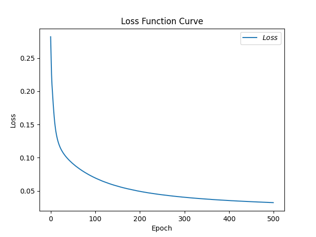

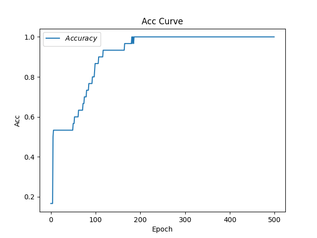

--------

# 第2讲 神经网络优化

## 常用函数

### 1. ft.where


```python
import tensorflow as tf

a = tf.constant([1, 2, 3, 1, 1])
b = tf.constant([0, 1, 3, 4, 5])
c = tf.where(tf.greater(a, b), a, b)  # 若a>b（对应元素比较），返回a对应位置的元素，否则返回b对应位置的元素
print("c：", c)
```

> 输出：
>
> c： tf.Tensor([1 2 3 4 5], shape=(5,), dtype=int32)

------

### 2. np.random.RandomState.rand()


```python
import numpy as np

rdm = np.random.RandomState(seed=1)
a = rdm.rand()
b = rdm.rand(2, 3)
print("a:", a)
print("b:", b)
```

> 输出：
>
> a: 0.417022004702574
> b: [[7.20324493e-01 1.14374817e-04 3.02332573e-01]
>  [1.46755891e-01 9.23385948e-02 1.86260211e-01]]

------

### 3. np.vstack()


```python
import numpy as np

a = np.array([1, 2, 3])
b = np.array([4, 5, 6])
c = np.vstack((a, b))
print("c:\n", c)
```

> 输出：
>
> c:
>  [[1 2 3]
>  [4 5 6]]

---

### 4. np.mgrid[]/.ravel()/c_[]

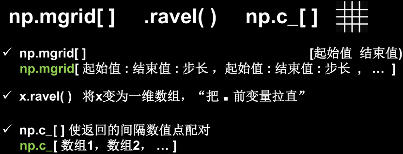

```python
import numpy as np

# mgrid()返回若干组维度相同的等差数组，左闭右开区间
# 1:3:1决定了第一个维度是2，2:4:0.5决定了第二个维度是4
x, y = np.mgrid[1:3:1, 2:4:0.5]
# 将x, y拉直，并合并配对为二维张量，生成二维坐标点
grid = np.c_[x.ravel(), y.ravel()]
print("x:\n", x)
print("y:\n", y)
print("x.ravel():\n", x.ravel())
print("y.ravel():\n", y.ravel())
print('grid:\n', grid)
```

> 输出：
>
> x:
>  [[1. 1. 1. 1.]
>  [2. 2. 2. 2.]]
> y:
>  [[2.  2.5 3.  3.5]
>  [2.  2.5 3.  3.5]]
> x.ravel():
>  [1. 1. 1. 1. 2. 2. 2. 2.]
> y.ravel():
>  [2.  2.5 3.  3.5 2.  2.5 3.  3.5]
> grid:
>  [[1.  2. ]
>  [1.  2.5]
>  [1.  3. ]
>  [1.  3.5]
>  [2.  2. ]
>  [2.  2.5]
>  [2.  3. ]
>  [2.  3.5]]

## 神经网络复杂度

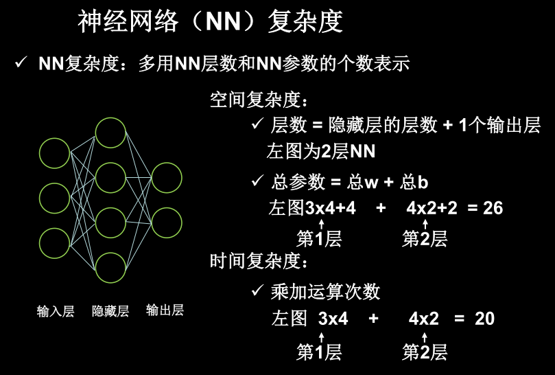

## 学习率

学习率决定了参数更新的快慢

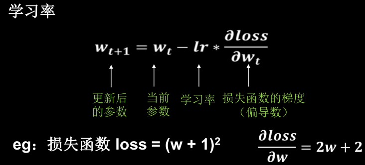

指数衰减学习率

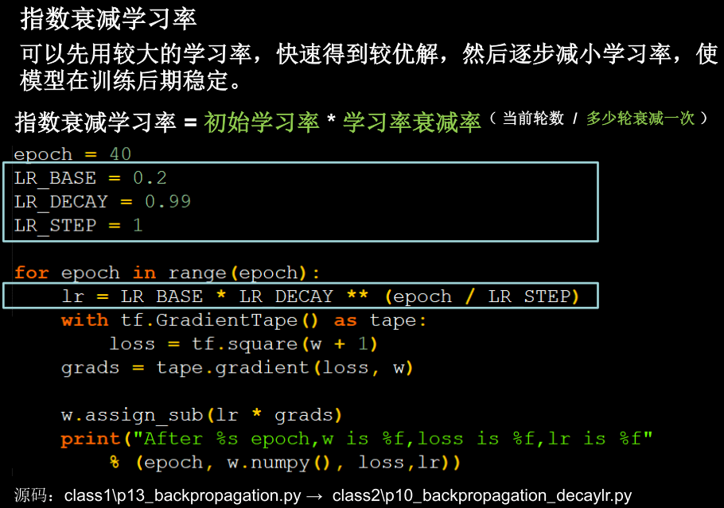

## 激活函数

激活函数是用来加入非线性因素的，因为线性模型的表达能力不够。引入非线性激活函数，可使深 层神经网络的表达能力更加强大。
优秀的激活函数应满足： 

- 非线性： 激活函数非线性时，多层神经网络可逼近所有函数
- 可微性： 优化器大多用梯度下降更新参数 
- 单调性： 当激活函数是单调的，能保证单层网络的损失函数是凸函数 
- 近似恒等性：$f(x)≈x$，当参数初始化为随机小值时，神经网络更稳定

激活函数输出值的范围：

- 激活函数输出为**有限值**时，基于梯度的优化方法更稳定
- 激活函数输出为**无限值**时，建议**调小学习率**

### sigmoid函数

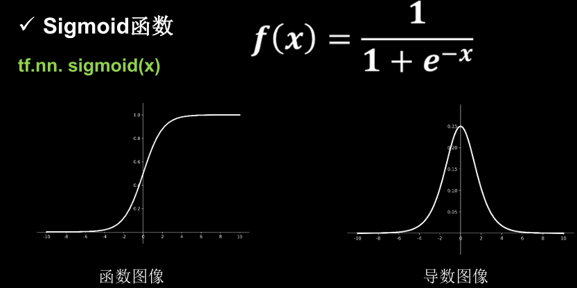

今年神经网络使用$sigmoid$函数作为激活函数已经较少，因为神经网络更新参数时需要从输入层到输出层进行**链式求导**，$sigmoid$函数导数的范围是0-0.25，链式求导需要多层导数连续相乘，会出现多个0-0.25之间的连续相乘，结果将趋于0，参数无法更新。

我们希望输入每层神经网络的特征是以0为均值的小数值，但是$sigmoid$函数的输出都是0-1之间的正数，会使收敛变慢

**优点：**

- 输出映射在(0,1)之间，单调连续，输出范围有限，优化稳定，可用作输出层； 
- 求导容易。

**缺点：**

- 易造成梯度消失；
- 出非0均值，收敛慢；
- 幂运算复杂，训练时间长。

sigmoid函数可应用在训练过程中。然而，当处理分类问题作出输出时，sigmoid却无能为力。简单地说，sigmoid函数只能处理两个类，不适用于多分类问题。而softmax可以有效解决这个问题，并 且softmax函数大都运用在神经网路中的最后一层网络中，使得值得区间在（0,1）之间，而不是二分类的。

### Tanh函数


**优点：**

- 比sigmoid函数收敛速度更快。
- 相比sigmoid函数，其输出以0为中心。

**缺点：**

- 易造成梯度消失；
- 幂运算复杂，训练时间长。

### Relu函数

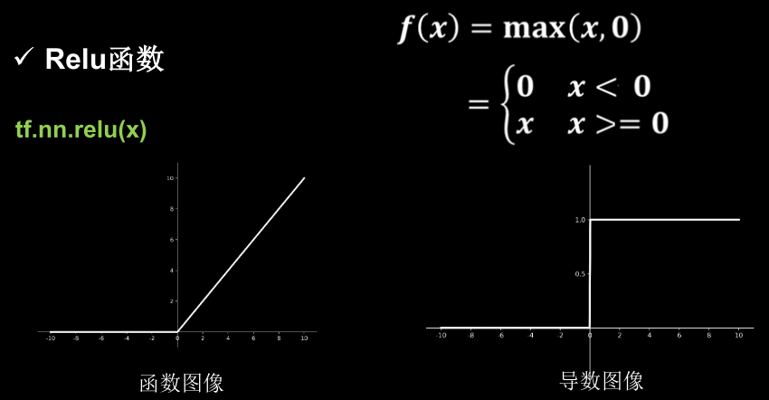

**优点：**

- 解决了梯度消失问题(在正区间)；

- 只需判断输入是否大于0，计算速度快；

- 收敛速度远快于sigmoid和tanh，因为sigmoid和tanh涉及很多求幂的操作；

- 提供了神经网络的稀疏表达能力。

**缺点：**

- 输出非0均值，收敛慢； 
- Dead ReLU问题：送入激活函数的特征是负数时激活函数是0，反向传播得到的梯度是0,导致参数无法更新,造成神经元死亡.造成神经元死亡的根本原因是送入激活函数的负数特征太多导致,可以改进随机初始化,**避免过多负数特征送入relu函数**.**通过设置更小的学习率避免训练中过多负数特征进入relu函数.**

### Leaky ReLU

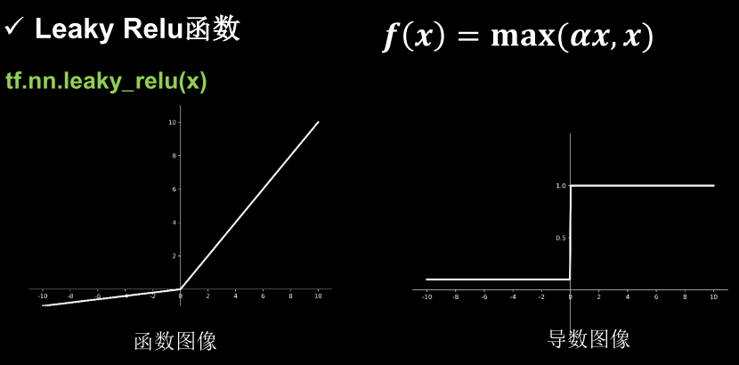

理论上来讲，Leaky ReLU有ReLU的所有优点，外加不会有Dead ReLU问题，但是在实际操作当 中，并没有完全证明Leaky ReLU总是好于ReLU。

### 建议

- **首选ReLU激活函数**； 

- **学习率设置较小值**； 

- **输入特征标准化**，即让输入特征满足以0为均值，1为标准差的正态分布；
- **初始参数中心化**，即让随机生成的参数满足以0为均值，$\sqrt{2/当前层输入特征数}$为标准差正态分布。

## 损失函数

loss函数表征预测值y与标准值y_的差距

### 均方误差损失函数MSE

$\operatorname{MSE}\left(\mathrm{y}_{-}, \mathrm{y}\right)=\frac{\sum_{i=1}^{n}\left(y-y_{-}\right)^{2}}{n}$

$loss\_mse = tf.reduce\_mean(tf.square(y\_ - y))$

### 交叉熵损失函数CE

CE(Cross Entropy)表征了两个概率分布之间的距离

$H(y\_ , y) = −∑ 𝑦\_ ∗ 𝑙n𝑦$

$tf.losses.categorical\_crossentropy(y\_，y)$

对于多分类问题，神经网络的输出一般不是概率分布，因此需要引入softmax层，使得输出服从概率分布。

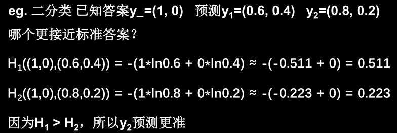

```python
# softmax与交叉熵损失函数的结合
import tensorflow as tf
import numpy as np

y_ = np.array([[1, 0, 0], [0, 1, 0], [0, 0, 1], [1, 0, 0], [0, 1, 0]])
y = np.array([[12, 3, 2], [3, 10, 1], [1, 2, 5], [4, 6.5, 1.2], [3, 6, 1]])
y_pro = tf.nn.softmax(y)
loss_ce1 = tf.losses.categorical_crossentropy(y_,y_pro)
loss_ce2 = tf.nn.softmax_cross_entropy_with_logits(y_, y)

print('分步计算的结果:\n', loss_ce1)
print('结合计算的结果:\n', loss_ce2)

# 输出的结果相同
```

> 输出:
>
> 分步计算的结果:
>  tf.Tensor(
> [1.68795487e-04 1.03475622e-03 6.58839038e-02 2.58349207e+00
>  5.49852354e-02], shape=(5,), dtype=float64)
> 结合计算的结果:
>  tf.Tensor(
> [1.68795487e-04 1.03475622e-03 6.58839038e-02 2.58349207e+00
>  5.49852354e-02], shape=(5,), dtype=float64)

### 自定义损失函数

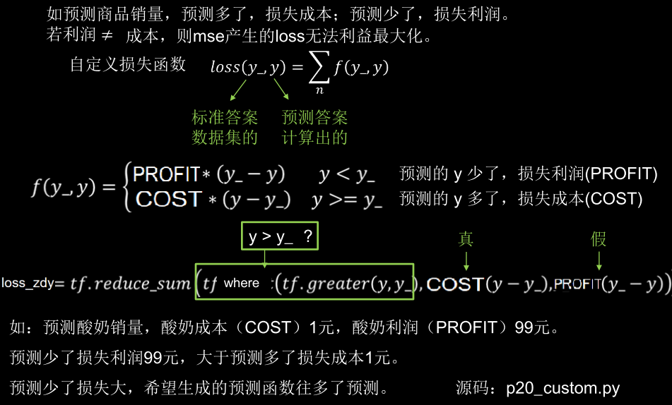

## 欠拟合与过拟合

欠拟合的解决方法：

- 增加输入特征项
- 增加网络参数

- 减少正则化参数

过拟合的解决方法：

- 数据清洗

- 增大训练集

- 采用正则化

- 增大正则化参数

## 正则化

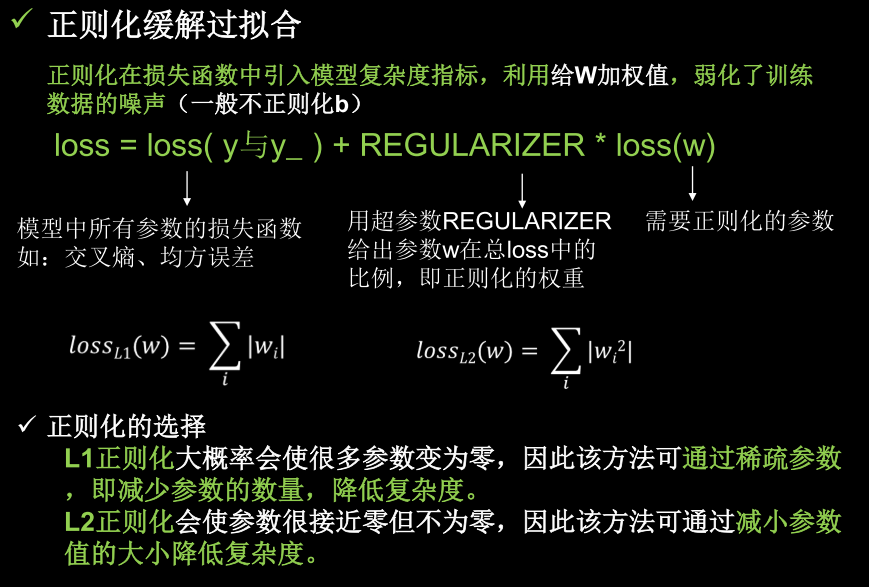

[机器学习中正则化项L1和L2的直观理解](https://blog.csdn.net/jinping_shi/article/details/52433975)

- L1正则化可以产生稀疏权值矩阵，即产生一个稀疏模型，可以用于特征选择
- L2正则化可以防止模型过拟合（overfitting）；一定程度上，L1也可以防止过拟合

```python
# 导入所需模块
import tensorflow as tf
from matplotlib import pyplot as plt
import numpy as np
import pandas as pd

# 读入数据/标签 生成x_train y_train
df = pd.read_csv('dot.csv')
x_data = np.array(df[['x1', 'x2']])
y_data = np.array(df['y_c'])

x_train = x_data
y_train = y_data.reshape(-1, 1)

Y_c = [['red' if y else 'blue'] for y in y_train]

# 转换x的数据类型，否则后面矩阵相乘时会因数据类型问题报错
x_train = tf.cast(x_train, tf.float32)
y_train = tf.cast(y_train, tf.float32)

# from_tensor_slices函数切分传入的张量的第一个维度，生成相应的数据集，使输入特征和标签值一一对应
train_db = tf.data.Dataset.from_tensor_slices((x_train, y_train)).batch(32)

# 生成神经网络的参数，输入层为4个神经元，隐藏层为32个神经元，2层隐藏层，输出层为3个神经元
# 用tf.Variable()保证参数可训练
w1 = tf.Variable(tf.random.normal([2, 11]), dtype=tf.float32)
b1 = tf.Variable(tf.constant(0.01, shape=[11]))

w2 = tf.Variable(tf.random.normal([11, 1]), dtype=tf.float32)
b2 = tf.Variable(tf.constant(0.01, shape=[1]))

lr = 0.01  # 学习率为
epoch = 400  # 循环轮数

# 训练部分
for epoch in range(epoch):
    for step, (x_train, y_train) in enumerate(train_db):
        with tf.GradientTape() as tape:  # 记录梯度信息

            h1 = tf.matmul(x_train, w1) + b1  # 记录神经网络乘加运算
            h1 = tf.nn.relu(h1)
            y = tf.matmul(h1, w2) + b2

            # 采用均方误差损失函数mse = mean(sum(y-out)^2)
            loss_mse = tf.reduce_mean(tf.square(y_train - y))
            # 添加l2正则化
            loss_regularization = []
            # tf.nn.l2_loss(w)=sum(w ** 2) / 2
            loss_regularization.append(tf.nn.l2_loss(w1))
            loss_regularization.append(tf.nn.l2_loss(w2))
            # 求和
            # 例：x=tf.constant(([1,1,1],[1,1,1]))
            #   tf.reduce_sum(x)
            # >>>6
            # loss_regularization = tf.reduce_sum(tf.stack(loss_regularization))
            loss_regularization = tf.reduce_sum(loss_regularization)
            loss = loss_mse + 0.03 * loss_regularization #REGULARIZER = 0.03

        # 计算loss对各个参数的梯度
        variables = [w1, b1, w2, b2]
        grads = tape.gradient(loss, variables)

        # 实现梯度更新
        # w1 = w1 - lr * w1_grad
        w1.assign_sub(lr * grads[0])
        b1.assign_sub(lr * grads[1])
        w2.assign_sub(lr * grads[2])
        b2.assign_sub(lr * grads[3])

    # 每200个epoch，打印loss信息
    if epoch % 20 == 0:
        print('epoch:', epoch, 'loss:', float(loss))

# 预测部分
print("*******predict*******")
# xx在-3到3之间以步长为0.01，yy在-3到3之间以步长0.01,生成间隔数值点
xx, yy = np.mgrid[-3:3:.1, -3:3:.1]
# 将xx, yy拉直，并合并配对为二维张量，生成二维坐标点
grid = np.c_[xx.ravel(), yy.ravel()]
grid = tf.cast(grid, tf.float32)
# 将网格坐标点喂入神经网络，进行预测，probs为输出
probs = []
for x_predict in grid:
    # 使用训练好的参数进行预测
    h1 = tf.matmul([x_predict], w1) + b1
    h1 = tf.nn.relu(h1)
    y = tf.matmul(h1, w2) + b2  # y为预测结果
    probs.append(y)

# 取第0列给x1，取第1列给x2
x1 = x_data[:, 0]
x2 = x_data[:, 1]
# probs的shape调整成xx的样子
probs = np.array(probs).reshape(xx.shape)
plt.scatter(x1, x2, color=np.squeeze(Y_c))
# 把坐标xx yy和对应的值probs放入contour<[‘kɑntʊr]>函数，给probs值为0.5的所有点上色  plt点show后 显示的是红蓝点的分界线
plt.contour(xx, yy, probs, levels=[.5])
plt.show()

# 读入红蓝点，画出分割线，包含正则化
# 不清楚的数据，建议print出来查看 
```

下图分别是未正则化的结果和正则化后的结果

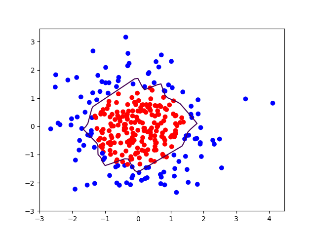

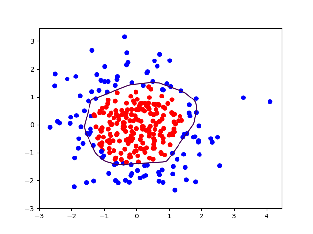

## 优化器


# 第3讲 神经网络搭建八股

## tf.keras 搭建神经网络八股

https://tensorflow.google.cn/api_docs/python/tf


1.import

导入相关库

2.train,test

指定训练集和测试集

3.model=tf.keras.models.Sequential

在Sequential()中搭建网络结构,逐层描述每层网络

4.model.compile

在compile()中配置训练方法,告知训练时选择纳宗优化器,选择哪个损失函数,选择哪种评测指标

5.model.fit

在fit()中告知训练集和测试集的输入特征和标签,告知每个batch是多少,告知要迭代多少次数据集

6.model.summary

用summary()打印出网络的结构和参数统计

### 1. model=tf.keras.models.Sequential

model=tf.keras.models.Sequential([网络结构]),描述各层网络结构

网络结构举例:

- 拉直层:

  ```python
  tf.keras.layers.Flatten()# 把输入特征拉直变成一维数组
  ```

  

- 全连接层:

  ```python
  tf.keras.layers.Dense(神经元个数,activation="激活函数",
  						kernel_regularizer=哪种正则化)
  # activation(字符串给出)可选:relu/softmax/sigmoid/tanh
  # kernel_regularizer可选:tf.keras.regularizer.l1()/tf.keras.regularizer.l1()
  ```

- 卷积层:

- LATM层:

### 2. model.compile

```python
model.compile(optimizer=优化器,loss=损失函数,metrics=["准确率"])
```

**Compile 用于配置神经网络的训练方法，告知训练时使用的优化器、损失函数和准确率评测标准。**

**optimizer 可以是字符串形式给出的优化器名字，也可以是函数形式，使用函数 形式可以设置学习率、动量和超参数。** 

可选项包括：

‘sgd’or tf.optimizers.SGD( lr=学习率, decay=学习率衰减率, momentum=动量参数)

‘adagrad’or tf.keras.optimizers.Adagrad(lr=学习率, decay=学习率衰减率)

‘adadelta’or tf.keras.optimizers.Adadelta(lr=学习率, decay=学习率衰减率)

‘adam’or tf.keras.optimizers.Adam (lr=学习率, decay=学习率衰减率)

**Loss 可以是字符串形式给出的损失函数的名字，也可以是函数形式。** 

可选项包括： 

‘mse’or tf.keras.losses.MeanSquaredError()

‘sparse_categorical_crossentropy or tf.keras.losses.SparseCategoricalCrossentropy(from_logits=False)

**from_logits参数表示是否是原始输出**,损失函数常需要经过 softmax 等函数将输出转化为概率分布的形式。from_logits 则用来标注该损失函数是否需要转换为概率的形式，取 False 时表 示转化为概率分布，取 True 时表示没有转化为概率分布，直接输出。

**Metrics 标注网络评测指标。**

可选项包括： ‘accuracy’：y~_~和 y 都是数值，如 y_=[1] y=[1]。

‘categorical_accuracy’：y~_~和 y 都是以独热码和概率分布表示。 如 y~_~=[0, 1, 0], y=[0.256, 0.695, 0.048]。
‘sparse_ categorical_accuracy’：y~_~是以数值形式给出，y 是以概率分布形式给出。
如 y_=[1],y=[0.256, 0.695, 0.048]。

### 3. model.fit

fit函数用于执行训练过程

```python
model.fit(训练集的输入特征， 训练集的标签， batch_size, epochs, 
	validation_data = (测试集的输入特征，测试集的标签)， 
	validataion_split = 从测试集划分多少比例给训练集， # 这一个参数与上一个二选一
	validation_freq = 测试的 epoch 间隔次数)
```

### 4. model.summary

summary用于打印网络结构和参数统计

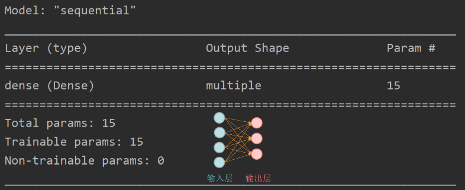

## 鸢尾花分类六步法实现

```python
# S1.导库
import tensorflow as tf
from sklearn import datasets
import numpy as np

# S2.导数据
x_train = datasets.load_iris().data
y_train = datasets.load_iris().target

# 数据集乱序
np.random.seed(116)
np.random.shuffle(x_train)
np.random.seed(116)
np.random.shuffle(y_train)
tf.random.set_seed(116)

# S3.神经网络结构
model = tf.keras.models.Sequential([
    tf.keras.layers.Dense(3, activation='softmax',
	kernel_regularizer=tf.keras.regularizers.l2())
])

# S4.配置优化器/损失函数/准确率评测指标
model.compile(optimizer=tf.keras.optimizers.SGD(lr=0.1), 
              loss=tf.keras.losses.SparseCategoricalCrossentropy(from_logits=False),
              metrics=['sparse_categorical_accuracy'])
# S5.执行训练
model.fit(x_train, y_train, batch_size=32, epochs=500,
          validation_split=0.2, validation_freq=20)

# S6.打印网络结构和参数统计
model.summary()
```

## 非顺序神经网络结构搭建

使用 Sequential 可以快速搭建网络结构，但是如果网络包含跳连等其他复杂网络结构，Sequential 就无法表示了。这就需要使用 class 来声明网络结构。

\__init__( ) 定义所需网络结构块

call( ) 写出前向传播

```python
import tensorflow as tf
from tensorflow.keras.layers import Dense
from tensorflow.keras import Model
from sklearn import datasets
import numpy as np

x_train = datasets.load_iris().data
y_train = datasets.load_iris().target

np.random.seed(116)
np.random.shuffle(x_train)
np.random.seed(116)
np.random.shuffle(y_train)
tf.random.set_seed(116)

class IrisModel(Model):
    def __init__(self): # 实例化一个类时会自动调用__init__方法
        super(IrisModel, self).__init__()   # super函数调用父类的方法
        self.d1 = Dense(3, activation='softmax', kernel_regularizer=tf.keras.regularizers.l2())

    def call(self, x):  # call函数中实现前向传播,override
        y = self.d1(x)  # ?self.d1(x)为什么是函数
        return y

model = IrisModel() # ?实例化后call函数自动调用了吗?

model.compile(optimizer=tf.keras.optimizers.SGD(lr=0.1),
              loss=tf.keras.losses.SparseCategoricalCrossentropy(from_logits=False),
              metrics=['sparse_categorical_accuracy'])

model.fit(x_train, y_train, batch_size=32, epochs=500, validation_split=0.2, validation_freq=20)
model.summary()
```

### 手写数字识别

```python
import tensorflow as tf

mnist = tf.keras.datasets.mnist
(x_train, y_train), (x_test, y_test) = mnist.load_data()
x_train, x_test = x_train / 255.0, x_test / 255.0	# x_train.shape为(60000,28,28)

model = tf.keras.models.Sequential([
    tf.keras.layers.Flatten(),	# 将输入层拉直
    tf.keras.layers.Dense(128, activation='relu'),
    tf.keras.layers.Dense(10, activation='softmax')
])

model.compile(optimizer='adam',
              loss=tf.keras.losses.SparseCategoricalCrossentropy(from_logits=False),
              metrics=['sparse_categorical_accuracy'])

model.fit(x_train, y_train, batch_size=32, epochs=5, validation_data=(x_test, y_test), validation_freq=1)
model.summary()
```

class方式实现

```python
import tensorflow as tf
from tensorflow.keras.layers import Dense, Flatten
from tensorflow.keras import Model

mnist = tf.keras.datasets.mnist
(x_train, y_train), (x_test, y_test) = mnist.load_data()
x_train, x_test = x_train / 255.0, x_test / 255.0


class MnistModel(Model):
    def __init__(self):
        super(MnistModel, self).__init__()
        self.flatten = Flatten()
        self.d1 = Dense(128, activation='relu')
        self.d2 = Dense(10, activation='softmax')

    def call(self, x):
        x = self.flatten(x)
        x = self.d1(x)
        y = self.d2(x)
        return y


model = MnistModel()

model.compile(optimizer='adam',
              loss=tf.keras.losses.SparseCategoricalCrossentropy(from_logits=False),
              metrics=['sparse_categorical_accuracy'])

model.fit(x_train, y_train, batch_size=32, epochs=5, validation_data=(x_test, y_test), validation_freq=1)
model.summary()
```

# 第4讲 神经网络八股功能扩展

## 自制数据集

读取原文件并保存层可以直接读取的待训练数据

```python
import tensorflow as tf
from PIL import Image
import numpy as np
import os

train_path = './mnist_image_label/mnist_train_jpg_60000/'
train_txt = './mnist_image_label/mnist_train_jpg_60000.txt'
x_train_savepath = './mnist_image_label/mnist_x_train.npy'
y_train_savepath = './mnist_image_label/mnist_y_train.npy'

test_path = './mnist_image_label/mnist_test_jpg_10000/'
test_txt = './mnist_image_label/mnist_test_jpg_10000.txt'
x_test_savepath = './mnist_image_label/mnist_x_test.npy'
y_test_savepath = './mnist_image_label/mnist_y_test.npy'


def generateds(path, txt):
    f = open(txt, 'r')  # 以只读形式打开txt文件
    contents = f.readlines()  # 读取文件中所有行
    f.close()  # 关闭txt文件
    x, y_ = [], []  # 建立空列表
    for content in contents:  # 逐行取出
        value = content.split()  # 以空格分开，图片路径为value[0] , 标签为value[1] , 存入列表
        img_path = path + value[0]  # 拼出图片路径和文件名
        img = Image.open(img_path)  # 读入图片
        img = np.array(img.convert('L'))  # 图片变为8位宽灰度值的np.array格式
        img = img / 255.  # 数据归一化 （实现预处理）
        x.append(img)  # 归一化后的数据，贴到列表x
        y_.append(value[1])  # 标签贴到列表y_
        print('loading : ' + content)  # 打印状态提示

    x = np.array(x)  # 变为np.array格式
    y_ = np.array(y_)  # 变为np.array格式
    y_ = y_.astype(np.int64)  # 变为64位整型
    return x, y_  # 返回输入特征x，返回标签y_


if os.path.exists(x_train_savepath) and os.path.exists(y_train_savepath) and os.path.exists(
        x_test_savepath) and os.path.exists(y_test_savepath):
    print('-------------Load Datasets-----------------')
    x_train_save = np.load(x_train_savepath)
    y_train = np.load(y_train_savepath)
    x_test_save = np.load(x_test_savepath)
    y_test = np.load(y_test_savepath)
    x_train = np.reshape(x_train_save, (len(x_train_save), 28, 28))
    x_test = np.reshape(x_test_save, (len(x_test_save), 28, 28))
else:
    print('-------------Generate Datasets-----------------')
    x_train, y_train = generateds(train_path, train_txt)
    x_test, y_test = generateds(test_path, test_txt)

    print('-------------Save Datasets-----------------')
    x_train_save = np.reshape(x_train, (len(x_train), -1))
    x_test_save = np.reshape(x_test, (len(x_test), -1))
    np.save(x_train_savepath, x_train_save)
    np.save(y_train_savepath, y_train)
    np.save(x_test_savepath, x_test_save)
    np.save(y_test_savepath, y_test)

model = tf.keras.models.Sequential([
    tf.keras.layers.Flatten(),
    tf.keras.layers.Dense(128, activation='relu'),
    tf.keras.layers.Dense(10, activation='softmax')
])

model.compile(optimizer='adam',
              loss=tf.keras.losses.SparseCategoricalCrossentropy(from_logits=False),
              metrics=['sparse_categorical_accuracy'])

model.fit(x_train, y_train, batch_size=32, epochs=5, validation_data=(x_test, y_test), validation_freq=1)
model.summary()
```

## 数据增强(增大数据量)

```
image_gen_train = tf.keras.preprocessing.image.ImageDataGenerator(
		rescale = 所有数据将乘以该数值
		rotation_range = 随机旋转角度数范围 
		width_shift_range = 随机宽度偏移量 
		height_shift_range = 随机高度偏移量 
		水平翻转：horizontal_flip = 是否随机水平翻转 
		随机缩放：zoom_range = 随机缩放的范围 [1-n，1+n] )
image_gen_train.fit(x_train)
```


```python
# 显示原始图像和增强后的图像
import tensorflow as tf
from matplotlib import pyplot as plt
from tensorflow.keras.preprocessing.image import ImageDataGenerator
import numpy as np

mnist = tf.keras.datasets.mnist
(x_train, y_train), (x_test, y_test) = mnist.load_data()
x_train = x_train.reshape(x_train.shape[0], 28, 28, 1)

image_gen_train = ImageDataGenerator(
    rescale=1. / 255,
    rotation_range=45,
    width_shift_range=.15,
    height_shift_range=.15,
    horizontal_flip=False,
    zoom_range=0.5
)
image_gen_train.fit(x_train)
print("xtrain",x_train.shape)
x_train_subset1 = np.squeeze(x_train[:12])
print("xtrain_subset1",x_train_subset1.shape)
print("xtrain",x_train.shape)
x_train_subset2 = x_train[:12]  # 一次显示12张图片
print("xtrain_subset2",x_train_subset2.shape)

fig = plt.figure(figsize=(20, 2))
plt.set_cmap('gray')
# 显示原始图片
for i in range(0, len(x_train_subset1)):
    ax = fig.add_subplot(1, 12, i + 1)
    ax.imshow(x_train_subset1[i])
fig.suptitle('Subset of Original Training Images', fontsize=20)
plt.show()

# 显示增强后的图片
fig = plt.figure(figsize=(20, 2))
for x_batch in image_gen_train.flow(x_train_subset2, batch_size=12, shuffle=False):
    for i in range(0, 12):
        ax = fig.add_subplot(1, 12, i + 1)
        ax.imshow(np.squeeze(x_batch[i]))
    fig.suptitle('Augmented Images', fontsize=20)
    plt.show()
    break;
```

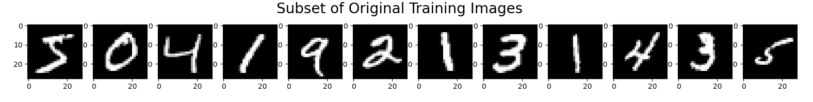

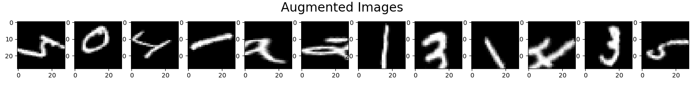

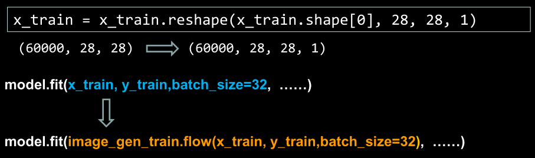

```python
import tensorflow as tf
from tensorflow.keras.preprocessing.image import ImageDataGenerator

mnist = tf.keras.datasets.mnist
(x_train, y_train), (x_test, y_test) = mnist.load_data()
x_train, x_test = x_train / 255.0, x_test / 255.0
x_train = x_train.reshape(x_train.shape[0], 28, 28, 1)  # 给数据增加一个维度,从(60000, 28, 28)reshape为(60000, 28, 28, 1)

image_gen_train = ImageDataGenerator(
    rescale=1. / 1.,  # 如为图像，分母为255时，可归至0～1
    rotation_range=45,  # 随机45度旋转
    width_shift_range=.15,  # 宽度偏移
    height_shift_range=.15,  # 高度偏移
    horizontal_flip=False,  # 水平翻转
    zoom_range=0.5  # 将图像随机缩放阈量50％
)
image_gen_train.fit(x_train)

model = tf.keras.models.Sequential([
    tf.keras.layers.Flatten(),
    tf.keras.layers.Dense(128, activation='relu'),
    tf.keras.layers.Dense(10, activation='softmax')
])

model.compile(optimizer='adam',
              loss=tf.keras.losses.SparseCategoricalCrossentropy(from_logits=False),
              metrics=['sparse_categorical_accuracy'])

model.fit(image_gen_train.flow(x_train, y_train, batch_size=32), epochs=5, validation_data=(x_test, y_test),
          validation_freq=1)
model.summary()
```

## 断点续训,存取模型

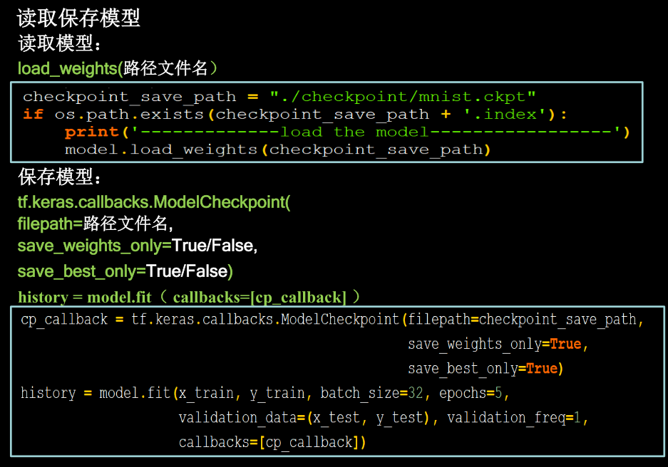

```python
import tensorflow as tf
import os

mnist = tf.keras.datasets.mnist
(x_train, y_train), (x_test, y_test) = mnist.load_data()
x_train, x_test = x_train / 255.0, x_test / 255.0

model = tf.keras.models.Sequential([
    tf.keras.layers.Flatten(),
    tf.keras.layers.Dense(128, activation='relu'),
    tf.keras.layers.Dense(10, activation='softmax')
])

model.compile(optimizer='adam',
              loss=tf.keras.losses.SparseCategoricalCrossentropy(from_logits=False),
              metrics=['sparse_categorical_accuracy'])

checkpoint_save_path = "./checkpoint/mnist.ckpt"
if os.path.exists(checkpoint_save_path + '.index'):
    print('-------------load the model-----------------')
    model.load_weights(checkpoint_save_path)

cp_callback = tf.keras.callbacks.ModelCheckpoint(filepath=checkpoint_save_path,
                                                 save_weights_only=True,
                                                 save_best_only=True)

history = model.fit(x_train, y_train, batch_size=32, epochs=5, validation_data=(x_test, y_test), validation_freq=1,
                    callbacks=[cp_callback])
model.summary()
```

## 提取可训练参数,写入文本

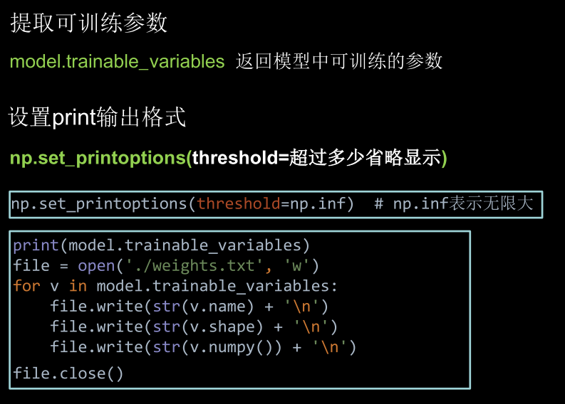

```python
import tensorflow as tf
import os
import numpy as np
np.set_printoptions(threshold=np.inf)
mnist = tf.keras.datasets.mnist
(x_train, y_train), (x_test, y_test) = mnist.load_data()
x_train, x_test = x_train / 255.0, x_test / 255.0
model = tf.keras.models.Sequential([
    tf.keras.layers.Flatten(),
    tf.keras.layers.Dense(128, activation='relu'),
    tf.keras.layers.Dense(10, activation='softmax')
])
model.compile(optimizer='adam',
              loss=tf.keras.losses.SparseCategoricalCrossentropy(from_logits=False),
              metrics=['sparse_categorical_accuracy'])
checkpoint_save_path = "./checkpoint/mnist.ckpt"
if os.path.exists(checkpoint_save_path + '.index'):
    print('-------------load the model-----------------')
    model.load_weights(checkpoint_save_path)
cp_callback = tf.keras.callbacks.ModelCheckpoint(filepath=checkpoint_save_path,
                                                 save_weights_only=True,
                                                 save_best_only=True)
history = model.fit(x_train, y_train, batch_size=32, epochs=5, validation_data=(x_test, y_test), validation_freq=1,
                    callbacks=[cp_callback])
model.summary()
print(model.trainable_variables)
file = open('./weights.txt', 'w')
for v in model.trainable_variables:
    file.write(str(v.name) + '\n')
    file.write(str(v.shape) + '\n')
    file.write(str(v.numpy()) + '\n')
file.close()
```

## acc/loss可视化,查看训练效果

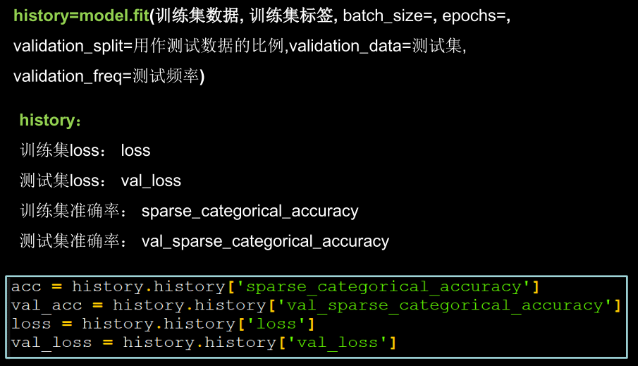

```python
import tensorflow as tf
import os
import numpy as np
from matplotlib import pyplot as plt

np.set_printoptions(threshold=np.inf)

mnist = tf.keras.datasets.mnist
(x_train, y_train), (x_test, y_test) = mnist.load_data()
x_train, x_test = x_train / 255.0, x_test / 255.0

model = tf.keras.models.Sequential([
    tf.keras.layers.Flatten(),
    tf.keras.layers.Dense(128, activation='relu'),
    tf.keras.layers.Dense(10, activation='softmax')
])

model.compile(optimizer='adam',
              loss=tf.keras.losses.SparseCategoricalCrossentropy(from_logits=False),
              metrics=['sparse_categorical_accuracy'])

checkpoint_save_path = "./checkpoint/mnist.ckpt"
if os.path.exists(checkpoint_save_path + '.index'):
    print('-------------load the model-----------------')
    model.load_weights(checkpoint_save_path)

cp_callback = tf.keras.callbacks.ModelCheckpoint(filepath=checkpoint_save_path,
                                                 save_weights_only=True,
                                                 save_best_only=True)

history = model.fit(x_train, y_train, batch_size=32, epochs=5, validation_data=(x_test, y_test), validation_freq=1,
                    callbacks=[cp_callback])
model.summary()

print(model.trainable_variables)
file = open('./weights.txt', 'w')
for v in model.trainable_variables:
    file.write(str(v.name) + '\n')
    file.write(str(v.shape) + '\n')
    file.write(str(v.numpy()) + '\n')
file.close()

###############################################    show   ###############################################

# 显示训练集和验证集的acc和loss曲线
acc = history.history['sparse_categorical_accuracy']
val_acc = history.history['val_sparse_categorical_accuracy']
loss = history.history['loss']
val_loss = history.history['val_loss']

plt.subplot(1, 2, 1)
plt.plot(acc, label='Training Accuracy')
plt.plot(val_acc, label='Validation Accuracy')
plt.title('Training and Validation Accuracy')
plt.legend()

plt.subplot(1, 2, 2)
plt.plot(loss, label='Training Loss')
plt.plot(val_loss, label='Validation Loss')
plt.title('Training and Validation Loss')
plt.legend()
plt.show()
```

## 输入图片,识别数字应用

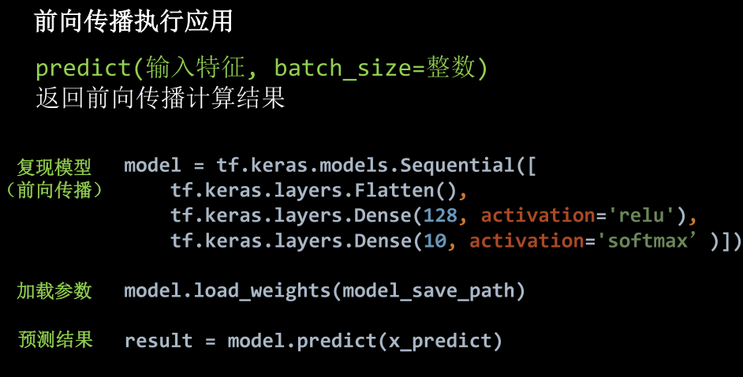

```python
from PIL import Image
import numpy as np
import tensorflow as tf

model_save_path = './checkpoint/mnist.ckpt'

model = tf.keras.models.Sequential([
    tf.keras.layers.Flatten(),
    tf.keras.layers.Dense(128, activation='relu'),
    tf.keras.layers.Dense(10, activation='softmax')])
    
model.load_weights(model_save_path)

preNum = int(input("input the number of test pictures:"))

for i in range(preNum):
    image_path = input("the path of test picture:")
    img = Image.open(image_path)
    img = img.resize((28, 28), Image.ANTIALIAS)
    img_arr = np.array(img.convert('L'))

    img_arr = 255 - img_arr
                
    img_arr = img_arr / 255.0
    print("img_arr:",img_arr.shape)
    x_predict = img_arr[tf.newaxis, ...]
    print("x_predict:",x_predict.shape)
    result = model.predict(x_predict)
    
    pred = tf.argmax(result, axis=1)
    
    print('\n')
    tf.print(pred)
```

# 第5讲 CNN

