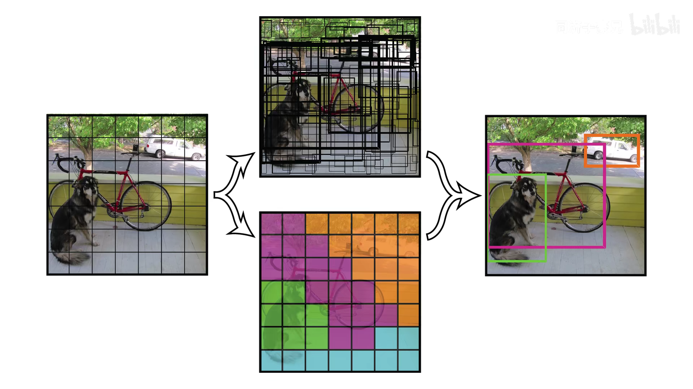
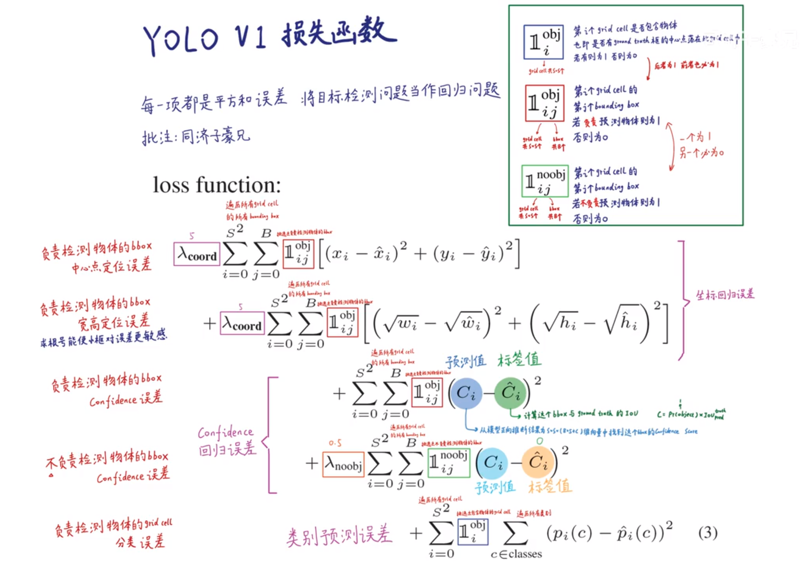
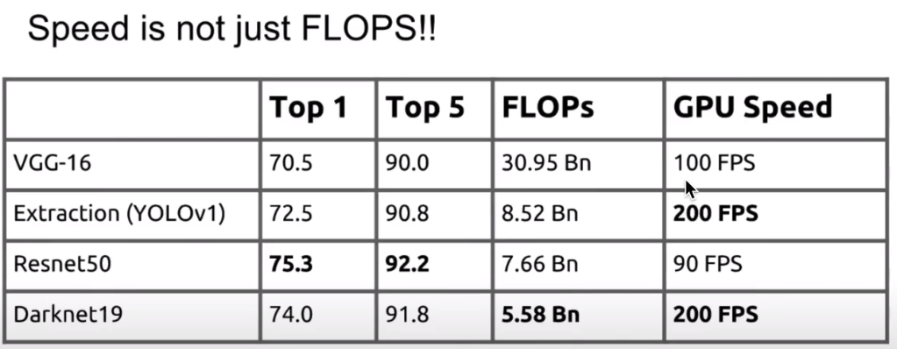
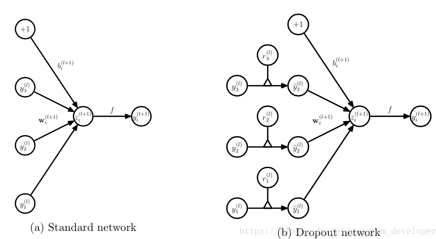

# 目标检测综述

## CV问题分类

- 分类
- 目标检测：分类+定位
- 分割：分类+抠图
  - 语义分割：只分割类别
  - 实例分割：既分割类别，又分割实例

目标检测和实例分割实现了实例级别的对象识别


## 目标检测发展


单阶段目标检测：直接把图像喂入神经网络，输出目标检测的结果

两阶段目标检测：先提取候选框，再对候选框逐一甄别（使用CNN或其他方法），特点：准确率较高，速度慢，对于背景识别的错误率较高

# YOLOV1

对与YOLOV1的理解需要关注几个东西：

**1.网络输出7\*7\*30的张量(预测阶段)**

7\*7：grid cell

5+5：2个bounding box的x、y、w、h、c

20：20个类别的条件类别概率，(假设该grid cell预测物体的条件下，分别时各个类别的概率)

**2.网络输出后处理(预测阶段后处理)**

网络输出后处理将网络输出7\*7\*30的张量处理成最后需要的结果

**先筛除置信度低(==置信度阈值==)的bbox，再筛除重复预测同一物体(==IOU阈值==)的bbox**

> 1.两个bbox的置信度分别乘以20个条件类别概率，得到20个类别的实际概率，49个grid cell得到98×20的张量
>
> 2.对于类别为狗而言，**将置信度小于某个阈值的概率全部抹零**，并从高到低排序
>
> 3.NMS：先看概率最高的，依次比较该bbox(1)与其他概率不为0的bbox(2)的IOU，**如果该IOU大于某阈值**，则认为这两个bbox重复识别同一对象，将bbox(2)概率抹零。
>
> 4.NMS：再看概率第二高的，重复上述步骤，知道全部比完，于是得到狗这个类别的所有bbox
>
> 5.对其他类别重复步骤3-5，于是得到所有类别的bbox

**3.损失函数(训练阶段)**

定义适当的损失函数让网络最终收敛于我们想要的输出结果，这里的损失包括三个方面

1.bbox位置误差

2.置信度误差(包括负责检测物体bbox的置信度误差和不负责检测物体bbox的置信度误差)

3.分类误差

## 预测阶段


将图片分成7*7的网格


每个网格预测两个


每个grid cell生成20个类别的条件概率





## 预测阶段后处理

本阶段做的就是将预测的98个预测框进行处理、过滤（去掉低置信度的框和重复的框），得到最终的预测结果


NMS:


## 训练阶段

与ground truth IOU大的框负责拟合实际框


### loss




### 置信度

对于**置信度**的理解：

还存在一个很关键的问题：在训练中我们挑选哪个bounding box的准则是选择预测的box与ground truth box的IOU最大的bounding box做为最优的box，但是在预测中并没有ground truth box，怎么才能挑选最优的bounding box呢？这就需要另外的参数了，那就是下面要说到的置信度。

置信度是每个bounding box输出的其中一个重要参数，作者对他的**作用定义有两重**：
**一重是**：**代表当前box是否有对象的概率$P_{r}(Object)$**，注意，是对象，不是某个类别的对象，也就是说它用来说明当前box内只是个背景（backgroud）还是有某个物体（对象）；
**另一重**：**表示当前的box有对象时，它自己预测的box与物体真实的box可能的$ IOU_{pred}^{truth}$的值**，注意，这里所说的物体真实的box实际是不存在的，这只是模型表达自己框出了物体的自信程度。
以上所述，也就不难理解作者为什么将其称之为置信度了，因为不管哪重含义，都表示一种自信程度：框出的box内确实有物体的自信程度和框出的box将整个物体的所有特征都包括进来的自信程度。经过以上的解释，其实我们也就可以用数学形式表示置信度的定义了：


其中，$C_{i}^{j}$表示第i个grid cell的第j个bounding box的置信度。

那么如何训练$C_{i}^{j}$？

> 训练中 $\hat C_{i}^{j}$表示真实值，$\hat C_{i}^{j}$的取值是由grid cell的bounding box有没有负责预测某个对象决定的。如果负责，那么$\hat C_{i}^{j}=1$，否则，$\hat C_{i}^{j}=0$。
> 下面我们来说明如何确定某个grid cell的bounding box是否负责预测该grid cell中的对象：前面在说明anchor box的时候提到每个bounding box负责预测的形状是依据与其对应的anchor box（bounding box prior）相关的，那这个anchor box与该对象的ground truth box的IOU在所有的anchor box（与一个grid cell中所有bounding box对应，COCO数据集中是9个）与ground truth box的IOU中最大，那它就负责预测这个对象，因为这个形状、尺寸最符合当前这个对象，这时$\hat C_{i}^{j}=1$，其他情况下$\hat C_{i}^{j}=0$。注意，你没有看错，就是所有anchor box与某个ground truth box的IOU最大的那个anchor box对应的bounding box负责预测该对象，与该bounding box预测的box没有关系。

# YOLOV2


## Better---BN

批标准化：将神经元的输出减去均值，再除以标准差


## Better---高分辨率分类器


## Better---Anchor

YOLOV1中的bounding box时野蛮生长的，YOLOV2每一个grid cell事先指定5中不同大小的先验框，与ground truth IOU最大的框预测物体，并且只需要预测ground truth与该先验框的偏移量，通过聚类选Anchor。Anchor指的就是事先制定长宽的若干个先验框


YOLOV2的loss：


## Better---细粒度特征

整合不同尺度特征，整合底层细粒度特征和高层语义特征


## Better---Mulit-scale training

全局平均池化，使模型结构不变时，输出不同尺度图像，输出相同


## Faster---Darknet-19

改进了网络，没有全连接层，全部用卷积，减少了参数量和计算量



注：图中FLOPs：

FLOPS：注意全大写，是floating point operations per second的缩写，意指每秒浮点运算次数，理解为计算速度。是一个衡量硬件性能的指标。

**FLOPs**：注意s小写，是floating point operations的缩写（s表复数），意指浮点运算数，理解为**计算量**。可以用来**衡量算法/模型的复杂度**。

**Darknet-19**，左侧为分类模型，右侧为目标检测模型，模型经过了32倍的下采样，因此输入像素必须为32的倍数，另外为了最后得到的特征图有一个实际中心点，即输出的feature map为奇数，所以这里输入为416\*416


## 补充：为什么现在都是小的卷积核

有两个方面的考虑：

1.在获取同样感受野的情况下，多次重复使用小卷积核比只使用大卷积核的参数量更少

2.多次卷积可以假如更多的BN层、非线性变换，效果更好，特征提取结果约细致


# YOLOV3

改进：多尺度输出、Anchor增加到9种

## Backbone---Darknet-53

骨干网络的作用非常重要，目标检测、语义分割等都是以**骨干网络提取的特征**处理后得到的

conv层不需要固定输入，输入不同尺度的图片后，conv层输出不同尺度的feature map，通道数相同。而全连接层需要把feature map拉直，因此不能处理不同尺度的输入。为了使CNN网络能处理不同尺度的输入，而不需要给图片做cut(剪裁)或wrap(变形)等预处理，使网络输入图片的尺寸相同，可以在conv的最后一层加一个**全局平均池化层(GAP)**，使得网络具有相同尺度的输出，最后的输出与输入通道数相同。

> 注：卷积的输出通道数取决于卷积核个数，池化的输出通道数与输入通道数相同


骨干网络对比：


## 网络结构

输入416\*416\*3，输出三种尺度的feature map，每个尺度的输出对应3个Anchor，每个Anchor包含位置信息\*4，置信度信息\*1，条件概率\*80(80个类别)，共计3\*(4+1+80)=255，13\*13\*255的feature map感受野为32，负责预测大目标，52\*52\*255的feature map感受野为8，负责预测小目标

深度学习不同层学习到的信息不同，浅层网络学到的是边缘、形状、转角、斑块、颜色等底层信息，高层网络学习到的是，纹理、眼睛、腿、车轱辘等抽象特化的语义信息，YOLOV3通过不同层次特征融合实现了多尺度信息的融合

用stride为2的卷积代替池化效果更好


backbone：特征提取

增加了残差连接

neck：特征融合(上采样)


YOLOV3网络输出：

三种尺度，分别下采样8倍、16倍、32倍

每个尺度3个先验框，每一个都包含x、y、w、h、c及80个条件类别概率（**这里为什么不像yolov1一样由grid cell来分担条件类别概率，而是由三个先验框各自都有80个条件类别概率呢？yolov1输出是2\*(4+1)+20）**


## anchor

yolov2中的5个先验框都是在一个grid cell上，而yolov5有三种尺度的输出，每种分配3个Anchor


## softmax层替代

softmax只适用于一个对象分配一个标签的分类场景，不适用于一个对象分配多个标签(比如一个人既是一个男人，又是一个学生)

**所以到底改进了啥？**


## 损失函数


## 训练过程


## 测试过程


# YOLOV4

## V4贡献


## 数据增强---mosaic

马赛克数据增强

变相增加了batchsize，丰富了图片背景


## dropblock

### dropout

https://blog.csdn.net/program_developer/article/details/80737724

Dropout可以比较有效的缓解过拟合的发生，在一定程度上达到正则化的效果

Dropout说的简单一点就是：我们在前向传播的时候，让某个神经元的激活值以一定的概率p停止工作，这样可以使模型泛化性更强，因为它不会太依赖某些局部的特征


#### dropout工作流程

假设现在要训练一个标准神经网络，正常流程是这样的：我们首先把输入通过网络前向传播，然后把误差反向传播以决定如何更新参数让网络进行学习


使用dropout后是这样的：

1. 首先随机（临时）删掉网络中一半的隐藏神经元，输入输出神经元保持不变

2. 然后把输入x通过修改后的网络前向传播，然后把得到的损失结果通过修改的网络反向传播。一小批训练样本执行完这个过程后，在没有被删除的神经元上按照随机梯度下降法更新对应的参数（w，b）。

3. 然后继续重复这一过程：

   . 恢复被删掉的神经元（此时被删除的神经元保持原样，而没有被删除的神经元已经有所更新）
   . 从隐藏层神经元中随机选择一个一半大小的子集临时删除掉（备份被删除神经元的参数）。
   . 对一小批训练样本，先前向传播然后反向传播损失并根据随机梯度下降法更新参数（w，b） （没有被删除的那一部分参数得到更新，删除的神经元参数保持被删除前的结果）。

训练：



测试：

预测模型的时候，每一个神经单元的权重参数要乘以概率p。


测试阶段Dropout公式：


#### dropblock


#### label smoothing


效果：


## IOU损失

### IOU损失


### GIOU损失


### DIOU损失


### CIOU损失

yolov4实际用的时CIOU损失 

## NMS

### DIOU-NMS


### SOFT-NMS

  不直接剔除高IOU的框

## SPPNet

空间金字塔池化与全局平局池化类似，可以处理不同尺度输入，输入相同尺度

SPP：先将feature map分成若干块(4\*4,2\*2,1)，再对每个块最大池化，最后将各个输出拼接，输出(16+4+1)×feature map个数的张量


## CSPNet

跨阶段局部网络CSPNet：将输入按通道分为两块，一块保留原始操作，一块不做操作，最后将两块直接拼接concat

好处：减小计算量，精度也没下降


## CBAM

引入注意力机制SAM

一般的SAM：输入h\*w\*n，先在channel上做max pooling和average polling，输出两个h\*w\*1，将这两个在channel方向concat，再连一个conv和sigmoid，(输出h\*w\*1？)，再将输出与原输入每一个channel相乘

https://blog.csdn.net/Roaddd/article/details/114646354


## PAN

特征融合


## 激活函数


## 网络架构


# YOLOV5

YOLOV4在YOLOV3上做了一系列改动，不久后就发布了YOLOV5，YOLOV5相当于时YOLOV4的工程版，用起来很方便

## YOLOV5网络结构

YOLOV5的版本更新非常快，截止2021.10.12已经发布到6.0版本，所以下面的网络结构与最新的可能有所差异，可以下载最新的权重文件.pt，并转为.onnx文件，将文件上传到https://netron.app/查看网络结构


`python export.py --weights container_yolo/NEU-DET/yolov5s.pt`

yolov5s.yaml，模型配置文件：

```yaml
# YOLOv5 🚀 by Ultralytics, GPL-3.0 license

# Parameters
nc: 80  # number of classes
depth_multiple: 0.33  # model depth multiple
width_multiple: 0.50  # layer channel multiple
anchors:
  - [10,13, 16,30, 33,23]  # P3/8
  - [30,61, 62,45, 59,119]  # P4/16
  - [116,90, 156,198, 373,326]  # P5/32

# YOLOv5 backbone
backbone:
  # [from, number, module, args]
  # [输入层，重复次数，模块名，参数]
  # 实际重复次数需×depth_multiple
  # 实际卷积核个数需×width_multiple
  # "第*层（从0开始计算）"-P*/*“第*特征层/下采样了*倍”
  [[-1, 1, Focus, [64, 3]],  # 0-P1/2				1
   [-1, 1, Conv, [128, 3, 2]],  # 1-P2/4			2
   [-1, 3, C3, [128]],			#					3
   [-1, 1, Conv, [256, 3, 2]],  # 3-P3/8			4
   [-1, 9, C3, [256]],			#					5
   [-1, 1, Conv, [512, 3, 2]],  # 5-P4/16
   [-1, 9, C3, [512]],
   [-1, 1, Conv, [1024, 3, 2]],  # 7-P5/32
   [-1, 1, SPP, [1024, [5, 9, 13]]],
   [-1, 3, C3, [1024, False]],  # 9
  ]

# YOLOv5 head
head:
  [[-1, 1, Conv, [512, 1, 1]],
   [-1, 1, nn.Upsample, [None, 2, 'nearest']],
   [[-1, 6], 1, Concat, [1]],  # cat backbone P4
   [-1, 3, C3, [512, False]],  # 13

   [-1, 1, Conv, [256, 1, 1]],
   [-1, 1, nn.Upsample, [None, 2, 'nearest']],
   [[-1, 4], 1, Concat, [1]],  # cat backbone P3
   [-1, 3, C3, [256, False]],  # 17 (P3/8-small)

   [-1, 1, Conv, [256, 3, 2]],
   [[-1, 14], 1, Concat, [1]],  # cat head P4
   [-1, 3, C3, [512, False]],  # 20 (P4/16-medium)

   [-1, 1, Conv, [512, 3, 2]],
   [[-1, 10], 1, Concat, [1]],  # cat head P5
   [-1, 3, C3, [1024, False]],  # 23 (P5/32-large)

   [[17, 20, 23], 1, Detect, [nc, anchors]],  # Detect(P3, P4, P5)
  ]
```

### Focus模块

目的：提速


### BottleneckCSP模块


