## 数据来源

东北大学钢材缺陷数据集，包含六种缺陷，每类包含训练集295张，测试集5张，共计1800张

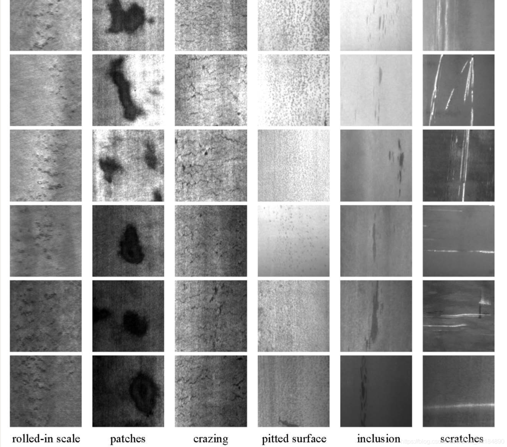

## 初次训练

先直接用yolov5x模型训练试试看，效果如下，mAP_0.5为0.807，由于样本太少，验证集的loss在60步左右就不再下降了，出现了过拟合现象

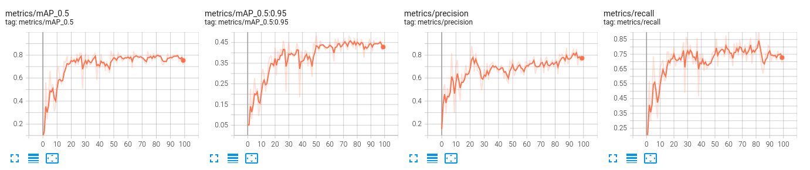

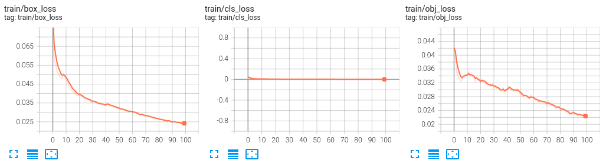

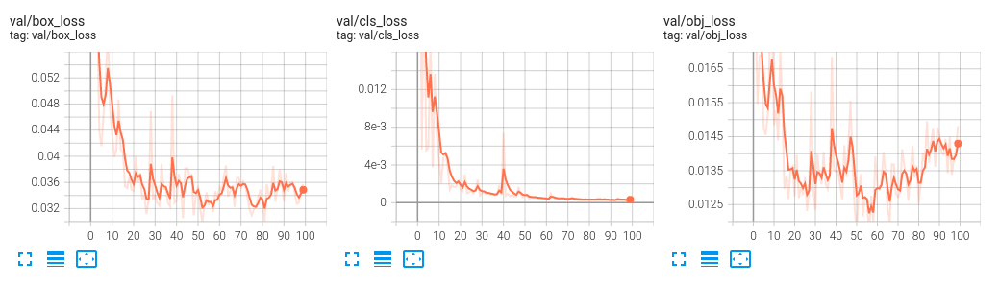

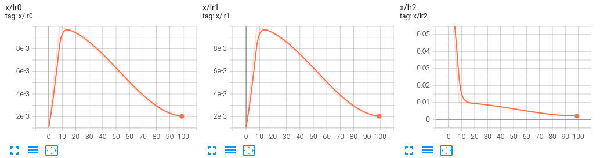

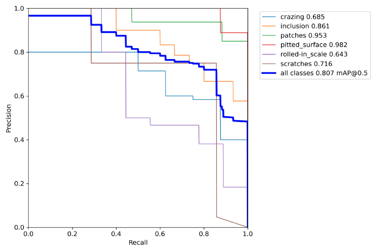

再来看一下验证集的ground truth和预测结果，对于一些区别明显的缺陷识别效果还不错(比如scratch的识别)，对于一些区别不明显的缺陷识别效果一般(比如rolled-in scale)

|  |  |
| :----------------------------------------------------------: | :----------------------------------------------------------: |

下面试试对inclusion(多类检测时AP为0.861)单个类别的检测效果怎么样，单独检测时AP值为0.91，二十多步时obj_loss就开始上升。

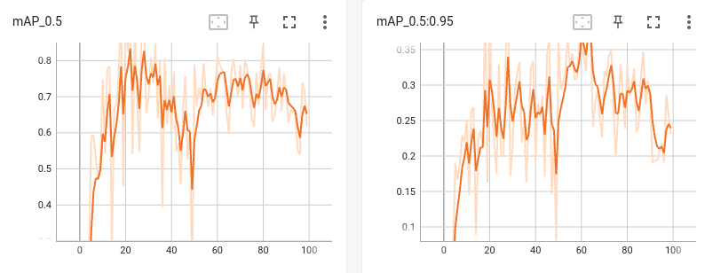

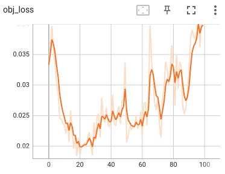

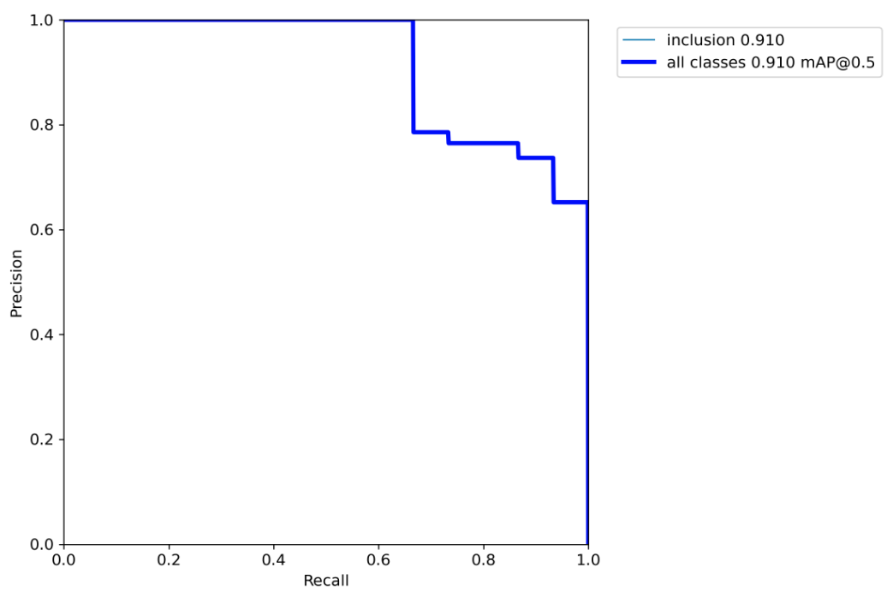

现在假设现在要达到AP>=0.85的效果，看看要多大的数据集才能做到，

训练集为295时，mAP_0.5=0.91，mAP_0.5:0.95=0.444


训练集为200时，mAP_0.5=0.91，mAP_0.5:0.95=0.504


训练集为100时，mAP_0.5=0.995，mAP_0.5:0.95=0.504

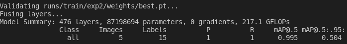

训练集越小，效果还越好了？？？看一下他数据集的划分，感觉有问题，一是验证集太少，只有5张，占比1/30；二是验证集感觉都是一种类型的，训练集有多种，如图

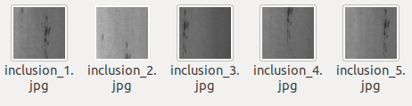

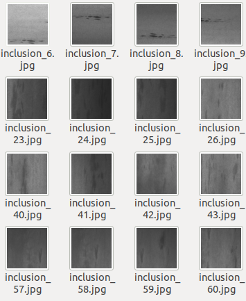

重新划分数据集，训练集270张，测试集30张

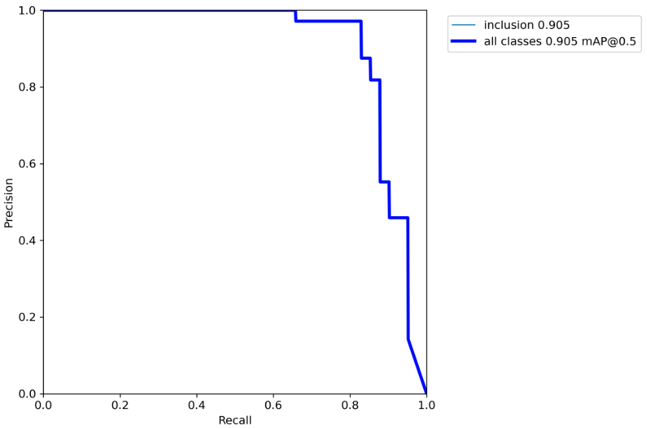

## yolov5s VS yolov5x

yolov5有几个不同大小的模型，区别在于网络的深度的宽度不同，其中v5n是yolov5 v6.0(2021.10.12发布)版本新发布的模型，大模型几乎能在所有情况下获得更好的效果，但训练时间更长，并且运行更慢。

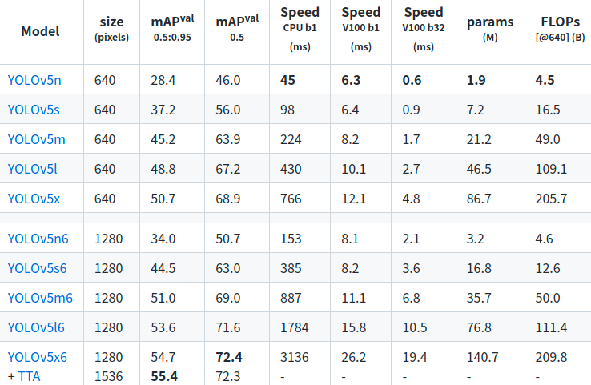

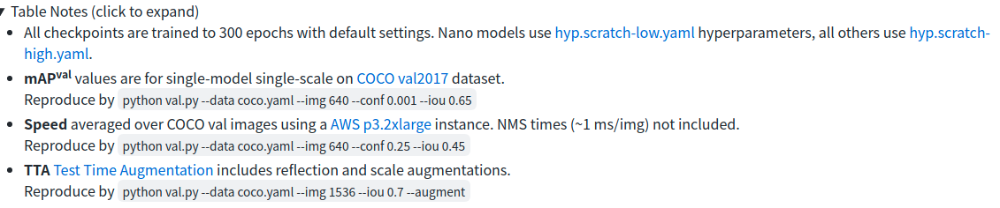

FLOPS：注意全大写，是floating point operations per second的缩写，意指每秒浮点运算次数，理解为计算速度。是一个衡量硬件性能的指标。

**FLOPs**：注意s小写，是floating point operations的缩写（s表复数），意指浮点运算数，理解为**计算量**。可以用来**衡量算法/模型的复杂度**。

### yolov5s

先用小模型v5s跑跑看

```python train.py --data /usr/src/app/container_yolo/NEU-DET/data.yaml --weights /usr/src/app/container_yolo/NEU-DET/yolov5s.pt --img 640 --epochs 100 --batch-size 32```，训练结果如下

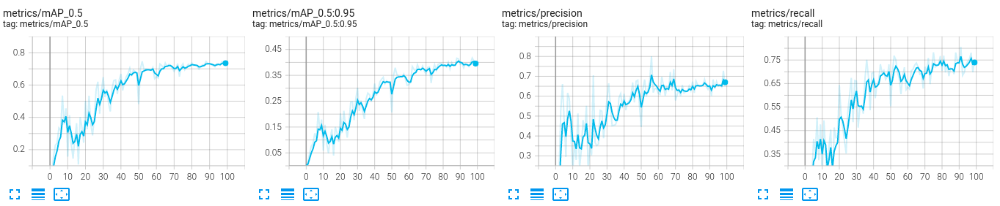

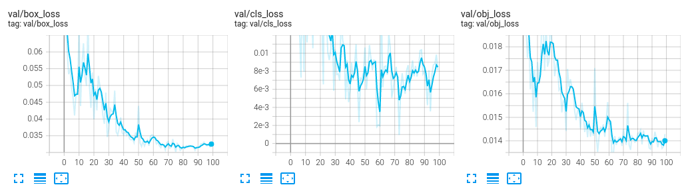

`python val.py --data container_yolo/NEU-DET/data.yaml --weights runs/train/v5s_all_new/weights/best.pt --batch-size 32`

mAP_0.5：0.745

speed：4.8ms(208FPS)

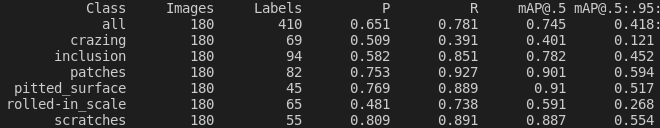

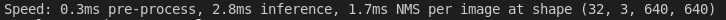

### yolov5x

再用v5x，```python train.py --data /usr/src/app/container_yolo/NEU-DET/data.yaml --weights /usr/src/app/container_yolo/NEU-DET/yolov5x.pt --img 640 --epochs 100```，batch-size为默认的16，训练结果如下，

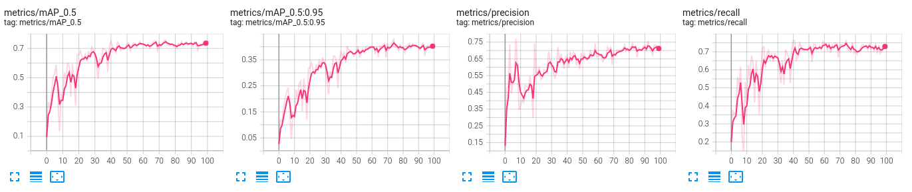

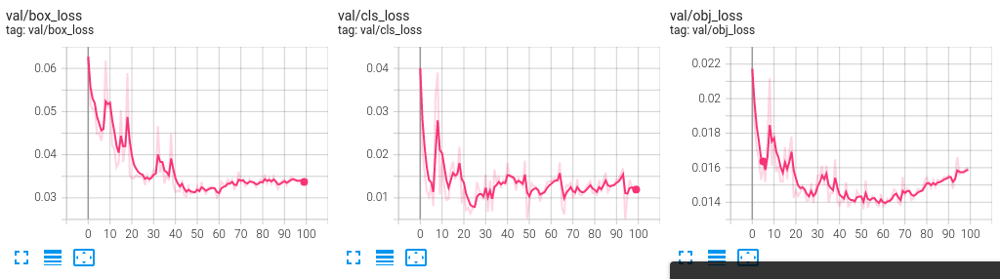

yolov5x:

`python val.py --data container_yolo/NEU-DET/data.yaml --weights runs/train/v5x_all_new/weights/best.pt --batch-size 32`

mAP_0.5：0.756

speed：16.2ms(61FPS)

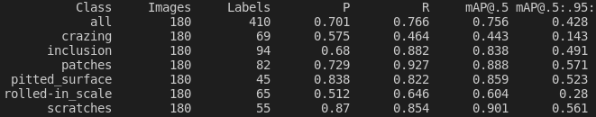

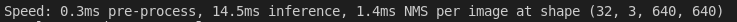

对比发现v5x的效果更好，但是精度上差距并不大(mAP_0.5相比v5s提升了0.012)，远不及coco数据集上的0.129，可能是因为钢材缺陷的数据集比较简单，不需要很复杂的模型也能达到较好的效果，而coco数据集类别多，数据复杂，需要大模型才能达到较好效果。

下面是v5x模型部分测试集结果，从结果中也可以看出对crazing(mAP为0.442)，rolled-in scale(mAP为0.605)识别效果一般，对pitted_surface(mAP为0.86)这种缺陷识别效果较好

|                         ground truth                         |                           predict                            |
| :----------------------------------------------------------: | :----------------------------------------------------------: |
| 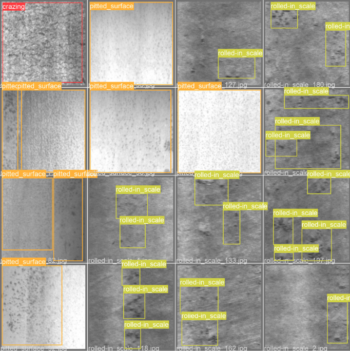 | 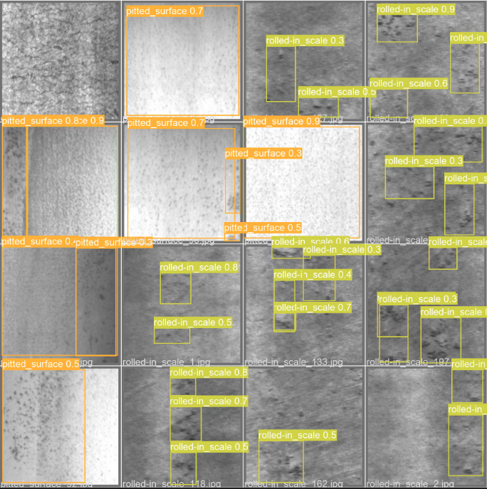 |

## 单目标检测

为了达到更好的训练效果，yolo官网对于数据集的建议时这样的：

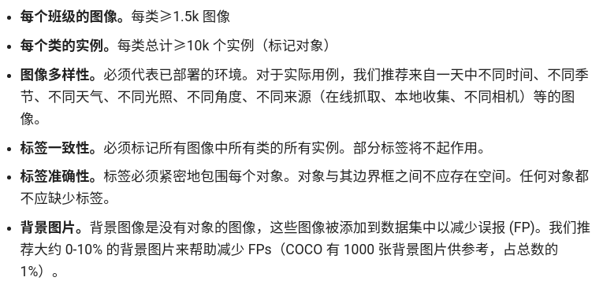

实际应用中很难采集到这么大的数据量，为了确定要多大数据集才能达到想要的训练效果，下面试试对inclusion(多类检测时AP为0.838)单个类别的检测效果怎么样，单独检测时AP值为0.857，注意进行训练时标签类别要从0开始

训练集为270，验证集为30时，

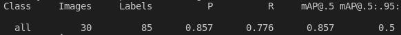

训练集为220，验证集为30时，

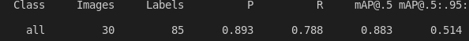

训练集为180，验证集为30时，

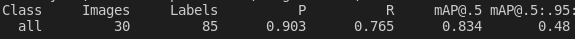

训练集为150，验证集为30时，

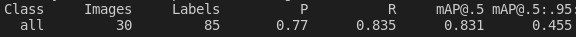

训练集为120，验证集为30时，

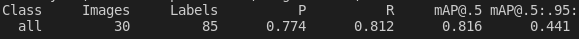

训练集为90，验证集为30时，

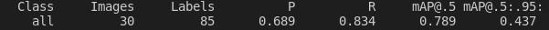

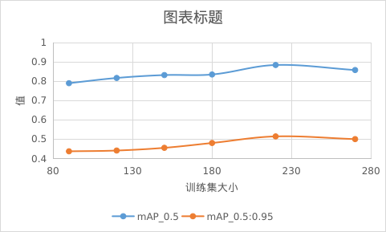

从上图中可以看到**假如对inclusion类型的缺陷做但类别的缺陷检测，mAP要达到0.8至少需要100训练集**，如果是多目标检测的话要达到这个mAP还需要更大的数据量，因为其他目标的存在也会对最终的结果产生一定影响。


训练集为220，验证集为25时，


训练集为180，验证集为20时，


训练集为150，验证集为17时，


训练集为120，验证集为13时，

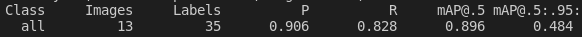

训练集为90，验证集为10时，

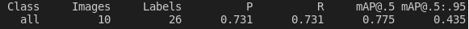


## 数据增强

数据增强可分为两类，一种是离线增强，一种是在线增强，

**离线增强直接对数据集进行处理**，数据的数目会变成增强因子 x 原数据集的数目 ，这种方法**常用于数据集很小的时候**

**在线数据**增强是指在训练过程中对图像进行各种变换**增加图像样本的多样性**，可以通过**增加迭代次数**来保证训练的图像数量增加，因为你每次迭代喂进网络的图像都是你增强后的图像，如果增强方法足够丰富，那么每次丢给网络的图像都是不一样的，即**间接增加了训练的数据量**。

yolov5中提供了13种数据增强方式，位于超参数配置文件中，只需修改配置文件即可修改数据增强设置，默认配置如下

```python
hsv_h: 0.015  # image HSV-Hue augmentation (fraction)
hsv_s: 0.7  # image HSV-Saturation augmentation (fraction)
hsv_v: 0.4  # image HSV-Value augmentation (fraction)
degrees: 0.0  # image rotation (+/- deg)
translate: 0.1  # image translation (+/- fraction)
scale: 0.5  # image scale (+/- gain)
shear: 0.0  # image shear (+/- deg)
perspective: 0.0  # image perspective (+/- fraction), range 0-0.001
flipud: 0.0  # image flip up-down (probability)
fliplr: 0.5  # image flip left-right (probability)
mosaic: 1.0  # image mosaic (probability)
mixup: 0.0  # image mixup (probability)
copy_paste: 0.0  # segment copy-paste (probability)
```

hsv---色彩、饱和度、明度增强

degrees---最大旋转角度

translate---平移(分数)

scale---缩放(最大缩放比例，值越小，最大缩放比例越小)

shear---错切

perspective---透视

flipud---上下翻转(概率)

fliplr---左右翻转(概率)

mosaic---mosaic(概率)

mosaic增强是在yolov4中被提出了的一种数据增强方式，主要思想是将四张图片进行随机裁剪，再拼接到一张图上作为训练数据。这样做的好处是**丰富了图片的背景**，并且四张图片拼接在一起，在进行batch normalization的时候也会计算四张图片，所以对本身batch_size不是很依赖，单块GPU就可以训练YOLOV4。如图

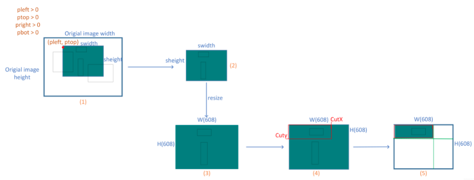

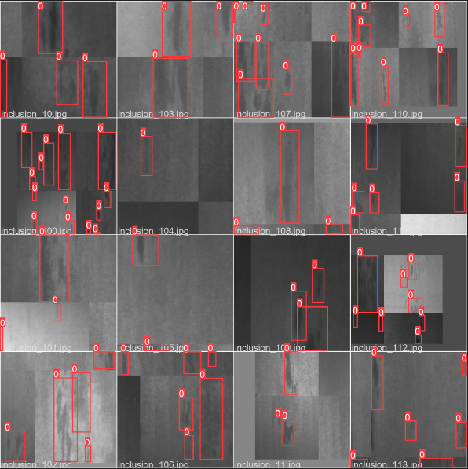

mixup---混合(概率)

copy_paste---复制粘贴部分元素(概率)

示例：

| 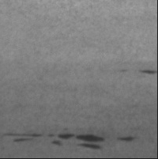 | 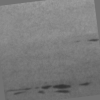 | 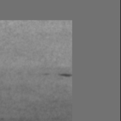 | 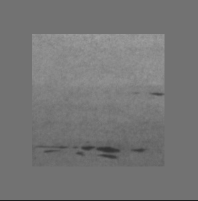 | 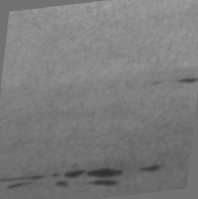 | 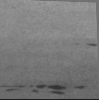 |
| :---------------------------------------------------------: | :---------------------------------------------------------: | :---------------------------------------------------------: | :---------------------------------------------------------: | :---------------------------------------------------------: | :---------------------------------------------------------: |
|                            原图                             |                          degree_10                          |                        translate_0.5                        |                          scale_0.5                          |                          shear_10                           |                      perspective_0.001                      |

先回顾一下原始效果：


aug2：

```
hsv_h: 0.015
hsv_s: 0.7
hsv_v: 0.4
degrees: 0.0
translate: 0.1
scale: 0.0
shear: 0.0
perspective: 0.0
flipud: 1.0
fliplr: 1.0
mosaic: 1.0
mixup: 0.0
copy_paste: 0.0
```


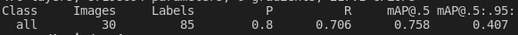

aug3：flipud: 1.0(这里是指上下翻转的概率，设为1就相当于每一个batch中所有原始数据都会被翻转)

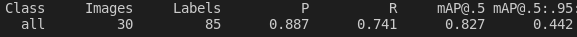

aug4：flipud: 1.0

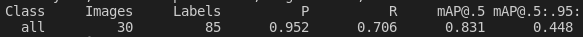

**aug5：flipud: 0.5**


aug6：flipud: 0.5、copy_paste:0.5

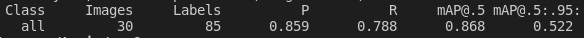

aug7：flipud: 0.5、mixup:0.5

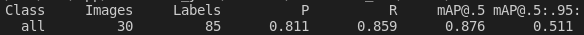

aug8：flipud: 0.5、copy_paste:0.5，epoches:200

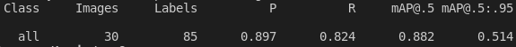

aug9：flipud: 0.5，epoches:200

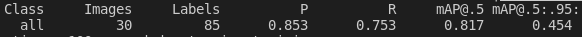

从上面的训练结果中可以看出，对于inclusion缺陷单目标检测，效果最好的是在原有数据增强的基础上加上0.5的上下反转，而其他的mixup、copy_paste等方式还起到反效果，因此数据增强还需要根据数据特点制定，比如可以针对不同的类别使用不同的增强方式，针对偏斜类使用数据增强平衡数据集，后续如果需要也可以在yolov5的代码中自己定义数据增强，把超参数设置放入对应文件。

https://kns.cnki.net/kcms/detail/detail.aspx?dbcode=CJFD&dbname=CJFDLAST2021&filename=DHKZ202101001&uniplatform=NZKPT&v=A%25mmd2Bu%25mmd2FX5sHoI3qNH8fDzejmGPVV6l6wHW%25mmd2BoumkzrSoe7ZSiiTpiI6BcVr1TLzPzkL2总结了一些小样本目标检测的方法，包括基于度量学习的 、 基于元学习的 、 基于数据增强的以及基于多模态的方法，下周可以试试其他方法。


## 迁移学习

**迁移学习(Transfer learning)** 顾名思义就是把已训练好的模型（预训练模型）参数迁移到新的模型来帮助新模型训练。考虑到大部分数据或任务都是存在相关性的，所以通过迁移学习我们可以将已经学到的模型参数（也可理解为模型学到的知识）通过某种方式来分享给新模型从而加快并优化模型的学习效率不用像大多数网络那样从零学习。

在深度学习过程中，获取数据集后，在训练自己的网络之前，用别人现有的网络进行**fine-tuning（微调）**，然后训练。在实践中，由于数据集不够大，很少有人从头开始训练网络，常见的做法是使用预训练的网络来重新fine-tuning（微调），或者当做特征提取器。fine-tuning是迁移学习的一种手段（方法）。

在微调（fine-tuning）中，需要确定冻结的层数和可训练的层数，主要取决于，**数据集相似度**和**新数据集的大小**。原则上，相似度越高，则固定（fix）的层数越多；新数据集越大，不考虑训练时间的成本，则可训练更多的层数。然后可能也要考虑数据集本身的类别间差异度，但上面说的规则基本上还是成立的。

例如，在图片分类的网络中，底层一般是颜色、轮廓、纹理等基础结构，显然大部分问题都由这些相同的基础结构组成，所以可以冻结这些层。层数越高，所具有泛化性越高，例如这些层会包含对鞋子、裙子和眼睛等，具体语义信息，比较敏感的神经元。所以，对于新的数据集，就需要训练这些较高的层。同时，比如一个高层神经元对车的轮胎较为敏感，不等于输入其它图像，就无法激活，因而，普通问题甚至可以只训练最后全连接层。

**冻结训练**的作用：当我们已有部分预训练权重，这部分预训练权重所应用的那部分网络是通用的，如骨干网络，那么我们可以先冻结这部分权重的训练，将更多的资源放在训练后面部分的网络参数，这样使得时间和资源利用都能得到很大改善。然后后面的网络参数训练一段时间之后再解冻这些被冻结的部分，这时再全部一起训练。

> 1.在预训练网络上添加自定义网络(分类器)
>
> 2.冻结基网络
>
> 3.训练添加的自定义网络
>
> 4.解冻部分基网络的一些层(此时学习率低一点，不要有太大的更新，1e-5)
>
> 5.联合训练解冻的这些层和添加的自定义网络


### 冻结骨干网络

`python train.py --data container_yolo/NEU-DET/data.yaml --weights container_yolo/NEU-DET/yolov5x.pt --epochs 100 --freeze 10`

mAP与冻结前的相比略有下降，但是训练更快，占用显存由原来的16.5G减少到7.7G，并且没有出现过拟合

冻结前：

冻结后：


训练过程对比：


增加epochs到300mAP也没有提升，并且在100步左右obj_loss开始上升


在冻结主干网络的基础上再训练50个epoch，训练效果也没有进一步提升，这里曲线震荡非常明显，是因为学习率设的太大，如果在冻结主干网络训练100轮的基础上接着训练，学习率应该减小


### 解冻并训练整个网络

将学习率减小为原来的1/3后，在冻结骨干网络训练100轮的基础上继续训练，效果果然比不改变学习率直接训练要好，这里我用的时last.pt，用best.pt应该也差不多。另外这里感觉不用warmup可能效果会更好

`python train.py --data container_yolo/NEU-DET/data.yaml --weights runs/train/v5x_all_new_freeze1_copy/weights/last.pt --epochs 50`

```
lr0: 0.01->0.003
lrf: 0.2->0.07
warmup_bias_lr: 0.1->0.03
```

训练结果：

与不冻结主干网络直接迁移相比，冻结主干网络训练100轮后再解冻联合训练50轮后mAP_0.5由0.757提升为0.77，mAP_0.5:0.95由0.429提升为0.444，并且训练过程更稳定。


减小学习率(蓝色)与不减小学习率的对比：


## 更换骨干网络

mobilenet v3


mobilenet是一个经典的轻量化骨干网络，可以将YOLOv5的骨干网络替换为mobilenet，但是预计效果不会比最新的yolov5n的效果好，毕竟yolov5n的整个网络参数量只有1.9M，骨干网络的参数量就更少，而mobilenet v3-small版本的参数量就有2.9M。

下面我打算先用mobilenet替换yolo的骨干网络试试看，对比看看速度和准确率两个指标，如果效果不好可以考虑从这些方面改进

> - 看看最新发布的一些轻量化网络，毕竟mobilenet v3是2019年的产品了，效果可能比不上最新的网络
> - 把一些网络轻量化的手段引入到yolov5中，改进yolov5的网络
> - 不用yolo，改用其他的目标检测算法，毕竟YOLO本身已经在轻量化上做的很好了，可能效果很难比它更好

（如果改了网络就没法用迁移学习，需要从头训练）

下周可能主要是看yolov5和mobilenet的网络架构和代码，看看怎么实现网络替换


### 如何更换网络

common.py：模型中用到的各个模块的具体实现

yolo.py：主要用于解析模型配置文件，搭建模型

修改yolov5的网络结构只需三步：

> 1.在common.py中定义需要用到的模块
>
> 2.在yolo.py中将模块加入模型
>
> 3.重写模型配置文件

#### 1.在common.py中定义需要用到的模块

1.在common.py中定义需要用到的模块，也就是mobilenetv3的最开始的卷积层及逆转残差模块，参照pytorch的官方实现：

官网最新版：https://hub.fastgit.org/pytorch/vision/blob/master/torchvision/models/mobilenetv3.py

查看本地安装的pytorch实现：

```python
from torchvision import models
models.mobilenet
```

具体添加代码如下：

注意这里如果所需模块要输入通道数最好将该参数放在第一个位置，因为yolo.py中的parse_model()函数可以自动计算每个模块所需的输入通道数，并作为第一个输入

```python
# MobileNetV3

from typing import Optional
from torch import Tensor
from torch.nn import functional as F

# 本函数定义在mobilenetv2.py中
def _make_divisible(v: float, divisor: int, min_value: Optional[int] = None) -> int:
    """
    This function is taken from the original tf repo.
    It ensures that all layers have a channel number that is divisible by 8
    It can be seen here:
    https://github.com/tensorflow/models/blob/master/research/slim/nets/mobilenet/mobilenet.py
    """
    if min_value is None:
        min_value = divisor
    new_v = max(min_value, int(v + divisor / 2) // divisor * divisor)
    # Make sure that round down does not go down by more than 10%.
    if new_v < 0.9 * v:
        new_v += divisor
    return new_v

# 卷积层，包含了卷积、BN、激活
class MobileNetV3_ConvBNACT(nn.Module):
    def __init__(self, in_c, out_c, kernel=3, stride=1, groups=1, act=False):
        super().__init__()
        padding = (kernel - 1) // 2
        self.conv = nn.Conv2d(in_c, out_c, kernel, stride, padding, groups=groups, bias=False)
        self.bn = nn.BatchNorm2d(out_c)
        self.act = act if isinstance(act, nn.Module) else  nn.Identity()

    def forward(self,x):
        return self.act(self.bn(self.conv(x)))

# SE模块
class MobileNetV3_SE(nn.Module):
    def __init__(self,ch_in,squeeze_factor=4):
        super().__init__()
        squeeze_channels = _make_divisible(ch_in // squeeze_factor, 8)
        self.fc1 = nn.Conv2d(ch_in, squeeze_channels, 1)
        self.relu = nn.ReLU(inplace=True)
        self.fc2 = nn.Conv2d(squeeze_channels, ch_in, 1)
    
    def _scale(self, input: Tensor, inplace: bool) -> Tensor:
        scale = F.adaptive_avg_pool2d(input, 1)# 自适应平均池化，outputsize=1*1
        scale = self.fc1(scale)
        scale = self.relu(scale)
        scale = self.fc2(scale)
        return F.hardsigmoid(scale, inplace=inplace)

    def forward(self, input: Tensor) -> Tensor:
        scale = self._scale(input, True)
        return scale * input


# bneck模块
class MobileNetV3_InvertedResidual(nn.Module):
    def __init__(self, in_c: int, out_c: int, kernel: int, expanded_c: int, use_se: bool, us_hs: bool, stride: int):
        super().__init__()
        # 检查步长
        if not (1 <= stride <= 2):# 步长只能为1或2
            raise ValueError('illegal stride value')

        # 如果步长为1且输入输出通道数相等，则代表使用残差模块
        self.use_res_connect = stride == 1 and in_c == out_c

        layers = []
        self.act = nn.Hardswish() if us_hs else nn.ReLU()

        # 如果输入通道与expand通道数不相等，则是一个完整的bneck模块(即包含1×1卷积升维层)
        # PW
        if expanded_c != in_c:
            layers.append(MobileNetV3_ConvBNACT(in_c,expanded_c,1,act=self.act))

        # DW
        layers.append(MobileNetV3_ConvBNACT(expanded_c,expanded_c,kernel,stride,expanded_c,self.act))

        # SE
        if use_se:
            layers.append(MobileNetV3_SE(expanded_c))

        # PW
        layers.append(MobileNetV3_ConvBNACT(expanded_c,out_c,1,act=False))

        self.block = nn.Sequential(*layers)

    def forward(self,x):
        y=self.block(x)
        if self.use_res_connect:
            return x+y
        else:
            return y

# mobilenetv3第一层
class MobileNetV3_FirstLayer(nn.Module):
    def __init__(self,in_c,out_c,kernel,stride):
        super().__init__()
        padding = (kernel - 1) // 2
        self.conv = nn.Conv2d(in_c, out_c, kernel, stride, padding, bias=False)
        self.bn = nn.BatchNorm2d(out_c)
        self.act = nn.Hardswish()

    def forward(self,x):
        return self.act(self.bn(self.conv(x)))
```

#### 2.在yolo.py中修改parse_model函数

```python
    	# 在列表中加入MobileNetV3_FirstLayer，MobileNetV3_InvertedResidual模块
        if m in [Conv, GhostConv, Bottleneck, GhostBottleneck, SPP, SPPF, DWConv, MixConv2d, Focus, CrossConv,
                 BottleneckCSP, C3, C3TR, C3SPP, C3Ghost, MobileNetV3_FirstLayer, MobileNetV3_InvertedResidual]:
            c1, c2 = ch[f], args[0]
            if c2 != no:  # if not output
                # 自定义的模块不进行宽度缩放
                if m in [MobileNetV3_FirstLayer, MobileNetV3_InvertedResidual]:
                    pass
                else:
                    c2 = make_divisible(c2 * gw, 8)
```

#### 3.修改模型配置文件

新建一个配置文件，取名为mobilenetv3small_yolo5s.yaml，根据mobilenetv3的网络结构进行配置

mobilenetv3-small的网络结构如下：


模型配置文件中参数的意义如下：

[from, number, module, args]

from：本模块的输入是哪一层，索引从0开始，参数-1表示直接连接上一层

number：本模块重复多少次

mudule：模块名，需要与common.py中定义的模块名保持一致

args：本模块需要传入的参数，这些参数具体什么意思看common.py中各模块的具体实现及yolo.py中parse_model()函数

```yaml
# YOLOv5 🚀 by Ultralytics, GPL-3.0 license

# Parameters
nc: 80  # number of classes
depth_multiple: 0.33  # model depth multiple
width_multiple: 0.50  # layer channel multiple
anchors:
  - [10,13, 16,30, 33,23]  # P3/8
  - [30,61, 62,45, 59,119]  # P4/16
  - [116,90, 156,198, 373,326]  # P5/32


# YOLOv5 backbone
backbone:
  # [from, number, module, args] # "第*层（从0开始计算）"-P*/*“第*特征层/下采样了*倍
  [[-1, 1, MobileNetV3_FirstLayer, [16, 3, 2]],  # 0-P1/2
   [-1, 1, MobileNetV3_InvertedResidual, [16, 3, 16, 1, 0, 2]],  # 1-P2/4
   [-1, 1, MobileNetV3_InvertedResidual, [24, 3, 72, 0, 0, 2]],  # 2-P3/8
   [-1, 1, MobileNetV3_InvertedResidual, [24, 3, 88, 0, 0, 1]],  # 3-P3/8
   [-1, 1, MobileNetV3_InvertedResidual, [40, 5, 96, 1, 1, 2]],  # 4-P4/16
   [-1, 1, MobileNetV3_InvertedResidual, [40, 5, 240, 1, 1, 1]],
   [-1, 1, MobileNetV3_InvertedResidual, [40, 5, 240, 1, 1, 1]],
   [-1, 1, MobileNetV3_InvertedResidual, [48, 5, 120, 1, 1, 1]],
   [-1, 1, MobileNetV3_InvertedResidual, [48, 5, 144, 1, 1, 1]],  # 8-P4/16
   [-1, 1, MobileNetV3_InvertedResidual, [96, 5, 288, 1, 1, 2]],  # 9-P5/32
   [-1, 1, MobileNetV3_InvertedResidual, [96, 5, 576, 1, 1, 1]],
   [-1, 1, MobileNetV3_InvertedResidual, [96, 5, 576, 1, 1, 1]],  # 11-P5/32
  ]

# YOLOv5 head
head:
  [[-1, 1, Conv, [512, 1, 1]],
   [-1, 1, nn.Upsample, [None, 2, 'nearest']],
   [[-1, 8], 1, Concat, [1]],  # cat backbone P4
   [-1, 3, C3, [512, False]],  # 15

   [-1, 1, Conv, [256, 1, 1]],
   [-1, 1, nn.Upsample, [None, 2, 'nearest']],
   [[-1, 3], 1, Concat, [1]],  # cat backbone P3
   [-1, 3, C3, [256, False]],  # 19 (P3/8-small)

   [-1, 1, Conv, [256, 3, 2]],
   [[-1, 16], 1, Concat, [1]],  # cat head P4
   [-1, 3, C3, [512, False]],  # 22 (P4/16-medium)

   [-1, 1, Conv, [512, 3, 2]],
   [[-1, 12], 1, Concat, [1]],  # cat head P5
   [-1, 3, C3, [1024, False]],  # 23 (P5/32-large)

   [[19, 22, 25], 1, Detect, [nc, anchors]],  # Detect(P3, P4, P5)
  ]
```

### 新模型训练结果

用钢材缺陷数据集对mobilenetv3small_yolo5s模型从头开始训练

`python train.py --data container_yolo/NEU-DET/data.yaml --weights '' --cfg models/mobilenetv3small_yolo5s.yaml --batch-size 32`

控制台有如下输出，说明模型修改成功了。

```

                 from  n    params  module                                  arguments                     
  0                -1  1       464  models.common.MobileNetV3_FirstLayer    [3, 16, 3, 2]                 
  1                -1  1       744  models.common.MobileNetV3_InvertedResidual[16, 16, 3, 16, 1, 0, 2]      
  2                -1  1      3864  models.common.MobileNetV3_InvertedResidual[16, 24, 3, 72, 0, 0, 2]      
  3                -1  1      5416  models.common.MobileNetV3_InvertedResidual[24, 24, 3, 88, 0, 0, 1]      
  4                -1  1     13736  models.common.MobileNetV3_InvertedResidual[24, 40, 5, 96, 1, 1, 2]      
  5                -1  1     57264  models.common.MobileNetV3_InvertedResidual[40, 40, 5, 240, 1, 1, 1]     
  6                -1  1     57264  models.common.MobileNetV3_InvertedResidual[40, 40, 5, 240, 1, 1, 1]     
  7                -1  1     21968  models.common.MobileNetV3_InvertedResidual[40, 48, 5, 120, 1, 1, 1]     
  8                -1  1     29800  models.common.MobileNetV3_InvertedResidual[48, 48, 5, 144, 1, 1, 1]     
  9                -1  1     91848  models.common.MobileNetV3_InvertedResidual[48, 96, 5, 288, 1, 1, 2]     
 10                -1  1    294096  models.common.MobileNetV3_InvertedResidual[96, 96, 5, 576, 1, 1, 1]     
 11                -1  1    294096  models.common.MobileNetV3_InvertedResidual[96, 96, 5, 576, 1, 1, 1]     
 12                -1  1     25088  models.common.Conv                      [96, 256, 1, 1]               
 13                -1  1         0  torch.nn.modules.upsampling.Upsample    [None, 2, 'nearest']          
 14           [-1, 8]  1         0  models.common.Concat                    [1]                           
 15                -1  1    308736  models.common.C3                        [304, 256, 1, False]          
 16                -1  1     33024  models.common.Conv                      [256, 128, 1, 1]              
 17                -1  1         0  torch.nn.modules.upsampling.Upsample    [None, 2, 'nearest']          
 18           [-1, 3]  1         0  models.common.Concat                    [1]                           
 19                -1  1     77568  models.common.C3                        [152, 128, 1, False]          
 20                -1  1    147712  models.common.Conv                      [128, 128, 3, 2]              
 21          [-1, 16]  1         0  models.common.Concat                    [1]                           
 22                -1  1    296448  models.common.C3                        [256, 256, 1, False]          
 23                -1  1    590336  models.common.Conv                      [256, 256, 3, 2]              
 24          [-1, 12]  1         0  models.common.Concat                    [1]                           
 25                -1  1   1182720  models.common.C3                        [512, 512, 1, False]          
 26      [19, 22, 25]  1     29667  models.yolo.Detect                      [6, [[10, 13, 16, 30, 33, 23], [30, 61, 62, 45, 59, 119], [116, 90, 156, 198, 373, 326]], [128, 256, 512]]
Model Summary: 301 layers, 3561859 parameters, 3561859 gradients, 6.3 GFLOPs
```

训练迭代过程如下：


训练结果对比：

`torchinfo`统计参数量和计算量(yolov5用的是`thop`，并且将计算量在原有基础上乘了2，应该是考虑到了反向传播的计算量，这两个库统计的计算量略有差别，但差距不大)

`python val.py --data container_yolo/NEU-DET/data.yaml --weights runs/train/mobilenetv3small_yolo5s/img640/weights/best.pt --imgsz 640`进行精度测试

`python detect.py --source container_yolo/NEU-DET/valid_new/images --weights runs/train/mobilenetv3small_yolo5s/img640/weights/best.pt --imgsz 640`进行时间测试，取5次的平均结果


参数量和计算量大大减少，但是时间反而稍有上升，这是为什么呢？

查了很多资料，其实这个现象是可以被解释的，主要是因为推理时间受到多方面因素的影响，参数量主要影响的是权重文件的大小，计算量是推理时间的一个重要影响因素，但其实推理时间还主要受到访存量，计算平台的算力、带宽的影响，这三个量是我们平时很少关注的，但都对模型的速度有深刻的印象。在知道这四个量后我们可以通过**Roof-line模型**算出模型的理论性能，从而预估推理速度！

用Roof-line模型在GTX 3090GPU上分析模型性能：

GPU理论算力：$\pi=10496*1.7*2=35686.4GFLOPS$

显存理论带宽：$\beta=19.5Ghz* 384/8 = 936GB/s$

GPU端理论计算强度上限：$I_{max}=35686/936=38.13FLOPs/Byte$ 


用torchinfo进行统计

mobilenetv3small_yolo5s模型summary：

输入imgsz=640时：

> 参数量：3761437
>
> 计算量：3.25GFLOPs
>
> 访存量：316.26MB
>
> 计算强度：3.2/0.31626=10.28FLOPs/Byte

yolov5s模型summary：

输入imgsz=640时：

> 参数量：7276605
>
> 计算量：8.48GFLOPs
>
> 访存量：442.74MB
>
> 计算强度：8.48/0.44274=19.15FLOPs/Byte

这两个模型的计算强度都小于GPU的计算强度上限，因此位于访存密集区，模型的推理速度与访存量乘正比

理论推理速度比值：$\frac{mobilenetv3small\_yolo5s}{yolov5s}=\frac{316.26}{442.74}=0.714$ 

但是mobilenetv3_yolov5s的访存量也比yolov5s要少，为什么推理时间还是要更长呢

我有两个猜想：

1.模型的推理时间还受到其他重要因素的影响，比如可能模型层数大的推理时间长，mobilenetv3_yolov5s层数为277，yolov5的层数为224

2.实际进行模型推理时硬件的算力和带宽根本达不到理论值或者用一些性能测试工具测出来的值，比如我用pytorch在CPU上进行模型推理时发现无论模型多大，输入图片尺寸多大，CPU根本无法满载，而用性能测试工具测试时CPU是满载运行的。这个貌似可以在部署时进行优化，使硬件发挥最大性能，比如因特尔推出的One API，英伟达推出的Tensor RT都可以加速神经网络的推理过程。


虽然推理时间很难通过公式准确量化，但是Roof-line模型给了我们一个参考，当我们的模型在遇到性能瓶颈的时候，可以从这几个方面去改进：

1.对于低算力平台，模型可能更容易受硬件算力限制，因此可以采用计算量低的网络来降低推理时间

2.对于高算力平台，往往更需要关注访存量

3.如何使硬件发挥全部性能也很重要

4.模型剪枝、权值量化、知识蒸馏这些是模型轻量化的常用手段

### 加载主干网络的预训练权重

**预训练权重以字典的形式储存，加载预训练权重需要做的其实就是把需要用到的各层权重更新到新模型的`model.state_dict()`**

先下载pytorch官网的预训练权重https://download.pytorch.org/models/mobilenet_v3_small-047dcff4.pth

PyTorch 模型将学习到的参数存储在一个名为`state_dict`的内部状态字典中，通过`torch.save`可将参数保存

pytorch有两种保存权重的方式，

- 仅保存权重或模型

```python
# 仅保存权重：
model = models.vgg16(pretrained=True)
torch.save(model.state_dict(), 'model_weights.pth')
#加载
model = models.vgg16() # we do not specify pretrained=True, i.e. do not load default weights
model.load_state_dict(torch.load('model_weights.pth'))
```

```python
# 保存整个模型：
torch.save(model, 'model.pth')
# 加载
model = torch.load('model.pth')
```

- 保存多个checkpoint

这时必须将它们组织在字典中并用于`torch.save()`序列化字典，yolov5就是用这种方式保存的权重，下面的代码定义在train.py的train函数中

```python
# Save model
if (not nosave) or (final_epoch and not evolve):  # if save
    ckpt = {'epoch': epoch,
            'best_fitness': best_fitness,
            'model': deepcopy(de_parallel(model)).half(),
            'ema': deepcopy(ema.ema).half(),
            'updates': ema.updates,
            'optimizer': optimizer.state_dict(),
            'wandb_id': loggers.wandb.wandb_run.id if loggers.wandb else None}
    # Save last, best and delete
    torch.save(ckpt, last)
    if best_fitness == fi:
        torch.save(ckpt, best)
    if (epoch > 0) and (opt.save_period > 0) and (epoch % opt.save_period == 0):
        torch.save(ckpt, w / f'epoch{epoch}.pt')
    del ckpt
    callbacks.run('on_model_save', last, epoch, final_epoch, best_fitness, fi)
```


加载并查看mobilenet_v3_small的预训练权重：

```python
para_dict1=torch.load("container_yolo/NEU-DET/mobilenet_v3_small-047dcff4.pth")
for key,val in para_dict1.items():
    print(key,":",val.size())
```

部分输出：


加载并查看mobilenetv3small_yolo5s的权重：

```python
para_dict2=torch.load("/usr/src/app/runs/train/mobilenetv3small_yolo5s/weights/best.pt")
for key ,val in para_dict2["model"].float().state_dict().items():
    print(key,":",val.size())
```

部分输出：


下面的代码可以粗略看看两个的预训练权重的size是不是一样的，一样则返回ture，这里可以看到0-233层是属于mobilenetv3的权重，记住这个数，后面要用

注：利用zip()函数同时迭代，如果两个的length不一样，只迭代到length短的就结束

```python
para_dict1=torch.load("container_yolo/NEU-DET/mobilenet_v3_small-047dcff4.pth")
para_dict2=torch.load("/usr/src/app/runs/train/mobilenetv3small_yolo5s/weights/best.pt")

for n,((key ,val),(key2,val2)) in enumerate(zip(para_dict1.items(),para_dict2["model"].float().state_dict().items())):
    print(n,":",key,":",val.size(),"\t\t\t",key2,":",val2.size())# 查看个参数的size及名称
    print(n,"Ture") if val.size()==val2.size() else print(n,"False")# 查看哪些层的参数size相同
```


yolov5加载预训练权重的代码位于train.py中的train函数中，原始代码如下

```python
    # Model
    check_suffix(weights, '.pt')  # check weights
    pretrained = weights.endswith('.pt')
    if pretrained:
        with torch_distributed_zero_first(RANK):
            weights = attempt_download(weights)  # download if not found locally
        ckpt = torch.load(weights, map_location=device)  # load checkpoint
        model = Model(cfg or ckpt['model'].yaml, ch=3, nc=nc, anchors=hyp.get('anchors')).to(device)  # create通过配置文件实例化模型
        exclude = ['anchor'] if (cfg or hyp.get('anchors')) and not resume else []  # exclude keys
        csd = ckpt['model'].float().state_dict()  # checkpoint state_dict as FP32
        # 检查当前预训练权重与模型state_dict()的key，value是否相同
        csd = intersect_dicts(csd, model.state_dict(), exclude=exclude)  # intersect
        model.load_state_dict(csd, strict=False)  # load
        LOGGER.info(f'Transferred {len(csd)}/{len(model.state_dict())} items from {weights}')  # report
    else:
        model = Model(cfg, ch=3, nc=nc, anchors=hyp.get('anchors')).to(device)  # create
```

修改如下：

``` python
    # Model
    # check_suffix(weights, '.pt')  # 注释掉这一行，不做权重文件后缀的检查
    # 这里就简单地以文件后缀作为标识，来判断传入的是原始yolov5的权重，还是修改模型后的权重
    pretrained = weights.endswith('.pt') # 如果传入的是pt文件，就认为传入原始yolov5模型的权重
    pretrained_backbone=weights.endswith('.pth') #如果传入权重文件后缀是pth就认为是更改网络后的权重
    if pretrained:
        with torch_distributed_zero_first(RANK):
            weights = attempt_download(weights)  # download if not found locally
        ckpt = torch.load(weights, map_location=device)  # load checkpoint
        model = Model(cfg or ckpt['model'].yaml, ch=3, nc=nc, anchors=hyp.get('anchors')).to(device)  # create
        exclude = ['anchor'] if (cfg or hyp.get('anchors')) and not resume else []  # exclude keys(为什么要忽略这些key，没看懂)
        csd = ckpt['model'].float().state_dict()  # checkpoint state_dict as FP32
        csd = intersect_dicts(csd, model.state_dict(), exclude=exclude)  # intersect
        model.load_state_dict(csd, strict=False)  # load
        LOGGER.info(f'Transferred {len(csd)}/{len(model.state_dict())} items from {weights}')  # report
    elif pretrained_backbone:
        # 加载预训练权重.pth(只有state_dict)
        pre_dict = torch.load(weights, map_location=device)  # load checkpoint
        model = Model(cfg, ch=3, nc=nc, anchors=hyp.get('anchors')).to(device)  # create
        model_dict=model.state_dict()
        #用字典提取出所有需要用到的权重层，mobilenetv3是0-233层，并把权重层对应的键值换成新模型权重的键值
        update_dict={}
        for n,((k,v),(v2)) in enumerate(zip(model_dict.items(),pre_dict.values())):
            if n<=233 and v.size()==v2.size():
                update_dict[k]=v2
        model_dict.update(update_dict)
        model.load_state_dict(model_dict)
        # print(pre_dict)
        # print(model.state_dict())
    else:
        model = Model(cfg, ch=3, nc=nc, anchors=hyp.get('anchors')).to(device)  # create
```


### 冻结与解冻

冻结：`python train.py --data container_yolo/NEU-DET/data.yaml --weights container_yolo/NEU-DET/mobilenet_v3_small-047dcff4.pth --cfg models/mobilenetv3small_yolo5s.yaml --batch-size 64 --freeze 12 --imgsz 224`

解冻并联合训练：`python train.py --data container_yolo/NEU-DET/data.yaml --weights runs/train/exp/weights/best.pt --cfg models/mobilenetv3small_yolo5s.yaml --batch-size 64 --imgsz 224`

注意这里要把输入尺寸改为224，因为mobilenetv3的预训练权重是在224\*224\*3的图片上训练得到的，如果直接用640的输入训练效果会比较差(冻结训练300epoch，map_0.5只有0.491，解冻再联合训练300epoch，map0.5提升为0.707)，而用224的输入冻结训练300epoch，map_0.5为0.663，解冻再联合训练300epoch，map0.5提升为0.737


迁移学习并没有效果，这是因为这个数据集对这个模型来说并不算小样本，已近能够“喂饱”这个网络，不使用迁移学习也能达到很好的效果，迁移学习在数据集越小，模型越复杂，原域与目标域相似性越大时越能发挥效果。在数据量足够时，迁移学习训练结果与随机初始化并没有不同，只是需要更长的迭代次数，这一点在何凯明的论文中早就提到过。


## Pytorch中查看网络结构

两种方式，一种直接print，一种利用torchsummary模块

```python
# 定义网络
class Net(nn.Module):
    def __init__(self):
        super().__init__()
        self.act1=nn.ReLU(inplace=True)# 这一层在前向传播中没用到，但print输出了
        self.conv1=nn.Conv2d(3,32,3)
        self.conv2=nn.Conv2d(32,64,3)
        self.conv3=nn.Conv2d(64,128,3)
        self.act2=nn.Hardswish(inplace=True)
        self.aaa=12345# 这种print不会输出

    def forward(self,x):
        return self.act2(self.conv3(self.conv2(self.conv1(x))))
```

### 1.直接print

```python
net=Net()
print(net)
```

输出：


直接print**会输出所有定义好的子模块，无论是否参与前向传播**（这也提醒我们不要随便在网络中定义子模块）

### 2.利用torchinfo模块

**torchsummary已死，用torchinfo！！！**

https://github.com/TylerYep/torchinfo

计算FLOPs：(yolov5用的就是这个)

https://github.com/Lyken17/pytorch-OpCounter

下面是之前写的：

先安装`pip install torchsummary`，使用方法如下:

```python
from torchsummary import summary

-------网络定义--------

net=Net()
net=net.cuda()
summary(net,(3,640,640),device="cuda")# 第二个参数为输入尺寸，必须指定
```

输出：


**这种方法网络会实际走一遍前向传播，并统计出参数量**

但是这个库写得不太好，可能会报错`AttributeError: ‘list‘ object has no attribute ‘size‘`，需要对其进行修改，参考：https://blog.csdn.net/huanjin_w/article/details/110858744


## 网络架构可视化工具


 


box_loss迭代前90步基本在下降，obj_loss为什么25步就开始上升


yolov5中最优权重best.pt是根据什么来确定的？好像是根据最优mAP_0.5:0.95来确定的，比如某次训练中，mAP_0.5最高为0.9383，这时mAP_0.5:0.95为0.41376，mAP_0.5:0.95最高为0.44443，此时mAP_0.5为0.91012，最后通过best.pt验证的mAP_0.5为0.91，mAP_0.5:0.95为0.444


mobilenetv3small_yolo5s随机初始化

`python train.py --data container_yolo/NEU-DET/data.yaml --weights '' --cfg models/mobilenetv3small_yolo5s.yaml --batch-size 32`


