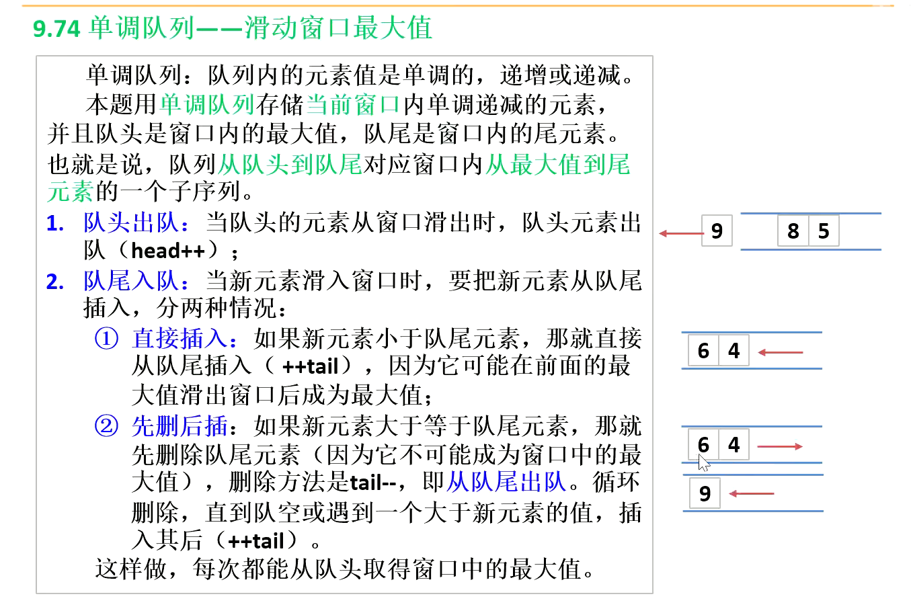

#### 数据类型

python中int、str、tuple属于不可变对象，str、tuple内部的元素一旦定义了就不能更改，可哈希对象必须是不可变对象

None表示空，与空字符串""、空列表[]等不是一个东西

None是一个空的对象，代表什么都没有。None在python中全局只有一个（==单例对象==，有且只有一个实例）
而""，是一个字符串对象，代表一个空的字符串。
只有字符串才能和字符串相互连接。

```python
a = list()
b = None
print(a, id(a), type(a))
print(b, id(b), type(b))
print(a == b)
print(a is b)

>>>
[] 1682218564096 <class 'list'>
None 140730618910848 <class 'NoneType'>
False
False
```

python中空串:""、空元组:()、空列表:[]、空字典:{}、None等` 都自动判定为 `False

判断是否为空列表、空字符或None的方法：

```python
# 1.
if not a:	# 如果a为空列表、空字符...或None
# 2.
if len(a)==0:	# 如果a为空列表、空字符...，a为None时会报错
# 3.
if a is None:	# 判断None时通常用is，因为==调用的是__eq__()函数，这个函数可以被重载
```

如

```python
class Test1:
    def __eq__(self, other):
        return False

class Test2:
    def __eq__(self, other):
        return True

t1 = Test1()
print(t1 is None)  # False
print(t1 == None)  # False
t2 = Test2()
print(t2 is None)  # False
print(t2 == None)  # True
```


#### is 与==

python中一切皆对象，对象具有三要素id、type和value

is相当于比较两个对象的id、==相当于比较两个对象的value，相当于调用`__eq__()`方法，即`a==b`等同于`a.__eq__(b)`。

(ob1 is ob2) 等价于 (id(ob1) == id(ob2))

#### 循环

python for循环只能用来遍历序列，当循环体中序列或循环条件要发生改变时不要用for循环，可以用while

```python
for i in range(5):
    print(i)
    i += 2
# 输出0、1、2、3、4，i并不会改变

i = 0
while i < 5:
    print(i)
    i += 2
# 输出0、2、4
```

for循环的range与一般序列好像不一样？

实验：

```python
# 这个循环了5次
l=["a","b","c","d","e"]
c1=0
for i in range(len(l)):
    print("l:",l)
    print("i:",i)
    l.pop()
    c1+=1
print("结束l：",l)

>>>
l: ['a', 'b', 'c', 'd', 'e']
i: 0
l: ['a', 'b', 'c', 'd']
i: 1
l: ['a', 'b', 'c']
i: 2
l: ['a', 'b']
i: 3
l: ['a']
i: 4
结束l： []
```

```python
# 这个值循环了3次
l=["a","b","c","d","e"]
c2=0
for i in l:
    print("l:",l)
    print("i:",i)
    l.pop()
    c2+=1
print("结束l：",l)

>>>
l: ['a', 'b', 'c', 'd', 'e']
i: a
l: ['a', 'b', 'c', 'd']
i: b
l: ['a', 'b', 'c']
i: c
结束l： ['a', 'b']
```

==**总之，如果循环体内循环的序列或当前循环值发生改变慎用for循环**==

#### 切片

python中数组下标不能越界，但是切片可以越界，结果会自动忽略越界部分

```python
a = [-1, 0, 1, 2, -1, -4]
print(a[:10])
>>>[-1, 0, 1, 2, -1, -4]
```

##### 逆序切片

python逆序切片不好理解，慎用！

```python
a[start:end:step]
# 从start开始,以步长为step依次取a中的元素,形成新的序列,
# 如果step<0,表示从start开始，以step从右向左依次取出a中的元素
```

整体逆序可以，但部分逆序无法取到第一个元素！！！

```python
a = [0, 1, 2, 3, 4, 5, 6]
print(a[::-1])
print(a[5:0:-1])
print(a[5:-1:-1])
>>>[6, 5, 4, 3, 2, 1, 0]
>>>[5, 4, 3, 2, 1]	# 取不到第一个元素
>>>[]	#5:-1与步长-1反向冲突了
```

#### 库函数

#####  `sep`.join(seq)

参数说明
sep：分隔符。可以为空
seq：要连接的元素序列、字符串、元组、字典，seq中的元素必须是字符串
上面的语法即：以sep作为分隔符，将seq所有的元素合并成一个新的字符串

返回值：返回一个以分隔符sep连接各个元素后生成的字符串。seq为空序列时返回空字符串

##### `reversed`(*序列*)

返回一个反向的 [iterator](https://docs.python.org/zh-cn/3.8/glossary.html#term-iterator)。 *seq* 必须是一个具有 [`__reversed__()`](https://docs.python.org/zh-cn/3.8/reference/datamodel.html#object.__reversed__) 方法的对象或者是支持该序列协议（具有从 `0` 开始的整数类型参数的 [`__len__()`](https://docs.python.org/zh-cn/3.8/reference/datamodel.html#object.__len__) 方法和 [`__getitem__()`](https://docs.python.org/zh-cn/3.8/reference/datamodel.html#object.__getitem__) 方法）。

##### `str.` `split`(*sep=None*, *maxsplit=-1*)

返回一个由字符串内单词组成的列表，使用 *sep* 作为分隔字符串。 如果给出了 *maxsplit*，则最多进行 *maxsplit* 次拆分（因此，列表最多会有 `maxsplit+1` 个元素）。 如果 *maxsplit* 未指定或为 `-1`，则不限制拆分次数（进行所有可能的拆分）。

如果给出了 *sep*，则**连续的分隔符不会被组合在一起而是被视为分隔空字符串** (例如 `'1,,2'.split(',')` 将返回 `['1', '', '2']`)。 *sep* 参数可能由多个字符组成 (例如 `'1<>2<>3'.split('<>')` 将返回 `['1', '2', '3']`)。 使用指定的分隔符拆分空字符串将返回 `['']`。

str.split()默认以空格为分隔符，但是连续的空格会被组合到一起

##### `str.` `find`(*sub*[, *start*[, *end*]])

返回子字符串 *sub* 在 `s[start:end]` 切片内被找到的最小索引。 可选参数 *start* 与 *end* 会被解读为切片表示法。 如果 *sub* 未被找到则返回 `-1`。

##### eval(str)

计算字符串表达式


#### 数据结构

##### 单调队列

https://www.bilibili.com/video/BV1H5411j7o6?spm_id_from=333.337.search-card.all.click&vd_source=3ab15aeffa3be66cfe0e7b7dc0bccf45



##### 二叉树

二叉树遍历：

1.前序遍历：中左右，即先遍历中间节点，再按中左右的顺序遍历左子树，再按中左右的顺序遍历右子树。第一次碰到这个节点

##### 递归

[递归中的return](https://blog.csdn.net/weixin_43812682/article/details/103418186)
