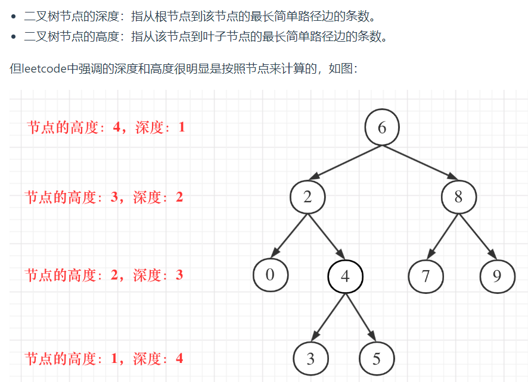
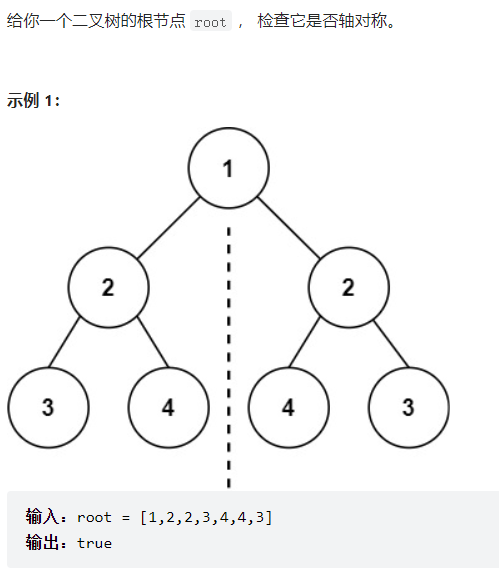

### 二叉树

叶节点：左右子节点都为Null的节点



#### [101. 对称二叉树](https://leetcode.cn/problems/symmetric-tree/)

题目：

思想：**递归**

思路：

递归的难点在于：找到可以递归的点 为什么很多人觉得递归一看就会，一写就废。 或者说是自己写无法写出来，关键就是你对递归理解的深不深。

对于此题： 递归的点怎么找？从拿到题的第一时间开始，思路如下：

1.怎么判断一棵树是不是对称二叉树？ 答案：如果所给根节点，为空，那么是对称。如果不为空的话，当他的左子树与右子树对称时，他对称

2.那么怎么知道左子树与右子树对不对称呢？在这我直接叫为左树和右树 答案：如果左树的左孩子与右树的右孩子对称，左树的右孩子与右树的左孩子对称，那么这个左树和右树就对称。

仔细读这句话，是不是有点绕？怎么感觉有一个功能A我想实现，但我去实现A的时候又要用到A实现后的功能呢？

当你思考到这里的时候，递归点已经出现了： 递归点：我在尝试判断左树与右树对称的条件时，发现其跟两树的孩子的对称情况有关系。

想到这里，你不必有太多疑问，上手去按思路写代码，函数A（左树，右树）功能是返回是否对称

def 函数A（左树，右树）： 左树节点值等于右树节点值 且 函数A（左树的左子树，右树的右子树），函数A（左树的右子树，右树的左子树）均为真 才返回真

实现完毕。。。

写着写着。。。你就发现你写出来了。。。。。。

有思路后就可以写了，**递归三部曲：**

1. 确定递归函数功能，确定参数与返回值
2. 确定终止条件
3. 确定单层递归逻辑

对于这一题来说：

1. 函数功能：判断两个左右树是否对称；

   参数：左树和右树

   返回值：True or False

2. 终止条件：

   a. 左右树均为空，返回True

   b. 左右树有一个为空，返回False

   c. 左右树的值不相等，返回False

3. 递归逻辑

   不满足终止条件，也就是左右树的值相等，开始递归

   a. 比较左树的左子树和右树的右子树是否对称

   b. 比较左树的右子树和右树的左子树是否对称

   c. 如果上面两个都对称，返回True，否则返回False

解答：

```python
# Definition for a binary tree node.
# class TreeNode:
#     def __init__(self, val=0, left=None, right=None):
#         self.val = val
#         self.left = left
#         self.right = right
class Solution:
    def isSymmetric(self, root: Optional[TreeNode]) -> bool:
        # 功能：判断左右树是否对称
        def compare(left,right)->bool:
            # 终止条件
            if left is None and right is None: return True
            elif left is None and right is not None: return False
            elif left is not None and right is None: return False
            elif left.val !=right.val: return False

            # 递归体
            a = compare(left.left, right.right)
            b = compare(left.right,right.left)
            return True if a and b else False
        
        if root is None: return True
        return compare(root.left,root.right)

```

#### [110. 平衡二叉树](https://leetcode.cn/problems/balanced-binary-tree/)

不会

自底向上

https://programmercarl.com/%E4%BA%8C%E5%8F%89%E6%A0%91%E7%9A%84%E9%80%92%E5%BD%92%E9%81%8D%E5%8E%86.html
