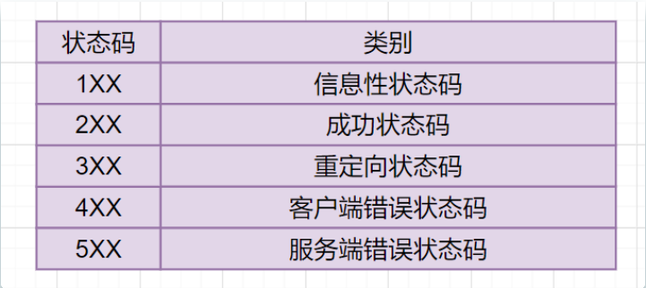

https://zhuanlan.zhihu.com/p/546999128

https://mp.weixin.qq.com/s/C82YpO0gwC8LHcJSHbR81A

### 名词解释

HTTP：Hyper Text Transfer Protocol超文本传输协议

HTTPS：Hyper Text Transfer Protocol Secure超文本安全传输协议

SSL： Secure Socket Layer安全套接字

TSL： Transport Layer Security 安全传输层协议

RTT：Round Trip Time 往返时间

DNS：domain name system 域名解析系统

### 计网体系结构

### 应用层

是超⽂本传输协议，也就是**H**yperText **T**ransfer **P**rotocol。

具体解释：**HTTP** 是⼀个在计算机世界⾥专⻔在「两点」之间「传输」⽂字、图⽚、⾳频、视频等「超⽂本」数据的「约定和规范」。

http报文格式

#### HTTP常见请求（方法）

GET、POST、PUT、HEAD

#### HTTP状态码

#### GET请求与POST请求的区别

- **GET** - 从指定的资源**请求**数据。该方法是**安全**（不会破坏服务器上的资源）且**幂等**（多次执行相同操作，结果都相同）的
- **POST** - 向指定的资源**提交**要被处理的数据，如网页中提交留言。该方法可能会修改服务器资源，是**不安全**且**不幂等**的

#### HTTP特性

**优点：**HTTP 最凸出的**优点**是「简单、灵活和易于扩展、应⽤⼴泛和跨平台」。

**缺点：**1.**无状态**：http不记录状态，http服务器无记忆能力，完成关联操作时麻烦（可通过cookies解决）

2.明文传输；不验证对方身份；不验证报文完整性：**不安全**

无状态：服务器向客户发送被请求的文件时，不会存储关于该客户的任何信息

#### HTTP与HTTPS

1. HTTP 是超⽂本传输协议，信息是明⽂传输，存在安全⻛险的问题。HTTPS 则解决 HTTP 不安全的缺陷，在

TCP 和 HTTP ⽹络层之间加⼊了 SSL/TLS 安全协议，使得报⽂能够**加密**传输。

2. HTTP 连接建⽴相对简单， TCP 三次握⼿之后便可进⾏ HTTP 的报⽂传输。⽽ HTTPS 在 TCP 三次握⼿之

后，还需进⾏ SSL/TLS 的握⼿过程，才可进⼊加密报⽂传输。

3. HTTP 的端⼝号是 80，HTTPS 的端⼝号是 443。

4. HTTPS 协议需要向 CA（证书权威机构）申请数字证书，来**保证服务器的身份**是可信的。

**https解决了http不安全的特性：**

信息加密：加密传输

校验机制：⽆法篡改通信内容，篡改了就不能正常显示

身份证书：验证对方身份

#### HTTP版本演变

客户端对服务器发出**请求**，服务端对客户的每个请求作出**响应**

HTTP/1.0采用**非持续连接**，即每个请求或相应经过一个单独的TCP连接发送。缺点：性能开销大，响应时间长

HTTP/1.1采用**持续连接**，所有请求及响应经相同的TCP连接发送

HTTP/2.0:

- **二进制协议**，1.1版本的头信息是文本（ASCII编码），数据体可以是文本或者二进制；2.0中，头信息和数据体都是二进制。
- 完全**==多路复用==**，在一个连接里，客户端和浏览器都可以同时发送多个请求或回应，而且不用按照顺序一一对应。
- 报头压缩，HTTP协议不带有状态，每次请求都必须附上所有信息。Http/2.0引入了头信息压缩机制，使用gzip或compress压缩后再发送。
- 服务端推送，允许服务器未经请求，主动向客户端发送资源。

HTTP/3.0:基于UDP连接和QUIC连接，提升性能

#### HTTPS流程

1. 客户端发起Https请求，连接到服务器的443端口。
2. 服务器必须要有一套数字证书（证书内容有公钥、证书颁发机构、失效日期等）。
3. 服务器将自己的数字证书发送给客户端（公钥在证书里面，私钥由服务器持有）。
4. 客户端收到数字证书之后，会验证证书的合法性。如果证书验证通过，就会生成一个随机的对称密钥，用证书的公钥加密。
5. 客户端将公钥加密后的密钥发送到服务器。
6. 服务器接收到客户端发来的密文密钥之后，用自己之前保留的私钥对其进行非对称解密，解密之后就得到客户端的密钥，然后用客户端密钥对返回数据进行对称加密，酱紫传输的数据都是密文啦。
7. 服务器将加密后的密文返回到客户端。
8. 客户端收到后，用自己的密钥对其进行对称解密，得到服务器返回的数据。

#### 对称加密与非对称加密有什么区别

**思路:** 这道题考察的知识点是对称加密与非对称加密算法，什么是对称加密，什么是非对称加密呢？

对称加密：指加密和解密使用同一密钥，优点是运算速度较快，缺点是如何安全将密钥传输给另一方。常见的对称加密算法有：DES、AES等。

对称加密

非对称加密：指的是加密和解密使用不同的密钥（即公钥和私钥）。公钥与私钥是成对存在的，如果用公钥对数据进行加密，只有对应的私钥才能解密。常见的非对称加密算法有RSA。

非对称加密

#### DNS解析过程

假设你要查询**www.baidu.com**的IP地址:

- 首先会查找浏览器的缓存,看看是否能找到**www.baidu.com**对应的IP地址，找到就直接返回；否则进行下一步。
- 将请求发往给本地DNS服务器，如果查找到也直接返回，否则继续进行下一步；
- 本地DNS服务器向**根域名服务器**发送请求，根域名服务器返回负责`.com`的顶级域名服务器的IP地址的列表。
- 本地DNS服务器再向其中一个负责`.com`的顶级域名服务器发送一个请求，返回负责`.baidu`的权威域名服务器的IP地址列表。
- 本地DNS服务器再向其中一个权威域名服务器发送一个请求，返回**www.baidu.com**所对应的IP地址

### TCP

