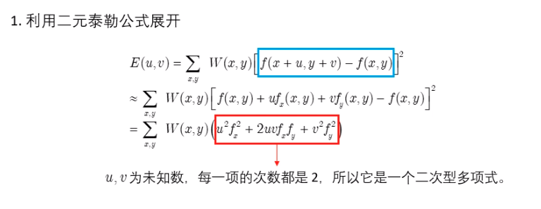

### Harris角点检测

#### 原理

https://www.bilibili.com/video/BV1Hv411e7CW/?spm_id_from=333.788.recommend_more_video.2

图像梯度


Sobel算子


高斯核


方向导数


u，v是待求方向导数像素点的坐标，W(x,y)高斯窗口对应的权重矩阵




二次型标准化把椭圆转正


两个特征值都很大时，椭圆的长轴和短轴都很小，E在u,v的各个方向变化都很大，属于角点

一个特征值远远大于另一个特征值时，E在某一个方向上变化大，在与之垂直的方向上变化小，属于边缘

两个特征值都很小时，椭圆的长轴和短轴都很大，E在u,v的各个方向变化都很小，属于平原

Harris算法通过下式表述这种特征


#### cv2.cornerHarris()

https://docs.opencv.org/3.4.8/dd/d1a/group__imgproc__feature.html#gac1fc3598018010880e370e2f709b4345

```
dst=cv2.cornerHarris(src, blockSize, ksize, k[, dst[, borderType]])
src - 输入图像。
blockSize - 角点检测中领域像素的大小。
ksize - Sobel 求导中使用的窗口大小
k - Harris 角点检测方程中的自由参数,取值参数为 [0.04,0.06].
输出得分R
```

```python
import cv2
import numpy as np

src = cv2.imread("/home/xl/pythonscript/GFR_data_process/_test/adhesive.png")
imgray = cv2.cvtColor(src, cv2.COLOR_BGR2GRAY)
imgray = np.float32(imgray)
dst = cv2.cornerHarris(imgray, 2, 5, 0.04)
src[dst > 0.01 * dst.max()] = [0, 0, 255]
cv2.imwrite("/home/xl/pythonscript/GFR_data_process/_test/corner_harris.png", src)
```

### Shi-Tomas角点检测

####  原理

Shi-Tomas是对Harris角点检测算法改进后的新算法，其打分函数为：


#### cv2.goodFeaturesToTrack()

https://docs.opencv.org/3.4.8/dd/d1a/group__imgproc__feature.html#ga1d6bb77486c8f92d79c8793ad995d541

```
void cv::goodFeaturesToTrack	(	InputArray 	image,
OutputArray 	corners,
int 	maxCorners,
double 	qualityLevel,
double 	minDistance,
InputArray 	mask = noArray(),
int 	blockSize = 3,
bool 	useHarrisDetector = false,
double 	k = 0.04 
)	


corners	=	cv2.goodFeaturesToTrack(image, maxCorners, qualityLevel, minDistance[, corners[, mask[, blockSize[, useHarrisDetector[, k]]]]]	)

src单通道输入图像，八位或者32位浮点数。
maxCorners表示检测到角点数量的最大值，设为<=0时表示不设限制
qualityLevel表示检测到的角点的质量等级， R < qualityLevel × max response的点将会被直接丢弃。一般为0.01或0.1(小于1)
minDistance 表示两个关键点之间的最短距离，像素单位
mask 表示mask区域，如果有表明只对mask区域做计算。
blockSize 计算梯度与微分的窗口区域。
useHarrisDetector 表示是否使用harris角点检测，默认是false 为shi-tomas。
k = 0.04默认值，当useHarrisDetector为ture时候起作用。

corners表示检测到角点的坐标
```

