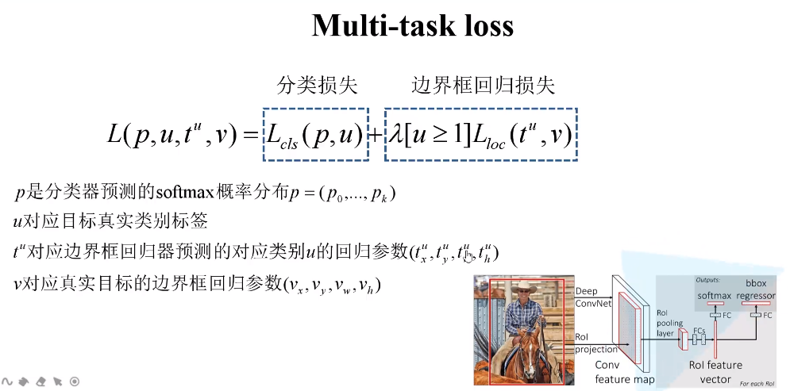
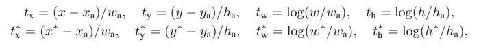
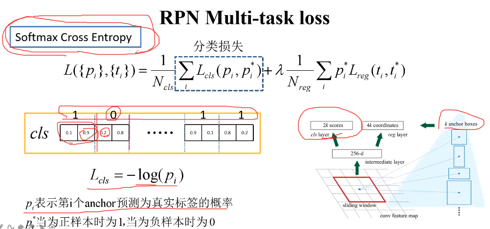
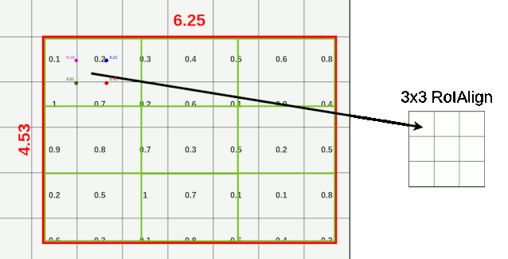
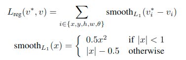
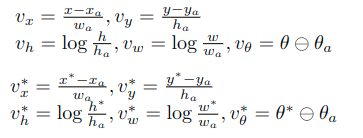

只涉及网络结构，不涉及损失函数

# RCNN

---Regions with CNNfeatures.将深度学习应用到目标检测领域的开山之作

**两阶段目标检测：先提取候选区域，再对候选区域进行分类和位置修正**

论文：https://arxiv.org/abs/1311.2524

RCNN步骤：

1. 每张图使用Selective Search方法提取2k个候选区域
2. 将每个候选区域喂入CNN提取特征
3. 将CNN输出的特征送入SVM分类器，判断是否属于该类
4. 使用回归器修正候选框位置

> SS:利用图像的颜色、纹理等特征分割出多个区域

RCNN不足

# SPPNET

空间金字塔池化与全局平局池化类似，可以处理不同尺度输入，输出相同尺度

SPP：先将每一个feature map分成若干块(4\*4,2\*2,1)，再对每个块最大池化，最后将各个feature map的输出拼接，输出(16+4+1)×feature map个数的张量

# Fast RCNN

论文：https://arxiv.org/abs/1504.08083

https://zhuanlan.zhihu.com/p/165324194

步骤：

1. **Sample RoIs：**输入一张图片，使用Selective Search方法生成2k候选区域

2. **Feature Extraction：**将图片图片喂入CNN提取特征

3. **ROI Projection：**将SS算法生成的候选区域映射到CNN提取的特征图中，输出h\*w的ROIs(Region of interest)

4. **ROI Pooling：**将上层输入变成固定大小的特征图输出
5. **分类和回归**：最后，通过后续的FC层分别生成bbox和class

> ROI Pooling可以看做是一种单尺度的SPP，作用是将不同尺度的特征图输入映射为同一尺度

一次性计算所有特征，不需要保存RCNN中SS算法生成的候选区域

在训练过程中并未用到SS算法提取的所有候选区域，而是做了采样

分类器：

边界框回归器：

**损失函数：**

其中

> $[u>=1]是艾弗森括号，u>=1时本式=1，否则=0，u>=1时表示预测类别为object而不是背景$

> $p_{u}:当前预测类别为u的概率$

Fast RCNN中图片只需要走一次卷积，并且不需要额外在硬盘上存储特征图，节省了大量时间，大部分时间都花在SS算法中

# Faster RCNN

论文：https://arxiv.org/abs/1506.01497

https://zhuanlan.zhihu.com/p/31426458

Faster RCNN的流程与Fast RCNN相同，不同之处在于采用RPN(Region Proposal Networks)替代SS算法进行候选区域提取

$Faster RCNN=RPN+Fast RCNN$

### RPN

https://zhuanlan.zhihu.com/p/137735486

https://blog.csdn.net/lanran2/article/details/54376126?spm=1001.2101.3001.6650.4&utm_medium=distribute.pc_relevant.none-task-blog-2%7Edefault%7ECTRLIST%7Edefault-4.no_search_link&depth_1-utm_source=distribute.pc_relevant.none-task-blog-2%7Edefault%7ECTRLIST%7Edefault-4.no_search_link

RPN(Region Proposal Networks)：在特征图上用3\*3卷积滑动窗口，后面并联两个1\*1卷积，一个用于预测该点有没有object(二分类)，一个用于修正Anchor以产生候选框

> Anchor与RPN产生的候选框不同，Anchor是在原图上一系列固定尺寸先验框，候选框是RPN输出的带目标的区域

> 正样本Anchor：与GT box的IOU最大或IOU大于0.7的Anchor
>
> 负样本Anchor：与GT box的IOU小于0.3
>
> 其他的Anchor对训练没有作用
>
> 注：一个GT box可能会给多个Anchor分配正样本标签

这里的256-d是因为ZF网络输出的feature map的channel为256 

以单个3\*3窗口来看：

以整个大的滑动窗口来看：

#### RPN的损失函数

> 式中：
>
> $i:mini-batch中的第i个anchor$
>
> $p_{i}:第i个anchor是object的概率$
>
> $p_{i}^{*}=\left\{\begin{matrix} 
> 1，anchor为正样本\\
> 0，anchor为负样本
> \end{matrix}\right. $
>
> $t_{i}：4个边界框回归参数组成的向量$
>
> $t_{i}^{*}：与正样本anchor相关的GT box的4个边界框回归参数组成的向量$
>
> $L_{cls} ：二分类log损失$
>
> $L_{reg}:smooth L_{1}损失$
>
> $p_{i}^{*}L_{reg}(t_{i},t_{i}^{*})表示只有anchor为正样本是L_{reg}才激活$
>
> $N_{cls}：mini-batch中所有样本数量(256)$
>
> $N_{reg}： anchor 位置的个数(不是 anchor 个数 约 2400)$
>
> $\lambda：正则化项，取10$
>
> $实际Faster RCNN的实现直接用N_{cls}代替\lambda/N_{reg}$

边界框回归参数用下式表示：

> 式中：
>
> $x、y、w、h表示预测边界框的中心坐标、宽、高$
>
> $x：预测框的x$
>
> $x_{a}：anchor的x$
>
> $x^{*}：GT box的x$

**这里的分类损失有两种计算方式**

第一种是按多分类损失来计算，输出为2k scores，这里的cls等前通过了softmax

第二种是按二值交叉熵损失来计算，输出k scores(pytorch的实现就是按这种)，这里的cls层通过sigmoid

### Faster RCNN训练

现在是联合训练，但Faster RCNN论文中使用的是分步训练：

# FPN

一个典型的FPN网络：

# FPN+Faster RCNN

原始的使用VGG网络的Faster RCNN只有一种尺度的特征图输出，需要在一个位置上分配各种尺度的anchor，而FPN有几种不同尺度的特征图输出，可以根据感受野给不同尺度的特征图分配Anchor。

==根据公式可以算出原图上的ROI应该映射到P几的特征图上：==

# Mask RCNN

https://arxiv.org/abs/1703.06870

https://zhuanlan.zhihu.com/p/37998710

Mask RCNN=改进的Faster RCNN+Mask

对Faster RCNN的改进在于：

- 使用ResNet-FPN作为特征提取的主干网络
- 采用ROI Align代替ROI Poolin层

## ResNet-FPN

Feature Pyramid Network (**FPN**)：特征金字塔网络，用于融合多尺度特征

ResNet-FPN架构如下：

## ResNet-FPN+RPN

与Faster RCNN的特征提取网络不同，ResNet-FPN结构具有多尺度输出，$P2、P3、P3、P4$ 分别下采样了4、8、16、32倍，而RPN网络最终要输出ROI，那么应该使用那种尺度的特征图来提取ROI呢。通过下面的公式来确定使用那种尺度的特征图来提取ROI

式中w、h表示ROI的宽高，k表示P~k~的下标，224表示ResNet-FPN的输入尺寸，k~0~表示ROI尺寸为224\*224时应该从哪一层提取ROI，作者将k~0~设为4，也就是ROI尺寸为224\*224时从P~4~层提取ROI。当ROI尺寸为112\*112时k=3，从P~3~提取ROI。对这个公式的感性认识就是，在感受野大的特征图上提取大的ROI，有利于检测大目标，在感受野小的特征图上提取小的ROI，有利于检测小目标

## ROI Align

[图解 RoIPooling、RoIAlign 和 RoIWarp](https://zhuanlan.zhihu.com/p/273587749)

Mask RCNN中用ROI Align层来代替Faster RCNN的ROI Pooling层，解决了Faster RCNN中两次量化造成的精度损失，两次量化分别是将原图的ROI映射到特征图的ROI做了量化处理，将特征图的ROI经过ROI Pooling映射为同一尺寸做了量化处理

图中虚线为特征图，实线为ROI，将ROI分为2\*2的bin，对每个bin采样四个点，对每个采样点的值做双线性插值，最后进行最大池化

## Mask

检测头有两个分支，上面的分支与Faster RCNN一样，用于分类和bbox回归，Mask分支使用全卷积神经网络在ROI区域进行二值语义分割

## 总体架构

# RRPN

论文：https://arxiv.org/abs/1703.01086

### 旋转BBOX表示

训练阶段ground truth表示为$(x，y，h，w，θ)$ 5元组，x、y为旋转框的中心点坐标，h、w为旋转框的短边长和长边长，$\theta$ 为长边到x轴正方向的转角。θ+kπ的取值在区间$[−π/4，3π/4)$内，并将θ+kπ更新为θ。

### Rotation Anchor

传统的Anchor只有Scale和Ratio的变化，这里加上了角度的变化

> 尺度---8、16、32
>
> 比例---2:1、5:1、8:1
>
> 角度---−π/6、0、π/6、π/3、π/2和2π/3

RPN网络在特征图上滑动，特征图上每个滑动位置生成54(3\*3\*6)个Anchor(这也太多了吧)，RPN的cls分支产生108(2\*54)个scores，reg分支产生270(5\*540)个输出，H\*W的特征图一共产生$H*W*54$ 个Anchor。

### RRPN损失函数

训练之前先定义好正负样本R-Anchor的标定规则：

> 正样本：与GT(ground truth)的IOU最高或IOU大于0.7且与GT夹角小于π/12
>
> 负样本：与GT的IOU小于0.3或与GT的IOU大于0.7但夹角大于π/12

损失函数

> 式中:
>
> $p=(p_{0},p_{1}):由softmax算得的类别概率$
>
> $l=\left\{\begin{matrix} 
> 1，anchor为正样本\\
> 0，anchor为负样本
> \end{matrix}\right. $
>
> $v=(v_{x},v_{y},v_{w},{v_h},v_{\theta})：边界框回归参数$
>
> $v^{*}=(v_{x}^{*},v_{y}^{*},v_{w}^{*},{v_h}^{*},v_{\theta}^{*})：与正样本anchor相关的GT box的边界框回归参数$
>
> $L_{cls} ：二分类log损失$
>
> $L_{reg}:smooth L_{1}损失$
>
> $p_{i}^{*}L_{reg}(t_{i},t_{i}^{*})表示只有anchor为正样本是L_{reg}才激活$
>
> $N_{cls}：mini-batch中所有样本数量(256)$
>
> $N_{reg}： anchor 位置的个数(不是 anchor 个数 约 2400)$
>
> $\lambda：正则化项，取10$
>
> $实际Faster RCNN的实现直接用N_{cls}代替\lambda/N_{reg}$

式中一些具体的定义如下:

> $x：预测框的x$ 
>
> $x_{a}：anchor的x$
>
> $x^{*}：GT box的x$

### 倾斜IOU计算(Skew IOU)

### Skew-NMS

传统的NMS只考虑IoU因素(例如，IoU阈值为0.7)，但这对于带有方向的proposals是不够的。例如，比例为1:8，角度小于为π/12的锚的loU值为0.31，小于0.7;然而，它可以被认为是一个正样本。因此，Skew-NMS包括两个阶段:(i)保持最大IoU大于0.7;(ii)如果所有的proposals IoU 在[0.3,0.7]的范围内，保持proposals与GT框的角度差最小(角度差应小于π/12)。

### RRoI Pooling

ROI Pooling只能处理轴对齐的区域提议，因此本文提出了Rotation ROI来调整RRPN产生的任意方向的区域提议。

首先确定RROI pooling层的超参数$H_{r}\times W_{r}$ ，对于$h\times w$ 的旋转区域提议，RROI pooling层将其分为$H_{r}\times W_{r}$ 个大小为$\frac{h}{H_{r}}\times \frac{w}{W_{r}}$ 的子区域。每个子区域的方向与区域提议方向相同。使用相似性变换(平移、缩放、旋转)确定下图的A、B、C、D4个顶点，并将其分组以确定子区域的边界范围。

