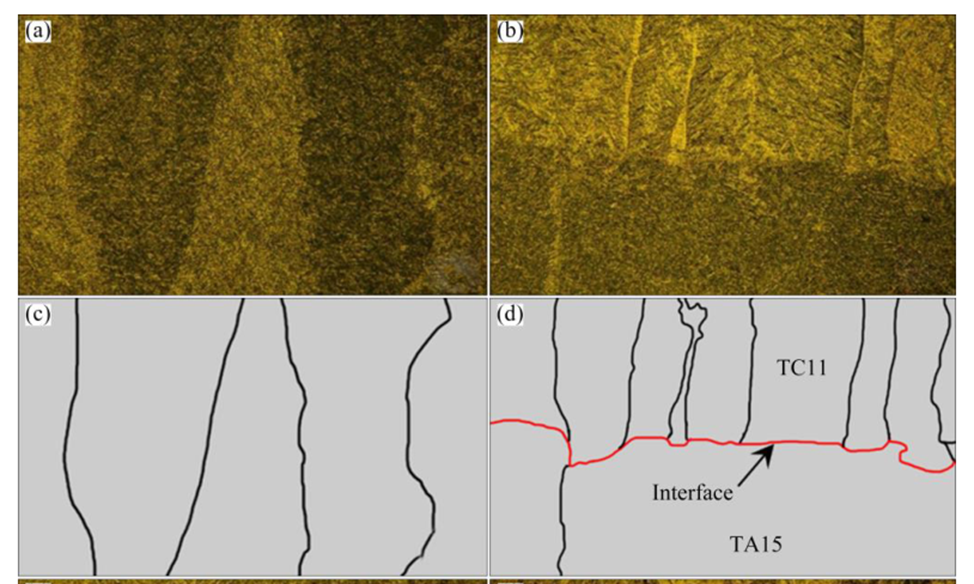

## 计算机视觉领域几大基本任务


**分类**：输入图片，输出类别

**语义分割**：像素级的分类，需要辨别图片中每一个像素属于什么类别，不需要辨别同一个类别中的不同实例

**目标检测**：用矩形框框出每一个实例，并输出每一个实例的对应类别

**实例分割**：可以看作是目标检测和语义分割任务的结合，既需要像素级的分类又需要区分不同的实例

**全景分割**：语义分割和实例分割的结合。跟实例分割不同的是：实例分割只对图像中的object进行检测，并对检测到的object进行分割，而全景分割是对图中的所有物体包括背景都要进行检测和分割。

对于数据1，需要将全图划分出不同的区域，可以看作是一个语义分割任务



对于数据2，与实例分割任务类似，但不完全相同，主要区别在于数据2全图都是待分割的目标，没有背景

难点1：数据标注工作量太大

难点2：只能分割出金相图中的alpha相

难点3：目前实例分割存在难以分割出宽高比巨大，朝向各异，密集排列的实例的问题，所以现有模型对数据2的检测效果可能不好


针对问题三，目前实例分割绝大部分是在目标检测的基础上对检测框内的实例进行语义分割，但如果实例如果宽高比巨大，朝向各异，密集排列，检测框内就会出现其他的实例，从而对下一步语义分割的结果产生干扰，导致效果很差。改进思路：在旋转目标检测框的基础上进行语义分割(还有一种实例分割的思路是先语义分割，再在语义分割的基础上实例分割，这方面研究较少，具体怎么做的不清楚)

|  |  |
| ------------------------------------------------------------ | ------------------------------------------------------------ |

## mmsegmentation

### 项目配置

https://github.com/open-mmlab/mmsegmentation

https://mmsegmentation.readthedocs.io/en/latest/get_started.html

1.`git clone https://hub.fastgit.org/open-mmlab/mmsegmentation.git`

2.`cd mmsegmentation/`

3.`touch Dockerfile`

4.在Dockerfile中写入以下内容

```dockerfile
# Author:xialei

#cuda11.3 pytorch1.9.0
FROM nvcr.io/nvidia/pytorch:21.05-py3

# Install linux packages
RUN apt update && apt install -y zip htop screen libgl1-mesa-glx

# 安装mmcv-full
RUN pip install mmcv-full -f https://download.openmmlab.com/mmcv/dist/cu113/torch1.9.0/index.html -i https://pypi.tuna.tsinghua.edu.cn/simple

# 创建工作目录
RUN mkdir -p /usr/src/app
WORKDIR /usr/src/app

# 以开发模式安装mmsegmentation
COPY . /usr/src/app
ENV FORCE_CUDA="1"
RUN pip install -r requirements.txt -i https://pypi.tuna.tsinghua.edu.cn/simple
RUN pip install -e . -i https://pypi.tuna.tsinghua.edu.cn/simple
# or "python setup.py develop"

# usage:
# build:
# docker build -t mmsegmentation:latest .

# run:
# docker run -it -v /home/xl/openmmlab/mmseg/data:/usr/src/app/data -v /tmp/.X11-unix:/tmp/.X11-unix -e DISPLAY=unix$DISPLAY -e GDK_SCALE -e GDK_DPI_SCALE --gpus all --name mymmseg --ipc=host mmsegmentation:latest bash
```

5.构建镜像，运行容器

### U-NET


U-NET是一种基于深度学习的语义分割模型，在医学影像分割中取得了较好效果。整个模型其实是一个encoder-decoder结构。

encoder---普通卷积，提取特征，输出特征图的尺寸为28\*28

decoder---转置卷积，上采样，将特征图尺寸还原会原图尺寸(由于卷积使用的是valid模式，实际输出比输入图像小一些)

语义分割的输出每个像素的类别


[卷积的三种模式full, same, valid以及padding的same, valid](https://zhuanlan.zhihu.com/p/62760780)

#### 转置卷积


#### HRF数据集训练效果

HRF视网膜数据集，一共45张图像(3504\*2336像素)

|  |  |
| :----------------------------------------------------------: | :---------------------------------------------------------: |

修改相应配置文件，并训练12000个iter`python tools/train.py configs/unet/deeplabv3_unet_s5-d16_64x64_40k_drive.py`

测试`python tools/test.py configs/unet/deeplabv3_unet_s5-d16_64x64_40k_drive.py work_dirs/deeplabv3_unet_s5-d16_64x64_40k_drive/iter_12000.pth --out work_dirs/deeplabv3_unet_s5-d16_64x64_40k_drive/res.pkl --eval mIoU --show-dir work_dirs/deeplabv3_unet_s5-d16_64x64_40k_drive/res`

验证集上的效果：


|  |  |
| :---------------------------------------------------------: | ----------------------------------------------------------- |

