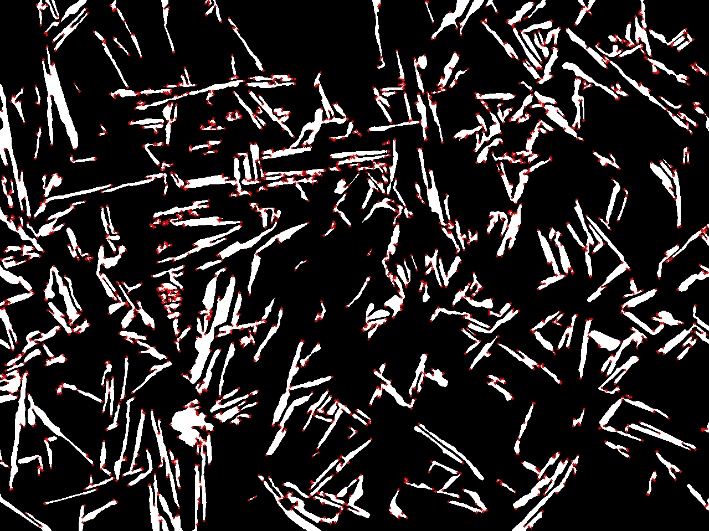
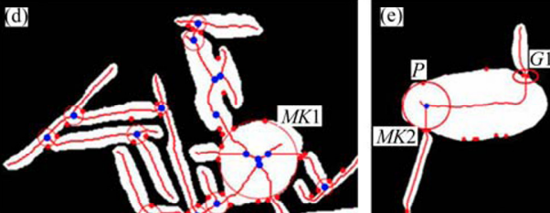
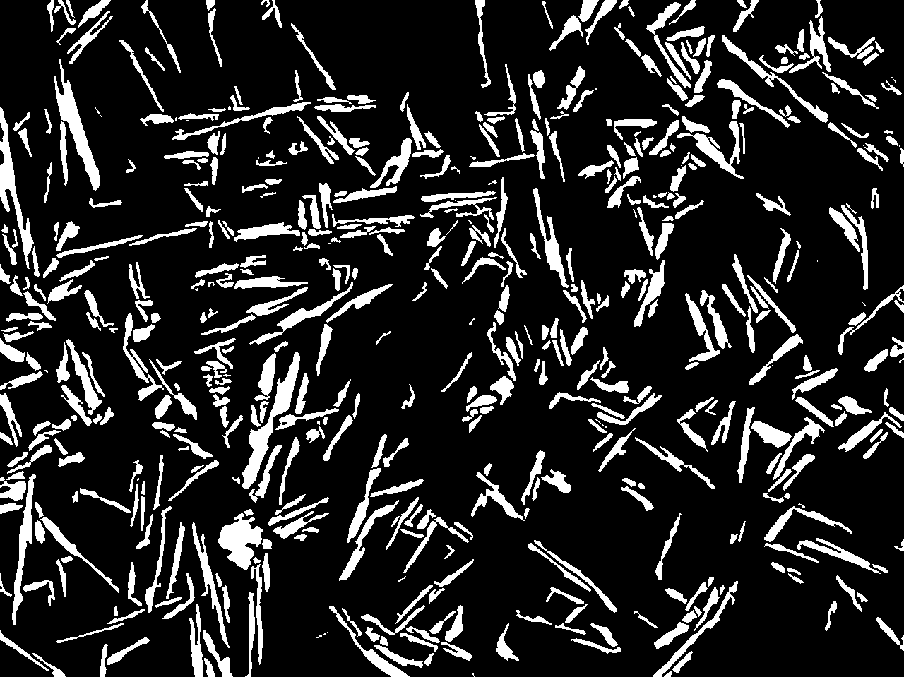

### 晶粒分割数据集制作

手动增强图像边缘->基于阈值分割获取标注数据->构建标准形式的数据集

基于阈值分割获取标注数据

| 1.原图                                | 2.去噪                                    | 3.锐化增强边缘                          | 4.阈值分割二值化                      |
| ------------------------------------- | ----------------------------------------- | --------------------------------------- | ------------------------------------- |
|                |  |  |  |
| 5.形态学运算连续边界                  | 6.轮廓检测                                | 7.过滤一些大小形状不符的轮廓            |                                       |
|  |    |          |                                       |

构建coco形式的标注标签

coco标注标签：用一个json文件记录所有标签数据

类似于下面这种，主要需要轮廓坐标，面积，水平外包框坐标（xywh），标签种类等

手动增强图像边缘：在二值化图像上增强晶粒边缘

增强边缘不明显的边界

手动分离相互粘连的晶粒

#### 粘连相分离方法

基本思路：首先识别出粘连相和独立相，提取粘连相的角点，在角点处以一定的规则将粘连相分割成独立相

1.粘连相与独立相的识别

计算各个封闭轮廓的凸包多边形，一般而言，独立相面积与其凸包多边形的面积较为接近，而粘连相面积通常小于其凸包多边形面积，因此，以封闭轮廓面积与其凸包多边形的面积比ratio作为粘连相与独立相识别的判定依据，给定阈值thresh，ratio<=thresh则判定为粘连相，ratio>thresh则判定为独立相。

| 独立相示意                                                  | 粘连相示意                                                   |
| ----------------------------------------------------------- | ------------------------------------------------------------ |
|  |  |

| 独立相                | 粘连相                |
| --------------------- | --------------------- |
|  |  |

2.粘连相角点检测

Shi-Tomas角点检测算法

算法根据像素点的方向导数判断该像素点是不是角点

角点---各个方向的方向导数都很大（表示改点灰度变化很大）

边缘---某一方向的方向导数很大，对应垂直方向方向导数很小

平原---各方向的方向导数都很小

检测结果：

3.去除凸点，保留凹点

粘连相的边界均存在与凹点处，因此只保留凹点

以角点为中心，半径为r画圆，设圆的面积为A~1~ ，圆与轮廓相交区域的面积为A~2~ ，计算二者比值ratio=A~2~ /A~1~ ，给定阈值thresh，若ratio>thresh则该角点为凹点，否则为凸点

凸点去除结果：

4.凹点匹配，连线分割

Zhe J I, He Y, Li H, et al. A new method for separating complex touching equiaxed and lamellar alpha phases in microstructure of titanium alloy[J]. Transactions of Nonferrous Metals Society of China, 2013, 23(8): 2265-2269.提出了一种凹点配对方法。

思路：先求解轮廓的骨架线，找到骨架线的交点，在骨架线的交点处绘制轮廓的内切圆，内切圆近似过两个凹点

特别的：每个凹点与其最近邻点沿标记圆顺时针方向配成一对；

无法被标记圆检测到的凹点将的距离小于2.2微米时也被视为一对；

（1）骨架线提取

https://homepages.inf.ed.ac.uk/rbf/HIPR2/skeleton.htm

https://legacy.imagemagick.org/Usage/morphology/#thinning_skeleton

形态学运算提取骨架线：

提取后的结果是单像素线宽但是毛刺太多

zhang-Suen细化算法提取骨架线：

毛刺少但是不是严格意义上的单像素线宽，如下的局部放大图所示，

（2）识别骨架线的交叉点（圆心)

单像素线宽骨架可以通过像素点3\*3邻域内像素值为1的个数判断该点是端点，中间点还是骨架交叉点。端点：1个，中间点：2个，交叉点：3个。

在Zhuang-Suen骨架提取结果中识别骨架线交点的方法：

交叉点的3\*3邻域总是类似于这种情况：至少有三个相互间隔的像素值为1的点，其它位置的像素值任意。

识别方法：

对于图上任意点p~0~ ，获取其3\*3邻域，令p=p~i~ (i=1,2,3,4)，从

p开始顺时针搜索，到p~8~ 结束，若p\==0，p=p~i+1~ ，若p\==1，p=p~i+2~ ，计算p==1出现的次数，若次数>=3，则p~0~ 为交叉点 

识别结果：

（3）获取圆半径

圆半径为骨架线交点到轮廓边界的距离，这个距离可以通过图像处理中的距离变换求得。

（4）连线分割

1.去除距离过近的骨架交叉点

(2)中识别的骨架交叉点，可能出现一个交叉点识别出多个距离相近交叉点的情况，先去除这些距离过近的点。得到新的junction_points；

2.通过距离变换获取骨架交叉点到轮廓边界的最小距离radius，以(radius+3)为半径，骨架交叉点为圆心绘制标志圆

3.根据以下规则将凹点分为两类

paired_concaves:有两个或两个以上凹点在标志圆内

single_concaves:在标志圆外或只有一个凹点在标志圆内

4.连线分割

对于paired_concaves，如果只有两个凹点，则直接连接，如果有多个凹点，按顺时针逐点连接

对于single_concaves，只对曲率大的凹点进行分割，分割线方向如图，在凹点处绘制像素为5的标志圆

5.只保留4中同时满足以下条件的分割线：

分割线长度小于阈值l~1~ ；

分割线与骨架线只相交一次；

分割后的轮廓数只增加一个，且分割后的轮廓面积大于均阈值a~1~；

6.不同阈值下的分割结果：

| 原始               | l1=13,a1=40               | l1=13,a1=20               | l1=16,a1=20               |
| ------------------ | ------------------------- | ------------------------- | ------------------------- |
|  |  |  |  |

| 粘连相                | 分割结果             |
| --------------------- | -------------------- |
|  |  |

#### coco类型标签的生成

将分割结果转换为coco实例分割类型的标注数据，coco标注标签：用一个json文件记录所有标签数据。

[coco数据格式介绍](https://zhuanlan.zhihu.com/p/29393415)

[cocoAPI可视化coco数据集的示例](https://github.com/cocodataset/cocoapi/blob/master/PythonAPI/pycocoDemo.ipynb)

之前写的不知道哪里出了问题，使用coco官方提供的可视化工具进行可视化的结果是错的。

之前的可视化出来标签混乱了

修改之后可以正确显示

