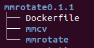
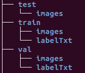

## 项目配置

配置版本：0.1.1

1.在本地新建文件夹`mmrotate0.1.1`，并使用命令git clone下载mmcv和mmrotate，新建Dockerfile文件，文件目录结构如下：



Dockerfile如下：

```dockerfile
# Author:xialei

#cuda11.3 pytorch1.9.0
FROM nvcr.io/nvidia/pytorch:21.05-py3

# Install linux packages
RUN apt update && apt install -y zip htop screen libgl1-mesa-glx

# 创建工作目录
RUN mkdir -p /app/mmcv && mkdir -p /app/mmrotate
WORKDIR /app/mmcv

ENV FORCE_CUDA="1"
# 设置网络代理的环境变量
# 容器运行后在/etc/profile中设置环境变量，如果直接按下面这么设置，docker build时会连不上网
# ENV https_proxy http://127.0.0.1:7890
# ENV http_proxy http://127.0.0.1:7890
# ENV no_proxy localhost,127.0.0.0/8,::1
# ENV all_proxy socks://127.0.0.1:7891

# 本地安装mmcv-full，安装预编译的会出错
# git连不上，下到本地吧
# RUN git clone https://github.com/open-mmlab/mmcv.git
WORKDIR /app/mmcv
COPY mmcv/. /app/mmcv
RUN MMCV_WITH_OPS=1 pip install -e . --no-cache-dir  # 安装好 mmcv-full

# 安装mmdet
RUN pip install mmdet --no-cache-dir

# 本地编译安装mmrotate，方便改代码
# RUN git clone https://github.com/open-mmlab/mmrotate.git
WORKDIR /app/mmrotate
COPY mmrotate/. /app/mmrotate
RUN pip install -r requirements/build.txt --no-cache-dir
RUN pip install -v -e . --no-cache-dir   # or "python setup.py develop"
WORKDIR /app


# usage:
# build:
# docker build -t mmrotate:v0.1.1 .

# run:
# docker run -it -v /home/xl/openmmlab/mmrotate/data:/app/mmrotate/.mydata -v /etc/localtime:/etc/localtime -v /tmp/.X11-unix:/tmp/.X11-unix -e DISPLAY=unix$DISPLAY -e GDK_SCALE -e GDK_DPI_SCALE --gpus all --name mymmrotate0.1.1 --ipc=host --network=host mmrotate:v0.1.1 bash
```

## 使用自定义数据集训练

### 制作DOTA格式的数据集

1.准备DOTA格式的数据集



2.按照需求修改`tools/data/dota/split/split_configs/dota1_0/ss_trainval.json`

3.运行以下命令生成数据集

```shell
python tools/data/dota/split/img_split.py --base_json tools/data/dota/split/split_configs/dota1_0/ss_trainval.json
```

### 修改配置文件

主要要修改的几个字段包括`data_root`，`classes`，`    samples_per_gpu`，` workers_per_gpu`，`runner`，`load_from`，`num_classes`，`work_dir`

### 训练

`python tools/train.py .mydata/configs/r3det/_myr3det_tiny_r50_fpn_1x_dota_oc.py`

### 测试

修改`mmrotate/core/visualization/image.py`中的图像显示函数`imshow_det_rbboxes`

`python tools/test.py .mydata/configs/r3det/_myr3det_tiny_r50_fpn_1x_dota_oc.py /app/mmrotate/.mydata/workdir/auged2_myr3det_tiny_r50_fpn_1x_dota_oc_20220318/latest.pth --work-dir .mydata/workdir/auged2_myr3det_tiny_r50_fpn_1x_dota_oc_20220318/test_workdir --show-dir .mydata/workdir/auged2_myr3det_tiny_r50_fpn_1x_dota_oc_20220318/test_show_dir2 --show-score-thr 0.1`
