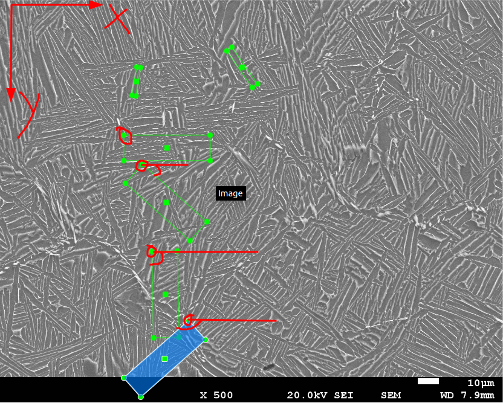
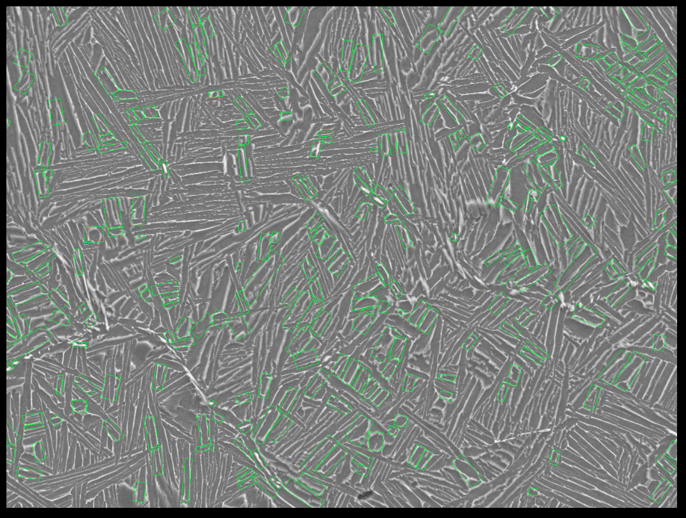

## 问题描述

在微观组织结构的目标检测问题中，需要检测到不同方向沟壑的宽度，而目前主流的目标检测框架只能检测出水平、竖直方向的长宽，无法实现对带旋转角的目标检测。


## 旋转目标检测标注软件

[roLabelImg](https://github.com/cgvict/roLabelImg) ：可标注PASCAL VOC格式的带旋转角的数据，包括标注框最高点坐标、标注框的长宽、最高点长边到x轴的旋转角

```xml
<annotation verified="no">
  <folder>Ti_500_src</folder>
  <filename>low-1</filename>
  <path>/home/xl/R3Det/mydata/Ti_500_src/low-1.bmp</path>
  <source>
    <database>Unknown</database>
  </source>
  <size>
    <width>1280</width>
    <height>1024</height>
    <depth>1</depth>
  </size>
  <segmented>0</segmented>
  <object>
    <type>robndbox</type>
    <name>Ti</name>
    <pose>Unspecified</pose>
    <truncated>0</truncated>
    <difficult>0</difficult>
    <robndbox>
      <cx>347.7106</cx>
      <cy>207.1579</cy>
      <w>9.9483</w>            
      <h>73.1789</h>
      <angle>0.162768</angle>
    </robndbox>
  </object>
  <object>
    <type>robndbox</type>
    <name>Ti</name>
    <pose>Unspecified</pose>
    <truncated>0</truncated>
    <difficult>0</difficult>
    <robndbox>
      <cx>616.9211</cx>
      <cy>171.3158</cy>
      <w>16.3336</w>
      <h>114.15</h>
      <angle>2.528984</angle>
    </robndbox>
  </object>
</annotation>
```



目前大部分的旋转目标检测是基于DOTA数据集训练的(比如下面要用到的R3Det)，DOTA数据集的标签是矩形框的四个点坐标，所以这里涉及到一个数据标签格式的转换


## 旋转目标检测方法---R3Det

### 概述

R3Det：上交、旷视联合提出的旋转目标检测器，在DOTA，HRSC2016和ICDAR2015数据集上都达到了当时的最好水平(2019)

DOTA：

R3Det着重解决了DOTA数据集中待检测目标长宽比大、排列密集、类别分布不均衡的问题，微观组织的检测也同样面临着待测目标长宽比大，排列密集的问题，而且密集排列的问题比DOTA数据集更严重，相当于全图都是密集排列的目标，而且目标的形状都不一样，数据标注和检测的难度都很大，但目前没有看到更好的方法，先用R3Det试试看。


项目地址：https://hub.fastgit.org/SJTU-Thinklab-Det/r3det-on-mmdetection

论文：https://arxiv.org/abs/1908.05612

dota数据集：https://captain-whu.github.io/DOTA/dataset.html

其他：https://github.com/yangxue0827/RotationDetection

### 开发环境搭建

环境：

```shell
pytorch：1.9.0
cuda：11.3
mmcv：0.5.9
mmdet：2.1
opencv-python：3.4.8.29
```

1.git clone项目

`git clone https://hub.fastgit.org/SJTU-Thinklab-Det/r3det-on-mmdetection.git`

2.编写Dockerfile，并构建我的镜像

以弃用：

```dockerfile
# Author:xialei

FROM yangxue2docker/py3-tf1.15.2-nv-torch1.8.0-cuda11:v1.0 #这个是cuda11.1，好像不支持3090

RUN mkdir -p /usr/src/app
WORKDIR /usr/src/app

COPY . /usr/src/app
# usage:
# docker build -t myr3det:v1.0 .
```

上面这个FROM源环境不行，编译会出步骤7的错，改成英伟达的镜像

```dockerfile
# Author:xialei

FROM nvcr.io/nvidia/pytorch:21.05-py3

RUN mkdir -p /usr/src/app
WORKDIR /usr/src/app

COPY . /usr/src/app

# usage:
# docker build -t myr3det:v1.1 .
```


3.根据镜像运行容器

已弃用：`docker run -it -v /home/xl/R3Det/mydata:/usr/src/app/mydata --gpus all --name myR3Det_Torch myr3det:v1.0 bash`

已弃用：`docker run -it -v /home/xl/R3Det/mydata:/usr/src/app/data --gpus all --name myR3Det_Torch --shm-size="16g" myr3det:v1.1 bash`

`docker run -it -v /home/xl/R3Det/mydata:/usr/src/app/data -v /tmp/.X11-unix:/tmp/.X11-unix -e DISPLAY=unix$DISPLAY -e GDK_SCALE -e GDK_DPI_SCALE --gpus all --name myR3Det_Torchv1.2 --shm-size="16g" myr3det:v1.2 bash`

说明：docker一般是用于运行后台服务或web服务的，默认无法运行GUI程序，运行GUI程序时会报错`cannot connect to X server`，X server是linux端的图形界面化服务，如果需要显示到本地显示器，需要这么做，参考：https://www.cnblogs.com/panpanwelcome/p/12877902.html

1. 在宿主机安装x11，并开放权限

```shell
sudo apt-get install x11-xserver-utils
xhost +   #开放权限，允许所有用户，这样docker就能访问x11的显示接口
```

2. `docker run`时加入下面的命令

```shell
-v /tmp/.X11-unix:/tmp/.X11-unix           #共享本地unix端口
-e DISPLAY=unix$DISPLAY                    #修改环境变量DISPLAY
-e GDK_SCALE                               #我觉得这两个是与显示效果相关的环境变量，没有细究
-e GDK_DPI_SCALE
```

3. 每次重新开机都要在宿主机输入`xhost +`

4.用VScode连接容器，打开`/usr/bin/app`

- start运行容器


- `Ctrl+shift+p` attach容器


- 打开项目文件夹


6.进入mmcv-0.5.9文件夹，将mmcv-0.5.9安装到环境中

```shell
pip install mmcv==0.5.9 -i https://pypi.mirrors.ustc.edu.cn/simple/
```

7.编译mmdet2.1

```shell
python setup.py install
```

这里编译到一半报了个错


看网上说是GPU算力太高，当前版本的pytorch不支持，解决方法是在容器中输入`export TORCH_CUDA_ARCH_LIST="7.5"`设置环境变量，降低算力。重新编译即可成功。==这中强行修改算力的方法并不靠谱，如果改了后面还会报错`RuntimeError: CUDA error: no kernel image is available for execution on the device`，非常坑！更好的方法就是用更高版本的cuda和pytorch，这里我换了pytorch1.9和cuda11.2就没问题了==

`pip list` 查看一下


环境搭建完成


按照项目要求修改这些地方

`rtools/dota_image_split.py`

`configs/r3det/datasets/dotav1_rotational_detection.py`


### 训练

`python tools/train.py {configuration-file-path}`

### 测试

`python tools/test.py {configuration-file-path} {checkpoint-file-path} --format-only --options submission_dir={path-to-save-submission-files}`

这里运行test.py时报错了`RuntimeError: DataLoader worker (pid 27233) is killed by signal: Bus error. It is possible that dataloader's workers are out of shared memory. Please try to raise your shared memory limit.`因为pytorch在使用DataLoader时会用到共享内存，而docker默认的共享内存只有64M，可以将Dataloader的num_workers设置为0，但训练会变慢。这里我们修改共享内存的大小为16G。

- `df -h`查看容器共享内存为64M


- 可以在`docker run`时制指定参数`--ipc=host` 或`--shm-size=“16g”` ，也可以运行后修改shmsize：


这时候又报错了


原因：缺少必要的依赖

```shell
apt update
apt install libgl1-mesa-glx
```

下载太慢，需要换源，docker容器内换源：https://www.jianshu.com/p/2072d1ab11db


test对安装的`mmdet`的rtest.py进行修改`mmdet`安装位置：`/opt/conda/lib/python3.8/site-packages/mmdet-2.1.0+8f3868f-py3.8-linux-x86_64.egg/mmdet/apis/rtest.py`

修改函数`single_gpu_mergetiles_visualize`如下

```python
def single_gpu_mergetiles_visualize(model,
                                    data_loader,
                                    test_res_path,  # 传入test结果图片保存的地址
                                    show_score_thr=0.3):
    model.eval()
    dataset = data_loader.dataset
    prog_bar = mmcv.ProgressBar(len(dataset))
    for i, data in enumerate(data_loader):
        with torch.no_grad():
            result = model(return_loss=False, rescale=True, **data)

        img_show = image_merge(data)

        model.module.show_result(
            img_show,
            result,
            show=False,  # 不显示
            out_file=test_res_path+'{}.png'.format(i),  # 逐个保存
            score_thr=show_score_thr)

        prog_bar.update()
```

修改`rtools/dota_result_visualize.py`

`parse_args`函数加上：

` parser.add_argument('--save_dir',default="data/test_res/", help='test result save path')`

`main`函数修改;

​    `single_gpu_mergetiles_visualize(model, data_loader,args.save_dir, 0.3)`


运行`python tools/test.py configs/r3det/r3det_r50_fpn_2x_CustomizeImageSplit.py work_dirs/r3det_r50_fpn_2x_20200616/epoch_24.pth --format-only --options submission_dir=work_dirs/r3det_r50_fpn_2x_20200616/submission`

运行`python rtools/dota_result_visualize.py configs/r3det/r3det_r50_fpn_2x_CustomizeImageSplit.py work_dirs/r3det_r50_fpn_2x_20200616/epoch_24.pth`可视化生成结果

结果默认保存位置`    parser.add_argument('--save_dir',default="data/test_res", help='test result save path')`

部分示例：


### 可视化

`python rtools/dota_result_visualize.py configs/r3det/r3det_r50_fpn_2x_CustomizeImageSplit.py work_dirs/r3det_r50_fpn_2x_20200616/epoch_24.pth`

报错：


缺少库：

```shell
apt-get install libsm6
apt-get install libxrender1
apt-get install libxext-dev
```

注意opencv要用低版本，不然会报错

`pip install opencv-python==3.4.8.29`

这时候又报了一个错


这个错误是docker引起的，因为可视化时用到了opencv的show()函数，而docker没法在宿主机上显示GUI程序，这里在容器内设置环境变量`export DISPLAY=:1`(与宿主机设置相同)是没用的，需要这么改：https://www.cnblogs.com/panpanwelcome/p/12877902.html


## 数据标注

**在数据标注上需要解决的问题**

- 标注的标准，与鲁师兄商量，这里我们是标出待检测目标的外接矩形，这个矩形的宽度与实际目标的宽度相比会偏大，所以最终的宽度应该检测出的宽度再乘一个缩放系数
- 标注的方法，如果每张图都全标，工作量太大，目前暂定是在原始图上标注，每份图只标一部分数据，把标注的区域提取出来生成新的图片，尽可能避免漏标的数据对结果产生影响，减少标注工作量，再将新生成的每张图拆成若干块(原始的图像是1280\*1024，拆成4份就是640\*512)，变相增大数据集。
  - 关于新生成图片的背景我觉得不应该直接用某一种颜色，可以在原始的图片上做聚类，聚成2类，前景和背景，新生成图片的背景用聚类得到的背景，前景用标注的区域
  - 关于标注区域提取我觉得还有一个问题，就是可能会破坏了原始数据集上目标密集排列的特点，导致训练时效果很好，但测试时效果很差，所以标注时还是需要有整块都标注的那种区域。
- 标注数据格式转化

鲁师兄一共发了29张图(其中low14和low15重复了)，数据集划分：20张作为训练集，4张作为验证集(24张图一共打了500+的标签)

1. 在roLabelImg软件中对原图进行标注


2. 标注格式转换

我们在标注软件中得到的是PASCAL VOC格式的带旋转角的数据，包括==标注框最高点坐标、标注框的长宽、最高点长边到x轴的旋转角==，但我们需要的是DOTA格式的数据，即标注框的四个顶点的坐标，所以中间需要有个转换。

|  |  |
| :---------------------------------------------------------: | :---------------------------------------------------------: |


3. 提取标注区域


4.拆分大图为若干份，这里我把每张图拆成600*600像素，重叠150像素，每张原图生成了6张图，最后在这种拆分后的图上训练


## 基于R3Det的微观组织目标检测

数据集目录结构：


修改并运行`rtools/dota_image_split.py` ，生成拆分数据

修改`configs/r3det/datasets/dotav1_rotational_detection.py` 中的数据集路径

修改`/opt/conda/lib/python3.8/site-packages/mmdet-2.1.0+8f3868f-py3.8-linux-x86_64.egg/mmdet/datasets/dotav1.py`中的`CLASSES`为`CLASSES = ('A',)`

修改`configs/r3det/models/r3det_r50_fpn.py`中的num_classes 三处地方

修改`configs/r3det/schedules/schedule_1x.py`中训练次数和学习率

修改`configs/r3det/r3det_r50_fpn_2x_CustomizeImageSplit.py`中两个interval(间隔多少epoch生成一次权重)
修改`changer3det.py`中的num_class，并运行生成新权重
修改`configs/r3det/r3det_r50_fpn_2x_CustomizeImageSplit.py`中load_from=新生成权重
训练：`python tools/train.py configs/r3det/r3det_r50_fpn_2x_CustomizeImageSplit.py --work-dir work_dirs/r3det_r50_fpn_2x_greydataset_20211128`

测试：`python rtools/dota_result_visualize.py configs/r3det/r3det_r50_fpn_2x_CustomizeImageSplit.py work_dirs/r3det_r50_fpn_2x_greydataset_20211128/epoch_20.pth`

`python tools/test.py configs/r3det/r3det_r50_fpn_2x_CustomizeImageSplit.py work_dirs/r3det_r50_fpn_2x_greydataset_20211128/epoch_20.pth --format-only --options submission_dir=work_dirs/r3det_r50_fpn_2x_greydataset_20211128/submission`

修改可视化代码，只显示bbox，不显示class和置信度，修改文件`/opt/conda/lib/python3.8/site-packages/mmdet-2.1.0+8f3868f-py3.8-linux-x86_64.egg/mmdet/utils/rbbox_visualization.py`的`imshow_det_rbboxes`函数，注释以下代码

```python
        cv2.putText(img, label_text, (int(p1[0]), int(p1[1])),
                    cv2.FONT_HERSHEY_COMPLEX, font_scale, text_color)
```

在验证集上的mAP值为0.726，在原图上直接测试，一共29张图，置信度为0.1时得到了6910个检测框，平均每张图得到了238个框


下一步我们打算上面的检测结果映射回标注软件中，在标注软件中进行修正，重复上面标注的步骤，在新的数据上迭代训练。

### 训练结果映射回rolabelimg

rolabelimg标注软件会自动读取标注结果，并将标注框显示在图片中，所以我们需要做的主要就是将检测结果转化为rolabelimg的标注结果。

rolabelimg的标注结果如下，主要包括检测框中心点坐标，检测框的长宽，第1、2个顶点所形成的边到x轴的转角


检测结果如下，同一个类别的检测结果位于同一个txt文件，文件中包括检测的图片名，矩形框的四个顶点


将四个点先按y升序再按x升序，找到最高点，编号为1，再将剩余三个点顺时针排序，依次编号为2、3、4，通过1、3点求cx、cy；通过1、2点求h，$\theta$ ；通过2、3点求w。

检测结果：



映射回rolabelimg的效果：


### 基于部分标注的数据增强


