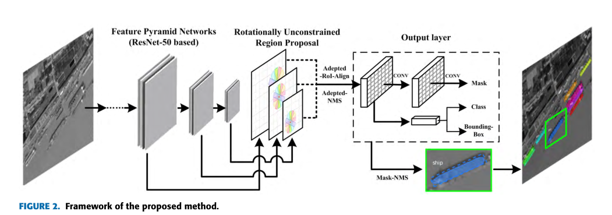
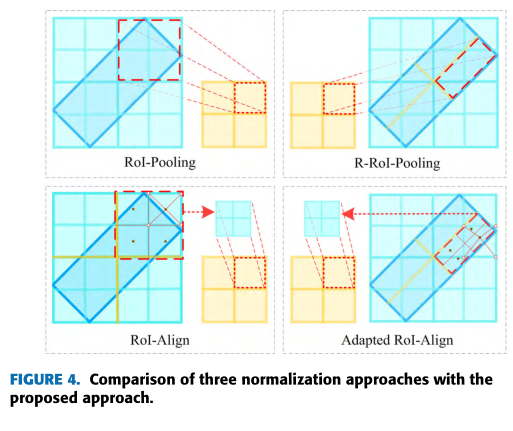
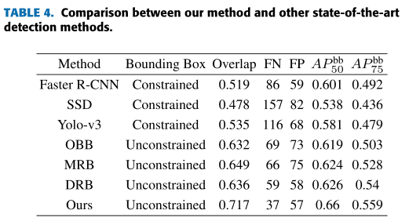

**一些基于旋转框实例分割的论文**

### [2019]Automatic Building Extraction from Google Earth Images under Complex Backgrounds  Based on Deep Instance Segmentation Network

作者提出了一种改进的Mask R-CNN，可以实现旋转边界框检测和实例分割。主要参考的是经典的Mask R-CNN和RRPN

作者的主要改进：在Mask R-CNN的RPN阶段使用旋转边界框（Rotation Bounding Box ，RBB）替代原有的水平框

网络结构：

1.在RPN阶段引入旋转锚。这一部分和RRPN一模一样

2.==将ROI的特征图逆时针旋转成水平矩形==，然后通过ROI对齐（双线性插值）进行处理。

像素坐标的转换公式如下：

其中(x,y)是bbox的中心坐标，(x',y')是原始ROI特征图中像素的坐标，(x",y")是转换后的ROI特征图像素的坐标。然后将转换后的水平ROI通过ROI对齐映射到同一尺度。

3.回归分支修改包围盒坐标，分类分支预测相应的分类分数，分割分支通过几个RFB模块（作者提的一种感受野模块）生成相应的对象掩码。

4.将包围盒和掩码按回归角度顺时针旋转（mask和box都要转回来），作为实例分割结果。计算三个分支的损失，并将其相加，形成多任务损失。

遥感数据上的目标检测结果对比：

分割结果对比：

### [2019]Rotationally Unconstrained Region Proposals for Ship Target Segmentation in Optical Remote Sensing

这个作者也是在Mask R-CNN基础上提出了一种基于旋转框的实例分割模型

模型框架：

模型分为两个部分，第一部分是生成旋转区域提议，第二部分细化这些提议并生成掩码。

论文的主要创新就是提出了多尺度区域提议层（multiangle region proposal layer，MA-RPL），其结构如下：

前面的k-means是用来产生旋转anchor的。

==自适应ROI对齐层：==

首先将带角度的提议区域特征图分为若干块（如2\*2）。然后将每块划分为4个等面积的区域，计算每块区域的中心坐标。最后对于每个中心，使用四个最近的像素通过双线性插值计算特征值，然后用最大池聚合每个单元的四个值。

==自适应ROI对齐实现了直接从旋转ROI到统一尺度的特征图，上篇论文是把旋转ROI转为水平的再进行ROI对齐。==

在航拍图上检测任务的结果对比：

分割任务结果对比：

### [2019]Oriented Boxes for Accurate Instance Segmentation

作者在引言中指出了基于轴对齐边界框的实例分割模型的缺陷：

1.框的大部分会覆盖背景或其他的非目标对象，导致会误分类或预测掩码延伸到其他对象上

2.在NMS时重叠的框很容易被滤除

3.旋转的目标用水平框检测时长宽比差异很大，会导致边界框不精确

而使用基于旋转框的实例分割模型有这些好处：

1.与检测对象的方向无关，大多数旋转边界框可以和待检测对象重叠，可以减少框内的背景像素，并且避免与相邻对象重叠

2.边界框纵横比与对象是否旋转无关，更容易训练

3.由于旋转框重叠小，减小了在相邻对象内产生假阳性的可能（假阳性：实例没有目标却检测出了目标）

4.对于大型、细长、沿对角分布的对象的检测准确率会更高

作者还在论文中指出他们可能是第一个做基于旋转目标实例分割的。

作者提出定向实例分割（oriented instance segmentation ，OIS） ，解决了轴对齐实例分割（axis-aligned instance segmentation ，AAIS)的缺陷

基于Mask R-CNN的框架：

主干网络：提取特征

RPN部分：进行定向区域提议，只区分前景背景

RCNN头部：分类、细化包围盒

Mask头部：预测mask，和Mask RCNN不同的是，这个网络的mask分支是串联在分类分支和回归分支后的，而Mask RCNN中这三个分支是并联的。

效果：在D2S、Screws、Pill Bags几个数据集上mAP值都提高了10%以上

上面几篇论文都没有给出源码，有很多实现细节并不清楚，比如说旋转是怎么加的，损失是怎么算的

为了实现基于旋转框的实例分割模型，现在就有两种思路：

1.旋转目标检测+语义分割：在现有的旋转目标检测模型的基础上加上语义分割头（目前没看到这方面的论文）

2.在现有基于水平框的实例分割模型中加入角度回归，将水平框改造为旋转框，从上面的的论文看，关键在于怎么加入角度回归以及怎么处理旋转后的ROI

MMDetection：openmmlab社区开源的一种目标检测开源工具箱，由商汤和香港科技大学开发，github star 18k+，目前官方实现的模型大约有50个，也有很多论文的实现都是在这个框架的基础上开发的。

MMDetection在pytorch上进行进一步封装，把目标检测的整个流程分成了几个模块，每个模块

MMRotate专门用于旋转框检测的开源工具箱

