# 机器学习（吴恩达）---学习笔记

[TOC]


## 绪论

### 来源

参考：

[吴恩达机器学习](https://www.bilibili.com/video/BV164411b7dx?from=search&seid=1912302349541647512&spm_id_from=333.337.0.0)

[黄海广机器学习笔记](https://github.com/fengdu78/Coursera-ML-AndrewNg-Notes)

[小王同学在积累机器学习专栏](https://www.zhihu.com/column/c_1193202112899747840) 

### 机器学习是什么

​		机器学习是人工智能的一种


> 人类学习通过经验(事件)，归纳出规律。
>
> 机器学习通过数据，训练出模型。


> 机器学习不是基于编程形成的直接结果，不是代码直接写出一个模型 y = -0.3x + 6，而是通过归纳得出来的模型，例如，通过初始化 y = ax + b 中的 a、b，不断迭代，获得针对样本数据最优的 a、b 值，即得到对应的、归纳出来的最优的模型。

> 机器学习中，会用一些真实的数据对算法构建的模型进行评估，评估模型的性能，如果这个模型能达到要求，就用来测试其他的数据，如果达不到要求就要调整算法来重新建立模型，再次进行评估，如此循环往复，最终获得满意的模型来处理其他的数据。

### 监督学习

- 特点

    > 输入为一组由正确答案组成的数据集

- 回归问题

    - 输入：一组由正确答案组成的数据集
    - 输出：连续的预估值


- 分类问题
    - 输入：由一组正确答案组成的数据集
    - 输出：离散的预估值


​		描述乳房肿瘤的特征可以有多个


------------------------------

### 无监督学习

- 特点

> ​		数据集没有“正确答案”，数据没有任何标签或者是有相同的标签或者就是没有标签

- 聚类问题
  - 输入：一组未知类型的数据集
  - 输出：聚类后的数据


## 单变量线性回归

### 模型表示

1. 问题描述

> ​		现在有一组波特兰市房屋尺寸与住房价格的数据集，根据该数据集，预计1250平方尺的房子能卖多少钱

2. 问题分析

> 这是一个典型的监督学习的例子，属于回归问题

​		将数据集画出来：


m---训练集中实例数量

x---特征/输入变量

y---目标变量/输出变量

(x,y)---训练集中的实例

(x^(i)^ ,y^(i)^ )---第i个观察实例

h---==学习算法的解决方案或函数，也成为假设(hypothesis)==，假设函数就是假设数据的分布符合某一个函数，使函数能尽可能的代表样本。假设函数的输出即为预测值。

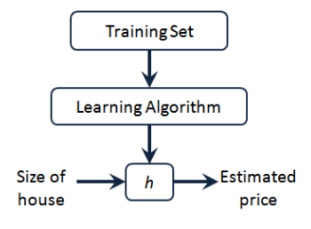

​		上图表示一个监督学习算法的工作方式，将训练集输入给学习算法，学习算法输出一个函数h，这个函数的输入是房屋尺寸，输出是房价。当h函数形如$h_{\theta}(x)=\theta_{0}+\theta_{1} x$时该问题就称为单变量线性回归问题

------------------------------------------

### 代价函数

​		现在问题来了，假设函数$h_{\theta}(x)=\theta_{0}+\theta_{1} x$中的参数θ~i~ 怎么确定呢，θ~i~ 的选着决定了我们所得到的直线相对于训练集的准确程度，模型预测值与训练集中的实际值之间的差距就是建模误差(modeling error)


​		我们的目标即是找到使建模误差平方和最小的模型参数。即代价函数$J\left(\theta_{0}, \theta_{1}\right)=\frac{1}{2 m} \sum_{i=1}^{m}\left(h_{\theta}\left(x^{(i)}\right)-y^{(i)}\right)^{2}$ 最小

|  |      |
| :----------------------------------------------------------: | ---- |

​		上图是该代价函数的三维及等高线图表示

- **该问题数学建模描述**


​		代价函数的理解：

①衡量模型预测出来的值 h(θ) 与真实值 y 之间差异的函数叫做代价函数 J(θ)。

② 代价函数值越小说明模型和参数越符合训练样本 (x, y) 对应的模型。

③ 代价函数是用来找到假设函数的最优解的，将求假设函数问题转换为求代价函数问题。

④ 我们根据平方误差代价函数来求假设函数的最优解。

### 梯度下降

​		梯度下降是一种求函数最小值的算法，用它来求代价函数的最小值

​		梯度下降的思想：开始时我们随机选择一个参数的组合（θ~0~,θ~1~,...,θ~n~），计算代价函数，然后我们寻找下一个能让代价函数值下降最多的参数组合。我们持续这么做直到到到 一个局部最小值（local minimum），因为我们并没有尝试完所有的参数组合，所以不能确定 我们得到的局部最小值是否便是全局最小值（global minimum），选择不同的初始参数组合， 可能会找到不同的局部最小值。


​		批量梯度下降(batch gradient descent)算法的公式：

​		repeat until convergence{

​		$\theta _{j} :=\theta _{j} -\alpha \frac{\partial }{\partial \theta _{j}}J(\theta _{0},\theta _{1}) $ 		 (for j=0 and j=1) 

​		}(:=表示赋值)

​		其中α表示学习效率(learning rate)，它决定了我们沿着能让代价函数下降程度最大的方向向下迈出的步子有多大，α太小，学习效率太低，α太大可能会无法收敛。

​		注意梯度下降算法中==参数θ要同步更新==：


​		将代价函数简化为只有一个θ参数时更容易理解：


​		首先初始化θ~1~ 的值，每次迭代虽然学习效率没变，但是这个点的倒数绝对值越来越小，因此每次迈的步子也越来越小，最后会趋于局部最小值。事实上体素梯度下降算法可以最小化任何代价函数J，而不只是线性回归中的代价函数J。

### 线性回归的梯度下降


上图左边可以写成：


**step1：**初始化θ~0~ ，θ~1~


**step2：**更新θ~0~ ，θ~1~ 直到收敛，收敛处的θ~0~ ，θ~1~ 即为是代价函数取得局部最小值的θ~0~ ，θ~1~ ，这里的代价函数为凸函数（只有一个局部最小），局部最优即为全局最优。


​		这个算法也被成为“批梯度下降”(Batch Gradient Descent)，指的是在梯度下降的每一步中，都用到了所有训练样本（在计算偏导时，对m个训练样本求和），其他类型的梯度下降算法可能不是这种“批量”型的，不考虑整个训练集，而是每次只关注训练集中的一些子集。

## 多变量线性回归

### 多维特征

​		将房价预测的回归问题增加更多特征，构成一个含有多个变量的模型，模型中的特征为(x~1~ ,x~2~ ,...,x~n~ )


​		n---特征的数量

​		x^(i)^ ---第i个训练实例，是特征矩阵中的第i行

​		x ~j~ ^(i)^ ---特征矩阵 中第i行的第j个特征，也就是第i个训练实例的第j个特征

​		假设函数h表示为：$h_{\theta}(x)=\theta_{0}+\theta_{1} x_{1}+\theta_{2} x_{2}+\ldots+\theta_{n} x_{n}$ ，引入x~0~ =1简化模型，特征矩阵维度为m*(n+1)，公式简化为$h_{\theta}(x)=\theta^{T} X$ 

### 多变量梯度下降

​		代价函数：


​		多变量线性回归梯度下降算法：


​		即：


​		求导后得到：


​		当n≥1时，

​		$\theta_{0}:=\theta_{0}-\alpha \frac{1}{m} \sum_{i=1}^{m}\left(h_{\theta}\left(x^{(i)}\right)-y^{(i)}\right) x_{0}^{(i)}$

​		$\theta_{1}:=\theta_{1}-\alpha \frac{1}{m} \sum_{i=1}^{m}\left(h_{\theta}\left(x^{(i)}\right)-y^{(i)}\right) x_{1}^{(i)}$

​		$\theta_{2}:=\theta_{2}-\alpha \frac{1}{m} \sum_{i=1}^{m}\left(h_{\theta}\left(x^{(i)}\right)-y^{(i)}\right) x_{2}^{(i)}$

### 特征缩放

​		在面对多维特征问题时，要保证这些特征具有相近的尺度，是梯度下降算法尽快收敛。

​		以房价问题为例，假设我们使用两个特征，房屋的尺寸和房间的数量，尺寸的值为 02000 平方英尺，而房间数量的值则是 0-5，以两个参数分别为横纵坐标，绘制代价函数的等 高线图能，看出图像会显得很扁，梯度下降算法需要非常多次的迭代才能收敛。


​		解决的方法是尝试将所有特征的尺度都尽量缩放到-1 到 1 之间。如图：


​		常用的缩放方法：

​		均值归一化：


其中μ~n~ 是平均值，S~n~ 是max(x~n~)-min(x~n~)或标准差

### 学习效率

​		我们可以绘制迭代次数与代价函数的曲线来观测算法合适收敛，也可以将代价函数的变化值与某个阈值（如0.001）较来判断是否收敛，但通常画图更好


​		学习效率影响了梯度下降算法的收敛速度，学习效率α过小时收敛速度太慢，过大时可能导致无法收敛，通常可以考虑这些学习效率值：

α=0.01，0.03，0.1，0.3，1，3，10

### 特征和多项式回归

​		线性回归并不适合所有数据，通常我们需要先观察数据，再决定准备尝试怎样的模型

​		例如，对于用面积预测房价的问题，模型$h_{\theta}(x)=\theta_{0}+\theta_{1}x+\theta_{2} \sqrt{x}$ 可能更合适，然后可以令$x_2 = \sqrt{(x)}$ ，于是多项式回归问题转化为多特征线性回归问题，回归模型为$h_{\theta}(x)=\theta_{0}+\theta_{1}x_{1}+\theta_{2}x_{2}$


### 正规方程

​		正规方程法通过求解方程$\frac{\partial}{\partial \theta_{j}} J\left(\theta_{j}\right)=0$ 求得，假设训练集特征矩阵为X(包含了x~0~ =1)训练集结果为向量y，则正规方程法求得的解为向量$\theta=\left(X^{T} X\right)^{-1} X^{T} y$ .

​	以下表数据为例：


**==正规方程法与梯度下降的对比==**

| 梯度下降                    | 正规方程                                                     |
| --------------------------- | ------------------------------------------------------------ |
| 需要选择学习效率α           | 不需要                                                       |
| 需要多次迭代                | 一次运算得出                                                 |
| 特征数量n较大时也能较好适用 | 通常矩阵求逆运算的时间复杂度为O(n^3^ )，通常来说当n<10000时可以接受 |
| 适用于各种模型              | 只适用于线性模型，不适用于逻辑回归等其他模型                 |

**不可逆性**

​		有时矩阵X'X会出现不可逆的情况，如特征量线性相关时不可逆，m小于或等于n时也也可能不可逆。在Octave中pinv()函数为伪逆运算，即使不可逆也能求出想要的结果。一般当X'X不可逆时，可以这么做：

​		看特征量中是否存在多与特征，如特征线性相关，去除重复特征；观察是否有多余特征，去除多余特征。

## 逻辑回归

### 分类问题		

​		在分类问题中，待预测的变量y是离散的值，逻辑回归(Logistic Regression)算法是一种常用于分类问题的学习算法。


### 问题描述

​		先考虑二元分类问题，将因变量可能属于的两个类分别称为负向类和正向类，则因变量y∈{0,1}，其中0表示负向类，1表示正向类。这类问题的输出始终在0,1之间，用线性回归算法显然不合适。

### 假说表示

​		分类问题的期望输出值在0和1之间，因此，我们希望想出一个满足某个性质的假设函数，这个性质是它的预测值要在0和1之间。逻辑回归模型的假设是：h~θ~ (x)=g(θ^T^ X)，其中：

​		X---特征向量

​		g---逻辑函数，一个常用的逻辑函数为S形函数，公式为$g(z)=\frac{1}{1+e^{-z}}$ 


​		于是$h_{\theta}(x)=\frac{1}{1+e^{-\theta^{T} X}}$ 

​		**==h~θ~(x)的作用是，对于给定的输入变量，根据选择的参数计算输出变量=1 的可能性$h_{\theta}(x)=P(y=1 \mid x ; \theta)$==** 

### 决策边界

​		在逻辑回归中，我们预测：

​		当h~θ~ 大于或等于0.5时，预测y=1；

​		当h~θ~ 小于0.5时，预测y=0

​		也就是θ^T^ X>=0时，预测y=1；

​		θ^T^ X<0时，预测y=0

​		例如，假设有模型：


​		并且参数$\theta$ 是向量[-3 1 1]。 则当$-3+{x_1}+{x_2} \geq 0$，即${x_1}+{x_2} \geq 3$时，模型将预测 $y=1$。

​		我们可以绘制直线${x_1}+{x_2} = 3$，这条线便是我们模型的分界线(即**决策边界**)，将预测为1的区域和预测为 0的区域分隔开。

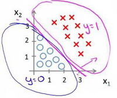

​		假使我们的数据呈现这样的分布情况，怎样的模型才能适合呢？


​		因为需要用曲线才能分隔 $y=0$ 的区域和 $y=1$ 的区域，我们需要二次方特征：${h_\theta}\left( x \right)=g\left( {\theta_0}+{\theta_1}{x_1}+{\theta_{2}}{x_{2}}+{\theta_{3}}x_{1}^{2}+{\theta_{4}}x_{2}^{2} \right)$是[-1 0 0 1 1]，则我们得到的判定边界恰好是圆点在原点且半径为1的圆形。

​		决策边界是假设函数的一个属性，取决于其参数，它不是数据集的属性

### 代价函数

​		如果我们在逻辑回归中沿用线性回归的代价函数$J\left( \theta  \right)=\frac{1}{m}\sum\limits_{i=1}^{m}{\frac{1}{2}{{\left( {h_\theta}\left({x}^{\left( i \right)} \right)-{y}^{\left( i \right)} \right)}^{2}}}$ ，代入${h_\theta}\left( x \right)=\frac{1}{1+{e^{-\theta^{T}x}}}$ 后将得到一个非凸函数，这将影响使用梯度下降算法寻找全局最小值。 


​		我们重新定义逻辑回归的代价函数为：$J\left( \theta  \right)=\frac{1}{m}\sum\limits_{i=1}^{m}{{Cost}\left( {h_\theta}\left( {x}^{\left( i \right)} \right),{y}^{\left( i \right)} \right)}$，其中


​		${h_\theta}\left( x \right)$与 $Cost\left( {h_\theta}\left( x \right),y \right)$之间的关系如下图所示：

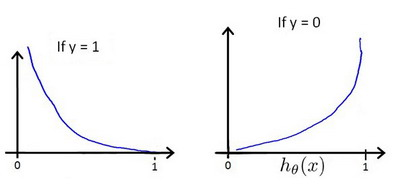

​		这样构建的$Cost\left( {h_\theta}\left( x \right),y \right)$函数的特点是：当实际的  $y=1$ 且${h_\theta}\left( x \right)$也为 1 时误差为 0，当 $y=1$ 但${h_\theta}\left( x \right)$不为1时误差随着${h_\theta}\left( x \right)$变小而变大；当实际的 $y=0$ 且${h_\theta}\left( x \right)$也为 0 时代价为 0，当$y=0$ 但${h_\theta}\left( x \right)$不为 0时误差随着 ${h_\theta}\left( x \right)$的变大而变大。

### 简化的代价函数和梯度下降

​		逻辑回归的代价函数：


​		简化：$Cost\left( {h_\theta}\left( x \right),y \right)=-y\times log\left( {h_\theta}\left( x \right) \right)-(1-y)\times log\left( 1-{h_\theta}\left( x \right) \right)$ 

​		即，**逻辑回归的代价函数：**
$Cost\left( {h_\theta}\left( x \right),y \right)=-y\times log\left( {h_\theta}\left( x \right) \right)-(1-y)\times log\left( 1-{h_\theta}\left( x \right) \right)$
$=-\frac{1}{m}\sum\limits_{i=1}^{m}{[{{y}^{(i)}}\log \left( {h_\theta}\left( {{x}^{(i)}} \right) \right)+\left( 1-{{y}^{(i)}} \right)\log \left( 1-{h_\theta}\left( {{x}^{(i)}} \right) \right)]}$ 

​		优化目标：

$\underset{\theta}{\min }J\left( \theta  \right)$ 

​		梯度下降算法：


​		求导后：


​		上式与线性回归的梯度下降结果看似一样，但实际上两者的假设函数不一样，线性回归的假设函数为：${h_\theta}\left( x \right)={\theta^T}X={\theta_{0}}{x_{0}}+{\theta_{1}}{x_{1}}+{\theta_{2}}{x_{2}}+...+{\theta_{n}}{x_{n}}$ 而逻辑回归的假设函数为：${h_\theta}\left( x \right)=\frac{1}{1+{{e}^{-{\theta^T}X}}}$ 。

​		在写代码求解时，我们可以通过for循环依次更新θ，也可以用向量的形式一次性更新θ


### 高级优化

这一节基本都是复制的

参考视频: 6 - 6 - Advanced Optimization (14 min).mkv

在上一个视频中，我们讨论了用梯度下降的方法最小化逻辑回归中代价函数$J\left( \theta  \right)$。在本次视频中，我会教你们一些高级优化算法和一些高级的优化概念，利用这些方法，我们就能够使通过梯度下降，进行逻辑回归的速度大大提高，而这也将使算法更加适合解决大型的机器学习问题，比如，我们有数目庞大的特征量。
现在我们换个角度来看什么是梯度下降，我们有个代价函数$J\left( \theta  \right)$，而我们想要使其最小化，那么我们需要做的是编写代码，当输入参数 $\theta$ 时，它们会计算出两样东西：$J\left( \theta  \right)$ 以及$J$ 等于 0、1直到 $n$ 时的偏导数项。


假设我们已经完成了可以实现这两件事的代码，那么梯度下降所做的就是反复执行这些更新。
另一种考虑梯度下降的思路是：我们需要写出代码来计算$J\left( \theta  \right)$ 和这些偏导数，然后把这些插入到梯度下降中，然后它就可以为我们最小化这个函数。
对于梯度下降来说，我认为从技术上讲，你实际并不需要编写代码来计算代价函数$J\left( \theta  \right)$。你只需要编写代码来计算导数项，但是，如果你希望代码还要能够监控这些$J\left( \theta  \right)$ 的收敛性，那么我们就需要自己编写代码来计算代价函数$J(\theta)$和偏导数项$\frac{\partial }{\partial {\theta_j}}J\left( \theta  \right)$。所以，在写完能够计算这两者的代码之后，我们就可以使用梯度下降。
然而梯度下降并不是我们可以使用的唯一算法，还有其他一些算法，更高级、更复杂。如果我们能用这些方法来计算代价函数$J\left( \theta  \right)$和偏导数项$\frac{\partial }{\partial {\theta_j}}J\left( \theta  \right)$两个项的话，那么这些算法就是为我们优化代价函数的不同方法，**共轭梯度法、 BFGS** (**变尺度法**) 和**L-BFGS** (**限制变尺度法**) 就是其中一些更高级的优化算法，它们需要有一种方法来计算 $J\left( \theta  \right)$，以及需要一种方法计算导数项，然后使用比梯度下降更复杂的算法来最小化代价函数。这三种算法的具体细节超出了本门课程的范畴。实际上你最后通常会花费很多天，或几周时间研究这些算法，你可以专门学一门课来提高数值计算能力，不过让我来告诉你他们的一些特性：

这三种算法有许多优点：

一个是使用这其中任何一个算法，你通常**不需要手动选择学习率 $\alpha$**，所以对于这些算法的一种思路是，给出计算导数项和代价函数的方法，你可以认为算法有一个智能的内部循环，而且，事实上，他们确实有一个智能的内部循环，称为**线性搜索**(**line search**)算法，它可以自动尝试不同的学习速率 $\alpha$，并自动选择一个好的学习速率 $a$，因此它甚至可以为每次迭代选择不同的学习速率，那么你就不需要自己选择。这些算法实际上在做更复杂的事情，不仅仅是选择一个好的学习速率，所以它们往往最终**比梯度下降收敛得快多了**，不过关于它们到底做什么的详细讨论，已经超过了本门课程的范围。

实际上，我过去使用这些算法已经很长一段时间了，也许超过十年了，使用得相当频繁，而直到几年前我才真正搞清楚**共轭梯度法、 BFGS** 和 **L-BFGS**的细节。

我们实际上完全有可能成功使用这些算法，并应用于许多不同的学习问题，而不需要真正理解这些算法的内环间在做什么，如果说这些算法有缺点的话，那么我想说主要缺点是它们比梯度下降法复杂多了，特别是你最好不要自己实现 **L-BGFS**、**BFGS**这些算法，除非你是数值计算方面的专家。实际上，我不会建议你们编写自己的代码来计算数据的平方根，或者计算逆矩阵，因为对于这些算法，我还是会建议你直接使用一个软件库，比如说，要求一个平方根，我们所能做的就是调用一些别人已经写好用来计算数字平方根的函数。幸运的是现在我们有**Octave** 和与它密切相关的 **MATLAB** 语言可以使用。

**Octave** 有一个非常理想的库用于实现这些先进的优化算法，所以，如果你直接调用它自带的库，你就能得到不错的结果。我必须指出这些算法实现得好或不好是有区别的，因此，如果你正在你的机器学习程序中使用一种不同的语言，比如如果你正在使用**C**、**C++**、**Java**等等，你可能会想尝试一些不同的库，以确保你找到一个能很好实现这些算法的库。因为在**L-BFGS**或者等高线梯度的实现上，表现得好与不太好是有差别的，因此现在让我们来说明：如何使用这些算法：


比方说，你有一个含两个参数的问题，这两个参数是${\theta_{0}}$和${\theta_{1}}$，因此，通过这个代价函数，你可以得到${\theta_{1}}$和 ${\theta_{2}}$的值，如果你将$J\left( \theta  \right)$ 最小化的话，那么它的最小值将是${\theta_{1}}=5$ ，${\theta_{2}}=5$。代价函数$J\left( \theta  \right)$的导数推出来就是这两个表达式：

$\frac{\partial }{\partial {{\theta }_{1}}}J(\theta)=2({{\theta }_{1}}-5)$

$\frac{\partial }{\partial {{\theta }_{2}}}J(\theta)=2({{\theta }_{2}}-5)$

如果我们不知道最小值，但你想要代价函数找到这个最小值，是用比如梯度下降这些算法，但最好是用比它更高级的算法，你要做的就是运行一个像这样的**Octave** 函数：

```octave
function [jVal, gradient]=costFunction(theta)
    
　　jVal=(theta(1)-5)^2+(theta(2)-5)^2;
    
　　gradient=zeros(2,1);
    
　　gradient(1)=2*(theta(1)-5);
    
　　gradient(2)=2*(theta(2)-5);
    
end
```

这样就计算出这个代价函数，函数返回的第二个值是梯度值，梯度值应该是一个2×1的向量，梯度向量的两个元素对应这里的两个偏导数项，运行这个**costFunction** 函数后，你就可以调用高级的优化函数，这个函数叫
**fminunc**，它表示**Octave** 里无约束最小化函数。调用它的方式如下：

```octave
options=optimset('GradObj','on','MaxIter',100);

initialTheta=zeros(2,1);
    
[optTheta, functionVal, exitFlag]=fminunc(@costFunction, initialTheta, options);
```

你要设置几个**options**，这个 **options** 变量作为一个数据结构可以存储你想要的**options**，所以 **GradObj** 和**On**，这里设置梯度目标参数为打开(**on**)，这意味着你现在确实要给这个算法提供一个梯度，然后设置最大迭代次数，比方说100，我们给出一个$\theta$ 的猜测初始值，它是一个2×1的向量，那么这个命令就调用**fminunc**，这个@符号表示指向我们刚刚定义的**costFunction** 函数的指针。如果你调用它，它就会使用众多高级优化算法中的一个，当然你也可以把它当成梯度下降，只不过它能自动选择学习速率$\alpha$，你不需要自己来做。然后它会尝试使用这些高级的优化算法，就像加强版的梯度下降法，为你找到最佳的${\theta}$值。

让我告诉你它在 **Octave** 里什么样：


所以我写了这个关于**theta**的 **costFunction** 函数，它计算出代价函数 **jval**以及梯度**gradient**，**gradient** 有两个元素，是代价函数对于**theta(1)** 和 **theta(2)**这两个参数的偏导数。

我希望你们从这个幻灯片中学到的主要内容是：写一个函数，它能返回代价函数值、梯度值，因此要把这个应用到逻辑回归，或者甚至线性回归中，你也可以把这些优化算法用于线性回归，你需要做的就是输入合适的代码来计算这里的这些东西。

现在你已经知道如何使用这些高级的优化算法，有了这些算法，你就可以使用一个复杂的优化库，它让算法使用起来更模糊一点。因此也许稍微有点难调试，不过由于这些算法的运行速度通常远远超过梯度下降。

所以当我有一个很大的机器学习问题时，我会选择这些高级算法，而不是梯度下降。有了这些概念，你就应该能将逻辑回归和线性回归应用于更大的问题中，这就是高级优化的概念。

在下一个视频，我想要告诉你如何修改你已经知道的逻辑回归算法，然后使它在多类别分类问题中也能正常运行。

### 多类别分类问题：一对多

​		举例，对于多元分类问题：


​		现在我们有一个训练集，好比上图表示的有3个类别，我们用三角形表示 $y=1$，方框表示$y=2$，叉叉表示 $y=3$。我们下面要做的就是使用一个训练集，将其分成3个二元分类问题。

​		我们先从用三角形代表的类别1开始，实际上我们可以创建一个，新的"伪"训练集，类型2和类型3定为负类，类型1设定为正类，我们创建一个新的训练集，如下图所示的那样，我们要拟合出一个合适的分类器。三角形代表正样本，圆形代表负样本。


​	为了能实现这样的转变，我们将多个类中的一个类标记为正向类（$y=1$），然后将其他所有类都标记为负向类，这个模型记作$h_\theta^{\left( 1 \right)}\left( x \right)$。接着，类似地第我们选择另一个类标记为正向类（$y=2$），再将其它类都标记为负向类，将这个模型记作 $h_\theta^{\left( 2 \right)}\left( x \right)$,依此类推。

​		最后我们得到一系列的模型简记为： $h_\theta^{\left( i \right)}\left( x \right)=p\left( y=i|x;\theta  \right)$其中：$i=\left( 1,2,3....k \right)$ 

​		总之，我们已经把要做的做完了，现在要做的就是训练这个逻辑回归分类器：$h_\theta^{\left( i \right)}\left( x \right)$， 其中 $i$ 对应每一个可能的 $y=i$，最后，为了做出预测，我们给出输入一个新的 $x$ 值，用这个做预测。我们要做的就是在我们三个分类器里面输入 $x$，然后我们选择一个让 $h_\theta^{\left( i \right)}\left( x \right)$ 最大的$ i$，即$\mathop{\max}\limits_i\,h_\theta^{\left( i \right)}\left( x \right)$。

## 正则化

### 过拟合

​		下图是一个回归问题的例子：


​		第一个模型是一个线性模型，**欠拟合**，不能很好地适应我们的训练集，具有**高偏差(bias)**；第二个模型采用二次函数拟合，拟合效果很好；第三个模型采用四次多项式拟合，能很好地拟合训练集，拟合几乎所有的训练数据，代价函数可能几乎为0，但这样的模型**无法泛化到新样本中**，称为**过拟合**，也叫**高方差**（历史叫法），产生过拟合的原因之一就是**没有足够的数据去约束这个变量过多的模型**。

​		分类问题中也存在这样的问题：


​		就以多项式理解，$x$ 的次数越高，拟合的越好，但相应的预测的能力就可能变差。

​		通常有2个方法解决过拟合问题：

​		1.丢弃一些不能帮助我们正确预测的特征，可以手动选择保留哪些特征，也可以利用模型选择算法自动滤除不重要的特征（如PCA）

​		2.正则化，保留所有特征，但是减小参数的大小。

### 代价函数

​		上面的回归问题中如果我们的模型是：
​		${h_\theta}\left( x \right)={\theta_{0}}+{\theta_{1}}{x_{1}}+{\theta_{2}}{x_{2}^2}+{\theta_{3}}{x_{3}^3}+{\theta_{4}}{x_{4}^4}$
​		我们可以从之前的事例中看出，正是那些高次项导致了过拟合的产生，所以如果我们能让这些高次项的系数接近于0的话，我们就能很好的拟合了。
所以我们要做的就是在一定程度上**减小这些参数$\theta $** 的值，这就是正则化的基本方法。我们决定要减少${\theta_{3}}$和${\theta_{4}}$的大小，我们要做的便是修改代价函数，在其中${\theta_{3}}$和${\theta_{4}}$ 设置一点惩罚。这样做的话，我们在尝试最小化代价时也需要将这个惩罚纳入考虑中，并最终导致选择较小一些的${\theta_{3}}$和${\theta_{4}}$。
修改后的代价函数如下：$\underset{\theta }{\mathop{\min }}\,\frac{1}{2m}[\sum\limits_{i=1}^{m}{{{\left( {{h}_{\theta }}\left( {{x}^{(i)}} \right)-{{y}^{(i)}} \right)}^{2}}+1000\theta _{3}^{2}+10000\theta _{4}^{2}]}$

​		通过这样的代价函数选择出的${\theta_{3}}$和${\theta_{4}}$ 对预测结果的影响就比之前要小许多。假如我们有非常多的特征，我们并不知道其中哪些特征我们要惩罚，我们将对所有的特征进行惩罚，并且让代价函数最优化的软件来选择这些惩罚的程度。这样的结果是得到了一个较为简单的能防止过拟合问题的假设：		$J\left( \theta  \right)=\frac{1}{2m}[\sum\limits_{i=1}^{m}{{{({h_\theta}({{x}^{(i)}})-{{y}^{(i)}})}^{2}}+\lambda \sum\limits_{j=1}^{n}{\theta_{j}^{2}}]}$

​		其中$\lambda $又称为**正则化参数**（**Regularization Parameter**）。 注：**根据惯例，我们不对${\theta_{0}}$ 进行惩罚**。经过正则化处理的模型与原模型的可能对比如下图所示：


​		如果选择的正则化参数$\lambda$ 过大，则会把所有的参数都最小化了，导致模型变成 ${h_\theta}\left( x \right)={\theta_{0}}$，也就是上图中红色直线所示的情况，造成欠拟合。
那为什么增加的一项$\lambda =\sum\limits_{j=1}^{n}{\theta_j^{2}}$ 可以使$\theta $的值减小呢？
​		因为如果我们令 $\lambda$ 的值很大的话，为了使**Cost Function** 尽可能的小，所有的 $\theta $ 的值（不包括${\theta_{0}}$）都会在一定程度上减小。
​		但若$\lambda$ 的值太大了，那么$\theta $（不包括${\theta_{0}}$）都会趋近于0，这样我们所得到的只能是一条平行于$x$轴的直线。
​		所以对于正则化，我们要取一个合理的 $\lambda$ 的值，这样才能更好的应用正则化。
​		回顾一下代价函数，为了使用正则化，让我们把这些概念应用到到线性回归和逻辑回归中去，那么我们就可以让他们避免过度拟合了。

### 线性回归正则化

​		线性回归正则化的代价函数为：$J\left( \theta  \right)=\frac{1}{2m}\sum\limits_{i=1}^{m}{[({{({h_\theta}({{x}^{(i)}})-{{y}^{(i)}})}^{2}}+\lambda \sum\limits_{j=1}^{n}{\theta _{j}^{2}})]}$ 

​		使用梯度下降：

$Repeat$  $until$  $convergence${

​                                                   ${\theta_0}:={\theta_0}-a\frac{1}{m}\sum\limits_{i=1}^{m}{(({h_\theta}({{x}^{(i)}})-{{y}^{(i)}})x_{0}^{(i)}})$ 

​                                                   ${\theta_j}:={\theta_j}-a[\frac{1}{m}\sum\limits_{i=1}^{m}{(({h_\theta}({{x}^{(i)}})-{{y}^{(i)}})x_{j}^{\left( i \right)}}+\frac{\lambda }{m}{\theta_j}]$ 

​                                                             $for$ $j=1,2,...n$

​                                                   }

​		对上面的算法中$ j=1,2,...,n$ 时的更新式子进行调整可得：

${\theta_j}:={\theta_j}(1-a\frac{\lambda }{m})-a\frac{1}{m}\sum\limits_{i=1}^{m}{({h_\theta}({{x}^{(i)}})-{{y}^{(i)}})x_{j}^{\left( i \right)}}$ 

​		可以看出，正则化线性回归的梯度下降算法的变化在于，每次都在原有算法更新规则的基础上令$\theta $值减少了一个额外的值。

​		我们同样也可以利用正规方程来求解正则化线性回归模型，方法如下所示：


​		图中的矩阵尺寸为 $(n+1)*(n+1)$，图中的求逆项一定可逆。

### 逻辑回归正则化

​		逻辑回归正则化的代价函数：

$J\left( \theta  \right)=\frac{1}{m}\sum\limits_{i=1}^{m}{[-{{y}^{(i)}}\log \left( {h_\theta}\left( {{x}^{(i)}} \right) \right)-\left( 1-{{y}^{(i)}} \right)\log \left( 1-{h_\theta}\left( {{x}^{(i)}} \right) \right)]}+\frac{\lambda }{2m}\sum\limits_{j=1}^{n}{\theta _{j}^{2}}$ 

​		梯度下降算法：

$Repeat$  $until$  $convergence${

​                                                   ${\theta_0}:={\theta_0}-a\frac{1}{m}\sum\limits_{i=1}^{m}{(({h_\theta}({{x}^{(i)}})-{{y}^{(i)}})x_{0}^{(i)}})$

​                                                  ${\theta_j}:={\theta_j}-a[\frac{1}{m}\sum\limits_{i=1}^{m}{({h_\theta}({{x}^{(i)}})-{{y}^{(i)}})x_{j}^{\left( i \right)}}+\frac{\lambda }{m}{\theta_j}]$

​                                                 $for$ $j=1,2,...n$

​                                                 }

​		**Octave** 中，我们依旧可以用 `fminuc` 函数来求解代价函数最小化的参数，值得注意的是参数${\theta_{0}}$的更新规则与其他情况不同。
注意：

1. 虽然正则化的逻辑回归中的梯度下降和正则化的线性回归中的表达式看起来一样，但由于两者的${h_\theta}\left( x \right)$不同所以还是有很大差别。

2. ${\theta_{0}}$不参与其中的任何一个正则化。

## 神经网络表述

### 非线性假设

​		为什么要用神经网络？神经网络能很好地解决线性回归和逻辑回归当特征量太多计算量大的问题。

​		举例：


​		假设我们有非常多的特征，例如大于100个变量，我们希望用这100个特征来构建一个非线性的多项式模型，结果将是数量非常惊人的特征组合，即便我们只采用两两特征的组合$(x_1x_2+x_1x_3+x_1x_4+...+x_2x_3+x_2x_4+...+x_{99}x_{100})$，我们也会有接近5000个组合而成的特征。这对于一般的逻辑回归来说需要计算的特征太多了，而且可能产生过拟合。

​		举例2：


​		假设我们现在要训练一个分类器来识别一张图片上是否含有汽车，当采用逻辑回归模型时，我们先输入一组数据集，这个数据集应该有一组带汽车的图片和一组不带汽车的图片组成，假设我们采用50*50像素的图片，将所有像素都视为特征，当采用灰度图像时，那么将有2500个特征，如果采用二次多项式模型拟合，将产生2500^2^ /2（接近300万）个特征，普通的逻辑回归模型无法有效处理这么多特征，这时候我们需要神经网络。


### 模型表示

​		首先看人脑中的神经元：


​		人脑中的神经元主要包括三个部分：

一是**若干个树突**---接收来自其他神经元的信息；

二是**神经元细胞主体**---负责从树突接受一定数目的信息，并做一些**计算**，然后将结果通过轴突传送到其他节点或神经元中

三是**轴突**---负责给其他神经元**传递信号**或**传送信息**

​		若干神经元连接组成神经网络

​		**人工神经网络模型**建立在很多神经元之上，每个神经元（也叫**激活单元**）又是一个学习模型。这些神经元采纳一些特征作为输入，并根据本身的模型提供一些输出。下图是一个以逻辑回归模型作为自身学习模型的神经元示例，在神经网络中，参数又可被成为**权重**（**weight**），图中黄色圆圈代表神经元，激励函数是对g(z)的另一个术语称呼。


​		我们设计出了类似于神经元的神经网络，效果如下：


​		其中$x_1$, $x_2$, $x_3$是输入单元（**input units**），我们将原始数据输入给它们。 $a_1$, $a_2$, $a_3$是中间单元，它们负责将数据进行处理，然后呈递到下一层。最后是输出单元，它负责计算${h_\theta}\left( x \right)$。

​		神经网络的第一层称为**输入层**，最后一层称为**输出层**，中间所有层称为**隐藏层**，为每层增加一个**偏置单元**

​		**$a_{i}^{\left( j \right)}$ 代表第$j$ 层的第 $i$ 个激活单元**。**${{\theta }^{\left( j \right)}}$代表从第 $j$ 层映射到第$ j+1$ 层时的权重的矩阵**，例如${{\theta }^{\left( 1 \right)}}$代表从第一层映射到第二层的权重的矩阵。其尺寸为：以第 $j+1$层的激活单元数量为行数，以第 $j$ 层的激活单元数加一为列数的矩阵。例如：上图所示的神经网络中${{\theta }^{\left( 1 \right)}}$的尺寸为 3*4。

​		对于上图所示的模型，激活单元和输出分别表达为：

$a_{1}^{(2)}=g(\Theta _{10}^{(1)}{{x}_{0}}+\Theta _{11}^{(1)}{{x}_{1}}+\Theta _{12}^{(1)}{{x}_{2}}+\Theta _{13}^{(1)}{{x}_{3}})$
$a_{2}^{(2)}=g(\Theta _{20}^{(1)}{{x}_{0}}+\Theta _{21}^{(1)}{{x}_{1}}+\Theta _{22}^{(1)}{{x}_{2}}+\Theta _{23}^{(1)}{{x}_{3}})$
$a_{3}^{(2)}=g(\Theta _{30}^{(1)}{{x}_{0}}+\Theta _{31}^{(1)}{{x}_{1}}+\Theta _{32}^{(1)}{{x}_{2}}+\Theta _{33}^{(1)}{{x}_{3}})$
${{h}_{\Theta }}(x)=g(\Theta _{10}^{(2)}a_{0}^{(2)}+\Theta _{11}^{(2)}a_{1}^{(2)}+\Theta _{12}^{(2)}a_{2}^{(2)}+\Theta _{13}^{(2)}a_{3}^{(2)})$

​		上图中每一个$a$ 都是由上一层所有的$x$ h和每一个$x$ 对应的权重决定的，我们将这样从左到右的算法称为**向前传播算法**

​		把$x$, $\theta$, $a$ 分别用矩阵表示：


​		我们可以得到$\theta \cdot X=a$ ，**这个矩阵在脑海中要有印象，不然后面章节的下标可能会搞不清楚。**

​		==$\Theta _{ij}^{(l)}$ ---$\Theta^{(l)}$ ，从第l层映射到底l+1层的权重矩阵，==

​		==i---第i行，其行数对应于第l+1层的单元数，$S_{l+1}$== 

​		==j---第j列，其列数对应于第l层的单元数+1，$S_{l}+1$== 

### 举例

​		神经网络中，单层神经元（无中间层）的计算可用来表示逻辑运算，比如逻辑与(**AND**)、逻辑或(**OR**)。

​		举例说明：逻辑与(**AND**)；下图中左半部分是神经网络的设计与**output**层表达式，右边上部分是**sigmod**函数，下半部分是真值表。

​		我们可以用这样的一个神经网络表示**AND** 函数：

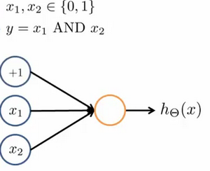

​		其中$\theta_0 = -30, \theta_1 = 20, \theta_2 = 20$
​		我们的输出函数$h_\theta(x)$即为：$h_\Theta(x)=g\left( -30+20x_1+20x_2 \right)$

​		我们知道$g(x)$的图像是：


​		所以我们有：$h_\Theta(x) \approx \text{x}_1 \text{AND} \, \text{x}_2$

​		所以我们的：$h_\Theta(x) $

​		这就是**AND**函数。

​		接下来再介绍一个**OR**函数：


​		**OR**与**AND**整体一样，区别只在于的取值不同。

​		二元逻辑运算符（**BINARY LOGICAL OPERATORS**）当输入特征为布尔值（0或1）时，我们可以用一个单一的激活层可以作为二元逻辑运算符，为了表示不同的运算符，我们只需要选择不同的权重即可。

​		下图的神经元（三个权重分别为-30，20，20）可以被视为作用同于逻辑与（**AND**）：


​		下图的神经元（三个权重分别为-10，20，20）可以被视为作用等同于逻辑或（**OR**）：

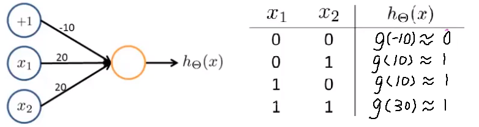

​		下图的神经元（两个权重分别为 10，-20）可以被视为作用等同于逻辑非（**NOT**）：


​		我们可以利用神经元来组合成更为复杂的神经网络以实现更复杂的运算。例如我们要实现**XNOR** 功能（输入的两个值必须一样，均为1或均为0），即 $\text{XNOR}=( \text{x}_1\, \text{AND}\, \text{x}_2 )\, \text{OR} \left( \left( \text{NOT}\, \text{x}_1 \right) \text{AND} \left( \text{NOT}\, \text{x}_2 \right) \right)$
​		首先构造一个能表达$\left( \text{NOT}\, \text{x}_1 \right) \text{AND} \left( \text{NOT}\, \text{x}_2 \right)$部分的神经元：


​		然后将表示 **AND** 的神经元和表示$\left( \text{NOT}\, \text{x}_1 \right) \text{AND} \left( \text{NOT}\, \text{x}_2 \right)$的神经元以及表示 OR 的神经元进行组合：

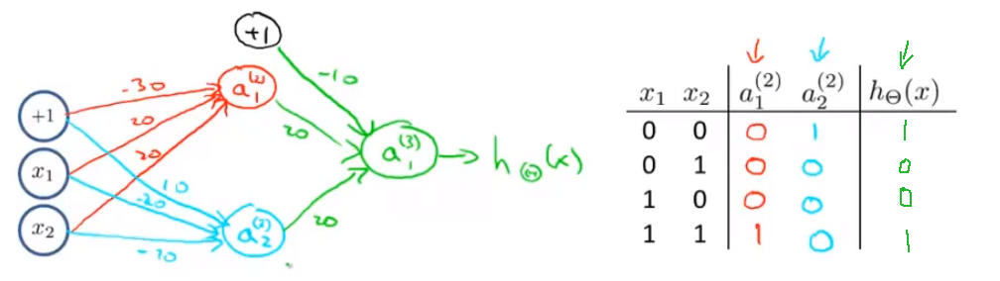

​		我们就得到了一个能实现 $\text{XNOR}$ 运算符功能的神经网络。

​		按这种方法我们可以逐渐构造出越来越复杂的函数，也能得到更加厉害的特征值。

​		这就是神经网络的厉害之处。

### 多类分类

当我们有不止两种分类时（也就是$y=1,2,3….$），比如以下这种情况，该怎么办？如果我们要训练一个神经网络算法来识别路人、汽车、摩托车和卡车，在输出层我们应该有4个值。例如，第一个值为1或0用于预测是否是行人，第二个值用于判断是否为汽车。

输入向量$x$有三个维度，两个中间层，输出层4个神经元分别用来表示4类，也就是每一个数据在输出层都会出现${{\left[ a\text{ }b\text{ }c\text{ }d \right]}^{T}}$，且$a,b,c,d$中仅有一个为1，表示当前类。下面是该神经网络的可能结构示例：


神经网络算法的输出结果为四种可能情形之一：


## 神经网络

### 代价函数

​		首先引入一些便于稍后讨论的新标记方法：

​		假设神经网络的训练样本有$m$个，每个包含一组输入$x$和一组输出信号$y$，$L$表示神经网络层数，$S_I$表示每层的**neuron**个数($S_l$表示输出层神经元个数)，$S_L$代表最后一层中处理单元的个数。

​		将神经网络的分类定义为两种情况：二类分类和多类分类，

​		二类分类：$S_L=0, y=0\, or\, 1$表示哪一类；

​		$K$类分类：$S_L=k, y_i = 1$表示分到第$i$类；$(k>2)$


​		我们回顾逻辑回归问题中我们的代价函数为：

$  J\left(\theta \right)=-\frac{1}{m}\left[\sum_\limits{i=1}^{m}{y}^{(i)}\log{h_\theta({x}^{(i)})}+\left(1-{y}^{(i)}\right)log\left(1-h_\theta\left({x}^{(i)}\right)\right)\right]+\frac{\lambda}{2m}\sum_\limits{j=1}^{n}{\theta_j}^{2}  $

​		在逻辑回归中，我们只有一个输出变量，又称标量（**scalar**），也只有一个因变量$y$，但是在神经网络中，我们可以有很多输出变量，我们的$h_\theta(x)$是一个维度为$K$的向量，并且我们训练集中的因变量也是同样维度的一个向量，因此我们的代价函数会比逻辑回归更加复杂一些，**==神经网络的代价函数为==**：$\newcommand{\subk}[1]{ #1_k }$
$$h_\theta\left(x\right)\in \mathbb{R}^{K}$$ $${\left({h_\theta}\left(x\right)\right)}_{i}={i}^{th} \text{output}$$

$J(\Theta) = -\frac{1}{m} \left[ \sum\limits_{i=1}^{m} \sum\limits_{k=1}^{k} {y_k}^{(i)} \log \subk{(h_\Theta(x^{(i)}))} + \left( 1 - y_k^{(i)} \right) \log \left( 1- \subk{\left( h_\Theta \left( x^{(i)} \right) \right)} \right) \right] + \frac{\lambda}{2m} \sum\limits_{l=1}^{L-1} \sum\limits_{i=1}^{s_l} \sum\limits_{j=1}^{s_{l+1}} \left( \Theta_{ji}^{(l)} \right)^2$

​		这个看起来复杂很多的代价函数背后的思想还是一样的，我们希望通过代价函数来观察算法预测的结果与真实情况的误差有多大，唯一不同的是，对于每一行特征，我们都会给出$K$个预测，基本上我们可以利用循环，对每一行特征都预测$K$个不同结果，然后在利用循环在$K$个预测中选择可能性最高的一个，将其与$y$中的实际数据进行比较。

​		正则化的那一项只是排除了每一层$\theta_0$后，每一层的$\theta$ 矩阵的和。最里层的循环$j$循环所有的行（由$s_{l+1}$  层的激活单元数决定），循环$i$则循环所有的列，由该层（$s_l$层）的激活单元数所决定。即：$h_\theta(x)$与真实值之间的距离为每个样本-每个类输出的加和，对参数进行**regularization**的**bias**项处理所有参数的平方和。

### 反向传播算法

​		之前我们在计算神经网络预测结果的时候我们采用了一种正向传播方法，我们从第一层开始正向一层一层进行计算，直到最后一层的$h_{\theta}\left(x\right)$。

​		现在，为了计算代价函数的偏导数$\frac{\partial}{\partial\Theta^{(l)}_{ij}}J\left(\Theta\right)$，我们需要采用一种反向传播算法，也就是首先计算最后一层的误差，然后再一层一层反向求出各层的误差，直到倒数第二层。
​		以一个例子来说明反向传播算法。

​		假设我们的训练集只有一个样本$\left({x}^{(1)},{y}^{(1)}\right)$，我们的神经网络是一个四层的神经网络，其中$K=4，S_{L}=4，L=4$：

​		前向传播算法：


​		下面的公式推导过程见：<https://blog.csdn.net/qq_29762941/article/details/80343185>

​		我们从最后一层的误差开始计算，误差是激活单元的预测（${a^{(4)}}$）与实际值（$y^k$）之间的误差，（$k=1:k$）。
​		我们用$\delta$来表示误差，则：$\delta^{(4)}=a^{(4)}-y$
​		我们利用这个误差值来计算前一层的误差：$\delta^{(3)}=\left({\Theta^{(3)}}\right)^{T}\delta^{(4)}\ast g'\left(z^{(3)}\right)$
​		其中 $g'(z^{(3)})$是 $S$ 形函数的导数，$g'(z^{(3)})=a^{(3)}\ast(1-a^{(3)})$。而$(θ^{(3)})^{T}\delta^{(4)}$则是权重导致的误差的和。下一步是继续计算第二层的误差：
​		$ \delta^{(2)}=(\Theta^{(2)})^{T}\delta^{(3)}\ast g'(z^{(2)})$
​		因为第一层是输入变量，不存在误差。我们有了所有的误差的表达式后，便可以计算代价函数的偏导数了，假设$λ=0$，即我们不做任何正则化处理时有：
​		$\frac{\partial}{\partial\Theta_{ij}^{(l)}}J(\Theta)=a_{j}^{(l)} \delta_{i}^{l+1}$

​		重要的是清楚地知道上面式子中上下标的含义：

​		$l$ 代表目前所计算的是第几层。

​		$j$ 代表目前计算层中的激活单元的下标，也将是下一层的第$j$个输入变量的下标。

​		$i$ 代表下一层中误差单元的下标，是受到权重矩阵中第$i$行影响的下一层中的误差单元的下标。

​		$a_{j}^{(l)}$ ---第l层的j单元的预测值

​		$\delta_{i}^{l+1}$ ---

​		如果我们考虑正则化处理，并且我们的训练集是一个特征矩阵而非向量。在上面的特殊情况中，我们需要计算每一层的误差单元来计算代价函数的偏导数。在更为一般的情况中，我们同样需要计算每一层的误差单元，但是我们需要为整个训练集计算误差单元，此时的误差单元也是一个矩阵，我们**用$\Delta^{(l)}_{ij}$来表示这个误差矩阵**。**第 $l$  层的第 $i$ 个激活单元受到第 $j$ 个参数影响而导致的误差。**

​		我们的**==反向传播算法==**表示为：

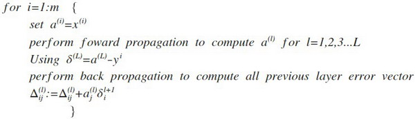

​		即首先用正向传播方法计算出每一层的激活单元，利用训练集的结果与神经网络预测的结果求出最后一层的误差，然后利用该误差运用反向传播法计算出直至第二层的所有误差。

​		在求出了$\Delta_{ij}^{(l)}$之后，我们便可以计算代价函数的偏导数了，计算方法如下：
$ D_{ij}^{(l)} :=\frac{1}{m}\Delta_{ij}^{(l)}+\lambda\Theta_{ij}^{(l)}$              ${if}\; j \neq  0$

$ D_{ij}^{(l)} :=\frac{1}{m}\Delta_{ij}^{(l)}$                             ${if}\; j = 0$

在**Octave** 中，如果我们要使用 `fminuc`这样的优化算法来求解求出权重矩阵，我们需要将矩阵首先展开成为向量，在利用算法求出最优解后再重新转换回矩阵。

假设我们有三个权重矩阵，Theta1，Theta2 和 Theta3，尺寸分别为 10\*11，10\*11 和1*11，
下面的代码可以实现这样的转换：

```octave
thetaVec = [Theta1(:) ; Theta2(:) ; Theta3(:)]

...optimization using functions like fminuc...

Theta1 = reshape(thetaVec(1:110, 10, 11);

Theta2 = reshape(thetaVec(111:220, 10, 11);

Theta1 = reshape(thetaVec(221:231, 1, 11);
```

### 反向传播算法的直观理解

​	前向传播算法：

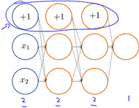


​		反向传播算法做的是：


​		**感悟**：上图中的 $\delta^{(l)}_{j}="error" \ of cost \  for \ a^{(l)}_{j} \ (unit \ j \ in \ layer \ l)$ 理解如下：

​		$\delta^{(l)}_{j}$ 相当于是第 $l$ 层的第 $j$ 单元中得到的激活项的“误差”，即”正确“的 $a^{(l)}_{j}$ 与计算得到的 $a^{(l)}_{j}$ 的差。

​		而 $a^{(l)}_{j}=g(z^{(l)})$ ，（g为sigmoid函数）。我们可以想象 $\delta^{(l)}_{j}$ 为函数求导时迈出的那一丁点微分，所以更准确的说 $\delta^{(l)}_{j}=\frac{\partial}{\partial z^{(l)}_{j}}cost(i)$

### 展开参数

​		在上一段视频中，我们谈到了怎样使用反向传播算法计算代价函数的导数。在这段视频中，我想快速地向你介绍一个细节的实现过程，怎样把你的参数从矩阵展开成向量，以便我们在高级最优化步骤中的使用需要。


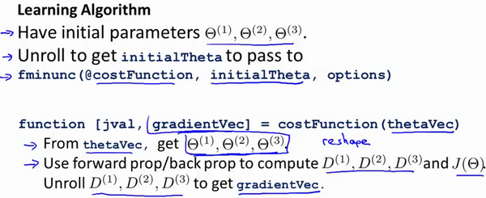

### 梯度检验

​		当我们对一个较为复杂的模型（例如神经网络）使用梯度下降算法时，可能会存在一些不容易察觉的错误，意味着，虽然代价看上去在不断减小，但最终的结果可能并不是最优解。

​		为了避免这样的问题，我们采取一种叫做梯度的数值检验（**Numerical Gradient Checking**）方法。这种方法的思想是通过估计梯度值来检验我们计算的导数值是否真的是我们要求的。

​		对梯度的估计采用的方法是在代价函数上沿着切线的方向选择离两个非常近的点然后计算两个点的平均值用以估计梯度。即对于某个特定的 $\theta$，我们计算出在 $\theta$-$\varepsilon $ 处和 $\theta$+$\varepsilon $ 的代价值（$\varepsilon $是一个非常小的值，通常选取 0.001），然后求两个代价的平均，用以估计在 $\theta$ 处的代价值。


​		**Octave** 中代码如下：

​		`gradApprox = (J(theta + eps) – J(theta - eps)) / (2*eps)`

​		当$\theta$是一个向量时，我们则需要对偏导数进行检验。因为代价函数的偏导数检验只针对一个参数的改变进行检验，下面是一个只针对$\theta_1$进行检验的示例：
$$ \frac{\partial}{\partial\theta_1}=\frac{J\left(\theta_1+\varepsilon_1,\theta_2,\theta_3...\theta_n \right)-J \left( \theta_1-\varepsilon_1,\theta_2,\theta_3...\theta_n \right)}{2\varepsilon} $$

​		最后我们还需要对通过反向传播方法计算出的偏导数进行检验。

​		根据上面的算法，计算出的偏导数存储在矩阵 $D_{ij}^{(l)}$ 中。检验时，我们要将该矩阵展开成为向量，同时我们也将 $\theta$ 矩阵展开为向量，我们针对每一个 $\theta$ 都计算一个近似的梯度值，将这些值存储于一个近似梯度矩阵中，最终将得出的这个矩阵同 $D_{ij}^{(l)}$ 进行比较。

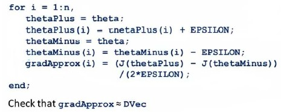

**总结梯度检验** 

1，将计算得到的D(1),D(2),D(3)**展开**为DVec向量。 

2，实现数值梯度检验，**计算**出gradApprox。 

3，**确定**DVec和gradApprox给出**接近**的结果。

4，**关掉**梯度检验，不再使用，**使用DVec来计算**，因为gradApprox计算量**非常大**。

### 随机初始化

​		任何优化算法都需要一些初始的参数。到目前为止我们都是初始所有参数为0，这样的初始方法对于逻辑回归来说是可行的，但是对于神经网络来说是不可行的。如果我们令所有的初始参数都为0，这将意味着我们第二层的所有激活单元都会有相同的值。同理，如果我们初始所有的参数都为一个非0的数，结果也是一样的。

​		我们通常初始参数为正负ε(这个值通产很小，接近0)之间的随机值，假设我们要随机初始一个尺寸为10×11的参数矩阵，代码如下：

​		Octave实现如下 rand 就是用来得出一个任意的**二维矩阵，**矩阵中的所有值都**介于0到1之间。**


​		总结来说，为了训练神经网络，应该对权重进行**随机初始化初始化为-ε到+ε间，接近于0的小数**，然后进行**反向传播**，执行**梯度检查**，或者使用**高级的优化算法**，试着使代价函数 J  达到最小**从某个随机选取的参数 θ 开始** ，来**打破对称性。**

### 小结

​		当我们在训练一个神经网络时，我们要做的第一件事就是：搭建网络的**大体框架**，这里我说的框架意思是神经元之间的**连接模式**，这里有如下几种结构：


​		那么我们该如何做出选择呢？ 对于**输入和输出层的单元数**是已经**确定**的。

​		我们只需要考虑：**隐藏单元的个数**以及**隐藏层的数目** 

​		规则一：只使用单个隐藏层 

​		规则二：如果你使用不止一个隐藏层的话，每一个隐藏层通常都**应有相同的单元数**   

​		规则三：隐藏单元**越多越好 (计算量一般会比较大)**

​		规则四：隐藏单元的数目应该和输入x 的维度，即特征的**数目匹配** (数量**相同**或者是它的**二倍**或者**三倍、四倍**，取为**稍大于输入特征数目**都是可以接受的)

​		实现神经网络的训练过程，这里一共**有六个步骤：** 

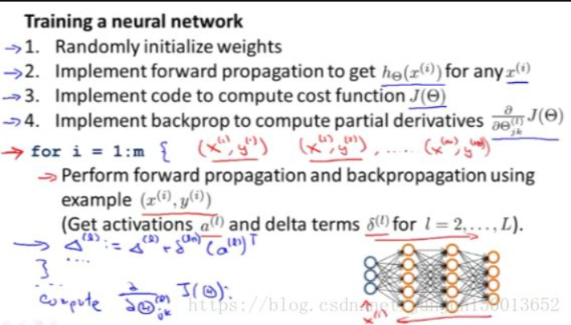


第一步：构建一个神经网络，然后**随机初始化权值** 

第二步：**执行前向传播算法**，也就是对于该神经网络的任意一个输入x(i) 计算出对应的h(x)值 也就是一个输出值y的向量

第三步：通过**代码计算出代价函数J(θ)** 

第四步：**执行反向传播算法，**来算出这些**偏导数或偏微分项，**也就是 **J(θ)关于参数θ的偏微分**

具体来说，我们要对所有训练集数据使用一个**for循环进行遍历，**一些比较**先进的分解方法**可能不需要像这里一样使用 for循环来对所有 m个训练样本进行遍历。但是，这是你第一次进行反向传播算法，所以我建议你最好还是使用一个for循环来完成程序对每一个训练样本进行迭代**执行前向传播和反向传播算法。**

具体来说就是：我们把x(i) 传到输入层，然后**执行前向传播和反向传播，**这样我们就能得到该神经网络中每一层中每一个单元对应的所有这些**激励值a(l)** 和**delta项，**记得考虑使用**正则化项lambda值**。 

第五步：**梯度检查**

第六步：使用一个最优化算法，比如说**梯度下降算法**或者说是**更加高级的优化方法，**比如说BFGS算法、共轭梯度法，或者其他一些已经**内置**到fminunc函数中的**方法**，将所有**这些优化方法和反向传播算法相结合，**这样我们就能计算出**使得J(θ)最小的θ。**

对于神经网络，**代价函数 J(θ)是一个非凸函数，**就是说不是凸函数。因此理论上是**能够停留在 局部最小值的位置。**实际上，梯度下降算法和其他一些高级优化方法，**理论上都能收敛于局部最小值，**但一般来讲，这个问题其实**并不是什么要紧的事，**尽管我们不能保证这些优化算法一定会得到**全局最优值。**但通常来讲**像梯度下降这类的算法，**在最小化代价函数 J(θ)的过程中，还是**表现得很不错的。**通常能够得到**一个很小的局部最小值，**尽管这**可能不一定是全局最优值。**

## 机器学习诊断法

### 引言

​		假如你在**开发**一个**机器学习系统**，或者想试着**改进**一个**机器学习系统**的性能，你应如何决定？

​		使用预测房价的学习例子，假如你已经完成了正则化线性回归，也就是**最小化代价函数J的值**。 假如在你**得到**你的**学习参数以后**，如果你要将你的假设函数放到**一组新的房屋样本上**进行测试，假如说你发现在预测房价时**产生了巨大的误差**。现在你的问题是要想**改进这个算法**，接下来应该怎么办？


方法一：使用**更多的训练样本** 

方法二：尝试选用**更少的特征集**

方法三：……(看图片上的英文介绍)

​		它们被称为**"机器学习诊断法"，**“诊断法”的意思是这是一种测试法，你通过执行这种测试 能够深入**了解某种算法到底是否有用**。这通常也能够告诉你：要想的改进一种算法**的效果**，什么样的尝试才是**有意义**的，这些诊断法的执行和实现通常也是需要花费**很多时间**，但是它们是**值得的。**

### 评估假设函数

​		假设我们有一组数据组，为了确保我们可以评估我们的假设函数。我们要做的是将这些数据分成两部分。训练集和测试集，其中一种典型的分割方法是按**比例7:3划分**。**如果**这组数据有某种**规律或顺序**的话，要**随机选择**。

​		测试集评估在通过训练集让我们的模型学习得出其参数后，对测试集运用该模型，我们有两种方式计算误差：

1. 对于线性回归模型，我们利用测试集数据计算代价函数$J$
2. 对于逻辑回归模型，我们除了可以利用测试数据集来计算代价函数外：

$$ J_{test}{(\theta)} = -\frac{1}{{m}_{test}}\sum_\limits{i=1}^{m_{test}}\log{h_{\theta}(x^{(i)}_{test})}+(1-{y^{(i)}_{test}})\log{h_{\theta}(x^{(i)}_{test})}$$

误分类的比率，对于每一个测试集样本，计算：


然后对计算结果求平均。


### 模型选择和训练/验证/测试

​		假如你想要确定对于某组数据，**最合适的**多项式次数**是几次**，怎样选用正确的特征来构造学习算法，或者假如你需要**正确选择**学习算法中的**正则化参数λ，**你应该怎样做呢？这些问题我们称之为**模型选择问题**。

​		在我们对于这一问题的讨论中，我们还将提到如何将数据分为三组，也就是**训练集**、**验证集**和**测试集**，而**不仅仅**是前面提到的**两组数据**。

​		假设我们要在10个不同次数的二项式模型之间进行选择：


​		显然越高次数的多项式模型越能够适应我们的训练数据集，但是适应训练数据集并不代表着能推广至一般情况，我们应该选择一个更能适应一般情况的模型。我们需要使用交叉验证集来帮助选择模型。
​	
​		即：使用60%的数据作为训练集，使用 20%的数据作为交叉验证集，使用20%的数据作为测试集


模型选择的方法为：

1. 使用训练集训练出10个模型

2. 用10个模型分别对交叉验证集计算得出交叉验证误差（代价函数的值）

3. 选取代价函数值最小的模型

4. 用步骤3中选出的模型对测试集计算得出推广误差（代价函数的值）

   ***Train/validation/test error***

   **Training error:**

$J_{train}(\theta) = \frac{1}{2m}\sum_\limits{i=1}^{m}(h_{\theta}(x^{(i)})-y^{(i)})^2$

**Cross Validation error:**

$J_{cv}(\theta) = \frac{1}{2m_{cv}}\sum_\limits{i=1}^{m}(h_{\theta}(x^{(i)}_{cv})-y^{(i)}_{cv})^2$

**Test error:**

$J_{test}(\theta)=\frac{1}{2m_{test}}\sum_\limits{i=1}^{m_{test}}(h_{\theta}(x^{(i)}_{cv})-y^{(i)}_{cv})^2$

**训练集训练模型，获取参数θ，验证集选择模型，测试集估计模型泛化误差**

### 诊断偏差和方差

本节要点：如何区分过**拟合(高方差)**和**欠拟合(高偏差)**，从而来指导改进学习算法的**多项式次数。**

​		当你运行一个学习算法时，如果这个算法的表现不理想，那么多半是出现两种情况：要么是**偏差比较大**，要么是**方差比较大**。换句话说，出现的情况要么是**欠拟合(高偏差)**，要么是**过拟合(高方差)**。那么这两种情况，哪个和偏差有关，哪个和方差有关？或者**是不是和两个都有关**，搞清楚这一点非常重要。因为能判断出现的情况是这两种情况中的**哪一种**，其实是一个很有效的**指示器**，指引着可以改进算法的**最有效的方法和途径**。


​		随多项式次数增加，训练误差逐渐减小，验证误差先减后增，图的右边J~train~ (θ)和J~CV~(θ)都很大，说明此时是**高偏差(欠拟合)**，图的左边J~train~ (θ)很小，J~CV~(θ)很大，说明此时是**高方差(过拟合)**

### 正则化偏差和方差

​		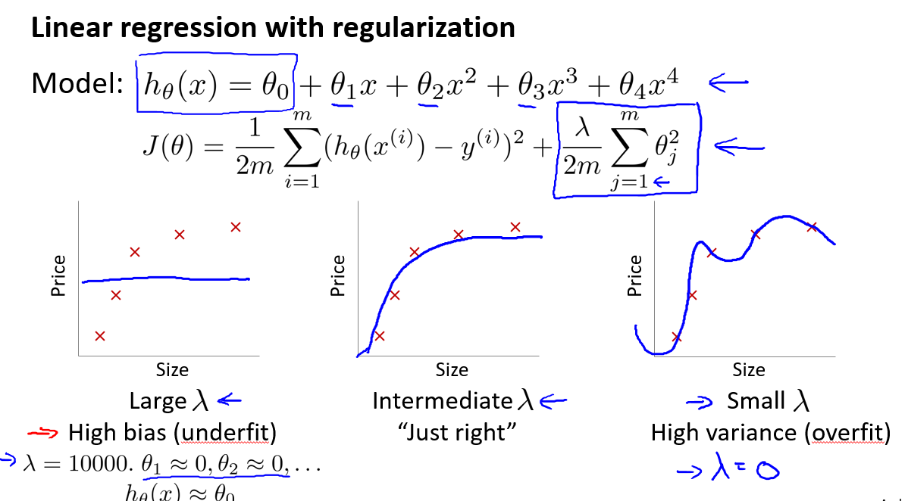

λ太大---对参数的惩罚太小，欠拟合

λ太小---对参数的惩罚太大，过拟合

​		假如我们打算使用高阶多项式来拟合数据，并用正则化防止过拟合，那么我们该**如何选取合适的正则化参数λ**呢？


​		注意这里我们的模型和学习参数以及最优化目标是这样的，J~train~ 、 J~cv~ 、J~test~ 的定义和没有正则化的Jθ是一样的(后面我们**做选择参数 λ的比较计算时**，都**不考虑正则化项**，**只有最小化代价函数Jθ时考虑λ**)

​		我们选择一系列的想要测试的 $\lambda$ 值，通常是 0-10之间的呈现2倍关系的值（如：$0,0.01,0.02,0.04,0.08,0.15,0.32,0.64,1.28,2.56,5.12,10$共12个）。 我们同样把数据分为训练集、交叉验证集和测试集。


**选择$\lambda$的方法**为：

1. 使用训练集训练出12个不同程度正则化的模型
2. 用12个模型分别对交叉验证集计算的出交叉验证误差
3. 选择得出**交叉验证误差最小**的模型
4. 运用步骤3中选出模型对测试集计算得出推广误差，我们也可以同时将训练集和交叉验证集模型的代价函数误差与λ的值绘制在一张图表上：


• 当 **$\lambda$ 较小**时，训练集误差较小（**过拟合**）而交叉验证集误差较大
	
• 随着 **$\lambda$ 的增加**，训练集误差不断增加（**欠拟合**），而交叉验证集误差则是先减小后增加

### 学习曲线

​		学习曲线是一种很好的工具，用来判断某一个学习算法**是否处于偏差、方差问题**，**或是**二者**皆有**。   

​		为了绘制一条学习曲线，通常先绘制出J~train~或者J~cv~ 将其绘制成一个**关于训练集**样本总数m的函数，但我要自己**取一些m的值，**也就是说我要自行对m的取值，做一点限制，比如说我取10 20或者30、40组训练集，然后**绘出训练集误差**以及**交叉验证集误差。**


欠拟合(高偏差)---J~train~ 、 J~cv~ 都很大，增加训练集对提高模型效果没有帮助

过拟合(高方差)---J~train~ 较小， J~cv~ 较大，两者之间有较大差距，增加训练集数据对提高模型效果有一定帮助

### 总结

**解决欠拟合---增加特征、增加多项式特征、减加正则化程度λ**

**解决过拟合---增加训练样本、减少特征、增加正则化程度λ**

(正则化就是为了解决过拟合问题)

神经网络的方差和偏差：
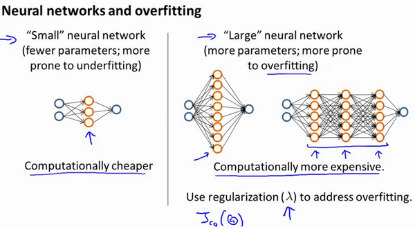

使用较小的神经网络，类似于参数较少(**参数少也就是约束少，约束少就会欠拟合**)的情况，容易导致高偏差和欠拟合，但计算代价较小使用较大的神经网络，类似于参数较多的情况，容易导致高方差和过拟合，虽然计算代价比较大，但是可以通过正则化手段来调整而更加适应数据。
	
**通常选择较大的神经网络并采用正则化处理会比采用较小的神经网络效果要好。**
	
对于神经网络中的隐藏层的层数的选择，通常**从一层开始逐渐增加层数**，为了更好地作选择，可以把数据分为训练集、交叉验证集和测试集，针对不同隐藏层层数的神经网络训练神经网络，
然后**选择交叉验证集代价最小的神经网络**。

## 机器学习系统设计

### 误差分析

在本次课程中，我们将会讲到误差分析（**Error Analysis**）的概念。这会帮助你更系统地做出决定。如果你准备研究机器学习的东西，或者构造机器学习应用程序，最好的实践方法不是建立一个非常复杂的系统，拥有多么复杂的变量；而是构建一个简单的算法，这样你可以很快地实现它。

**构建一个学习算法的推荐方法为：**
	

1.从一个简单的能快速实现的算法开始，实现该算法并用交叉验证集数据测试这个算法

2.绘制学习曲线，决定是增加更多数据，或者添加更多特征，还是其他选择
	
3.进行误差分析：人工检查交叉验证集中我们算法中产生预测误差的样本，看看这些样本是否有某种系统化的趋势

以我们的垃圾邮件过滤器为例，误差分析要做的既是检验交叉验证集中我们的算法产生错误预测的所有邮件，看：是否能将这些邮件按照类分组。例如医药品垃圾邮件，仿冒品垃圾邮件或者密码窃取邮件等。然后看分类器对哪一组邮件的预测误差最大，并着手优化。
	
思考怎样能改进分类器。例如，发现是否缺少某些特征，记下这些特征出现的次数。
	
例如记录下错误拼写出现了多少次，异常的邮件路由情况出现了多少次等等，然后从出现次数最多的情况开始着手优化。
	
误差分析并不总能帮助我们判断应该采取怎样的行动。有时我们需要尝试不同的模型，然后进行比较，在模型比较时，用数值来判断哪一个模型更好更有效，通常我们是看交叉验证集的误差。
	
在我们的垃圾邮件分类器例子中，对于“我们是否应该将**discount/discounts/discounted/discounting**处理成同一个词？”如果这样做可以改善我们算法，我们会采用一些截词软件。误差分析不能帮助我们做出这类判断，我们只能尝试采用和不采用截词软件这两种不同方案，然后根据数值检验的结果来判断哪一种更好。
	
因此，当你在构造学习算法的时候，你总是会去尝试很多新的想法，实现出很多版本的学习算法，如果每一次你实践新想法的时候，你都要手动地检测这些例子，去看看是表现差还是表现好，那么这很难让你做出决定。到底是否使用词干提取，是否区分大小写。但是通过一个量化的数值评估，你可以看看这个数字，误差是变大还是变小了。你可以通过它更快地实践你的新想法，它基本上非常直观地告诉你：你的想法是提高了算法表现，还是让它变得更坏，这会大大提高你实践算法时的速度。所以我强烈推荐在交叉验证集上来实施误差分析，而不是在测试集上。但是，还是有一些人会在测试集上来做误差分析。即使这从数学上讲是不合适的。所以我还是推荐你在交叉验证向量上来做误差分析。
	
**总结一下，当你在研究一个新的机器学习问题时，我总是推荐你实现一个较为简单快速、即便不是那么完美的算法。我几乎从未见过人们这样做。大家经常干的事情是：花费大量的时间在构造算法上，构造他们以为的简单的方法。因此，不要担心你的算法太简单，或者太不完美，而是尽可能快地实现你的算法。当你有了初始的实现之后，它会变成一个非常有力的工具，来帮助你决定下一步的做法。因为我们可以先看看算法造成的错误，通过误差分析，来看看他犯了什么错，然后来决定优化的方式。另一件事是：假设你有了一个快速而不完美的算法实现，又有一个数值的评估数据，这会帮助你尝试新的想法，快速地发现你尝试的这些想法是否能够提高算法的表现，从而你会更快地做出决定，在算法中放弃什么，吸收什么误差分析可以帮助我们系统化地选择该做什么。**

### 偏斜类误差度量

有了算法的评估和误差度量值，有一件重要的事情要注意：就是使用一个**合适的误差度量值，**这有时会对于你的学习算法**造成非常微妙的影响。**这件重要的事情就是**偏斜类（skewed classes）的问题**：

比如**癌症分类问题**：我们拥有内科病人的特征变量，我们希望知道他们是否患有癌症，我们假设 **y=1**表示患者**患有癌症**，假设 **y=0** 表示他们**没有得癌症**。

我们**训练逻辑回归模型，**假设我们用测试集，检验了这个分类模型，并且发现它只有1%的错误，因此我们99%会做出正确诊断。看起来是非常不错的结果，但是我们发现在测试集中**只有0.5%**的患者**真正**得了癌症，因此在这个例子中 1%的错误率就**不再显得那么好**了。   

举个具体的例子，这里有一行代码，它**让y总是等于0，**因此它总是预测：没有人得癌症。那么这个算法实际上只有 **0.5%的错误率。**因此这甚至比我们**之前得到的1%的错误率更好。**在这个例子中，正样本的数量与负样本的数量相比非常非常少，我们把这种情况叫做偏斜类。一个类中的样本数与另一个类的数据相比，**多很多**。通过总是预测y=0 或者总是预测y=1算法**可能表现非常好。** 

因此使用**分类误差**或者**分类精确度**来作为**评估度量**可能会产生如下问题：

假如说你有一个算法，它的精确度是99.2% 。因此它只有0.8%的误差，假设你对你的算法做出了一点**改动**，现在你得到了 99.5%的精确度，**只有0.5%**的误差。这到底是不是算法的一个提升呢？用某个实数来作为评估度量值的一个好处就是：它可以帮助我们**迅速决定**我们**是否需要对算法做出一些改进，**将精确度从99.2%提高到99.5% 。但是我们的**改进到底是有用的，**还是说我们只是把代码替换成了。例如总是预测y=0 这样的东西，因此如果你有一个偏斜类，用分类精确度**并不能很好地衡量算法。**因为你可能会获得一个很高的精确度，**非常低的错误率。** 但是我们并不知道我们是否真的提升了分类模型的质量。因为总是预测y=0 **并不是一个好的分类模型**。**但是**总是预测y=0 会将你的误差降低至比如**降低至0.5%。** 

当我们遇到这样一个偏斜类时，我们希望有一个不同的误差度量值，其中一种评估度量值叫做查准率（precision）和召回率（recall。让我来解释一下假设我们正在**用测试集来评估一个二元分类模型，**我们的学习算法要做的是做出值的预测。如果有一个样本**它实际所属的类是1，**预测的类也是1，那么，我们把这个样本叫做**真阳性（true positive）学习算法**，预测某个值是阴性，等于0，实际的类也确实属于0，那么我们把这个叫做**真阴性（true negative） 学习算法。预测某个值等于1，**但是实际上它等于0，这个叫做**假阳性**（false positive）。算法预测值为0，但是实际值是1，叫做**假阴性（false negative）。**这样，我们有了一个2x2的表格 **基于实际类与预测类**，这样我们有了一个另一种方式来评估算法的表现。 

我们要**计算两个数字，**第一个叫做**查准率**，这个意思是对于所有我们预测，他们患有癌症的病人有多大比率的病人是真正患有癌症的。

**==一个分类模型的查准率 = 真阳性/预测为阳性 = 真阳性/(真阳性 +假阳性)==** 

查准率**越高就越好** 。

另一个数字我们要计算的，叫做召回率。召回率是，如果所有这些在数据集中的病人**确实得了**癌症，有多大比率我们**正确预测**他们得了癌症。

**==召回率(查全率) = 真阳性/实际阳性  = 真阳性/(真阳性 +  假阴性)==**   

同样地，召回率**越高越好**。

通过计算查准率和召回率，我们能更好的知道：**分类模型到底好不好**。


-----------

下面是另一种理解：

**查准率**（**Precision**）和**查全率**（**Recall**） 我们将算法预测的结果分成四种情况：

1.**正确肯定**（**True Positive,TP**）：预测为真，实际为真

2.**正确否定**（**True Negative,TN**）：预测为假，实际为假
	
3.**错误肯定**（**False Positive,FP**）：预测为真，实际为假
	
4.**错误否定**（**False Negative,FN**）：预测为假，实际为真

则：查准率=**TP/(TP+FP)**。例，在所有我们预测有恶性肿瘤的病人中，实际上有恶性肿瘤的病人的百分比，越高越好。
	
查全率=**TP/(TP+FN)**。例，在所有实际上有恶性肿瘤的病人中，成功预测有恶性肿瘤的病人的百分比，越高越好。
	
这样，对于我们刚才那个总是预测病人肿瘤为良性的算法，其查全率是0。

|            |              | **预测值**   |             |
| ---------- | ------------ | ------------ | ----------- |
|            |              | **Positive** | **Negtive** |
| **实际值** | **Positive** | **TP**       | **FN**      |
|            | **Negtive**  | **FP**       | **TN**      |

### 查准率和召回率之间的权衡

癌症分类的例子，假如我们希望在我们**非常确信地情况下**，**才预测**一个病人得了癌症，这样做的**一种方法**是**修改算法。**我们不再将临界值设为0.5，也许，我们只在 **h(x)的值大于或等于0.7 的情况下才预测y=1，**因此你的回归模型**会有较高的查准率**和**较低的召回率。** 

因为，当我们做预测的时候，我们只给很小一部分的病人预测y=1。现在我们把这个情况夸大一下，我们临界值设为0.9，我们只在至少90%肯定这个病人患有癌症的情况下，预测y=1。那么这些病人当中有非常大的比率**真正患有癌症，**因此这是一个**高查准率的模型**。但是**召回率会变低，**因为我们希望能够**正确检测患有癌症的病人。** 

现在考虑一个不同的例子。假设我们希望**避免遗漏掉患有癌症的人，**即我们希望避免假阴性。具体地说，如果一个病人**实际患有癌症**，但是我们**并没有告诉他患有癌症**，那这可能**造成严重后果。**在这个例子中，我们将**临界值设得较低，**比如0.3。在这种情况下，我们会有一个**较高召回率**和**较低的查准率的模型。** 

因此，总的来说，对于大多数的**回归模型，**你得**权衡查准率和召回率：** 


当你**改变临界值的值时**，我在这儿**画了一个临界值**，你可以画出曲线来**权衡查准率和召回率。** 这里的一个值反应出**一个较高的临界值，**这个临界值**可能等于0.99。**我们假设只在有大于99%的确信度的情况下**才预测y=1，**至少有99%的可能性。因此这个点反应**高查准率低召回率。**然而这里的一个点反映一个**较低的临界值，**比如说0.01。毫无疑问，在这里预测y=1。如果你这么做，你最后会得到**很低的查准率，**但是**较高的召回率。**

当你改变临界值，如果你愿意，你可以画出**回归模型的所有曲线**来看看你能**得到的查准率和召回率的范围**。顺带一提，**查准率-召回率曲线**可以是各种不同的形状，**有时**它看起来是**这样**，**有时**是**那样**。查准率-召回率曲线的形状有很多可能性，这**取决于回归模型的具体算法。**因此这又产生了另一个有趣的问题，那就是**有没有办法自动选取临界值**或者更广泛地说，如果我们有不同的算法或者不同的想法，我们如何**比较不同的查准率和召回率**呢？


具体来说，假设我们**有三个不同的学习算法，**或者这**三个不同的学习曲线**是**同样的算法**但是**临界值不同**。我们怎样**决定哪一个算法是最好的，**我们之前讲到的其中一件事就是**评估度量值的重要性。**

这个概念是通过一个**具体的数字**来反映你的**回归模型到底如何。**但是**查准率和召回率的问题**，我们却**不能这样做**。因为在这里我们有**两个可以判断的数字**。因此，我们经常会不得不面对这样的情况，如果我们正在试图比较算法1和算法2，我们最后问自己到底是0.5的查准率与 0.4的召回率好，还是说 0.7的查准率与 0.1的召回率好，或者每一次你设计一个新算法， 你都要坐下来思考：到底0.5好，还是0.4好？还是说0.7好，还是0.1好？如果你最后这样坐下来思考，这会**降低你的决策速度：**思考**到底哪些改变是有用的**应该被**融入到**你的算法。与此相反的是，如果我们有一个**评估度量值，**一个数字能够告诉我们到底是算法1好还是算法2好。这能够帮助我们更快地决定**哪一个算法更好**，同时也能够更快地帮助我们**评估不同的改动中**哪些**应该被融入进算法里面**，那么我们怎样才能**得到这个评估度量值**呢？   

你可能会去尝试的一件事情是**计算一下查准率和召回率的平均值，**用 **P 和 R** 来表示查准率和召回率，你可以做的是**计算它们的平均值**，看一看哪个模型**有最高的均值**。但是这**可能并不是一个很好的解决办法**，因为像我们之前的例子一样，如果我们的回归模型总是预测  y=1 这么做你可能得到非常**高的召回率**，得到非常**低的查准率**。相反地，如果你的模型总是预测y=0   就是说，如果很少预测y=1，对应的，设置了一个**高临界值**。最后，你会得到非常**高的查准率**和非常**低的召回率。**

这两个极端情况：一个有非常**高的临界值**，一个有非常**低的临界值**，它们中的任何一个**都不是一个好的模型**。 

相反地，有一种**结合查准率和召回率**的不同方式，叫做**F值**，公式是这样。在这个例子中，F值是这样的。我们可以通过F值来判断**算法1有最高的F值**，算法2第二，算法3是最低的。因此，通过F值，我们会在这几个算法中选择算法1，F值也叫做F1值，一般写作F1值，但是人们一般只说F值，它的定义会考虑一部分**查准率和召回率的平均值**。但是它==会给查准率和召回率中**较低的值更高的权重**。==

${{F}_{1}}Score:2\frac{PR}{P+R}$ 

因此，你可以看到**F值的分子**是查准率和召回率的**乘积**，因此如果查准率等于0，或者召回率等于0，F值也会**等于0**。因此它结合了查准率和召回率，对于一个较大的F值，查准率和召回率都**必须较大**。

我必须说，**有较多的公式可以结合查准率和召回率**，F值公式**只是其中一个。**但是出于历史原因和习惯问题，人们在机器学习中**使用F值**，这个术语F值，没有什么特别的意义，所以不要担心，它到底为什么叫做**F值或者F1值，**但是它给了你你需要的有效方法。

因为无论是查准率等于0，还是召回率等于0，它都会得到一个**很低的F值**。因此 **如果要得到一个很高的F值**，你的算法的查准率和召回率都要**接近于1**。具体地说，如果P=0或者 R=0，你的F值也会等于0，对于一个最完美的F值，如果查准率等于1，同时召回率也等于1， 那你得到的F值等于1乘以1除以2再乘以2。那么F值**就等于1，**如果你能得到**最完美的查准率和召回率**，在0和1**中间的值**，这经常是回归模型**最经常出现的分数。** 

在这次的视频中，我们讲到了如何**权衡查准率和召回率，**以及我们如何**变动临界值**来决定我们**希望预测y=1还是y=0**，比如我们需要一个**70%还是90%置信度**的临界值或者别的来预测y=1，==通过**变动临界值**，你**可以控制权衡查准率和召回率**==，==之后我们讲到了**F值，**它权衡查准率和召回率，给了你一个**评估度量值**==，当然，如果你的目标是**自动选择临界值**来决定你**希望预测y=1 还是y=0，**那么一个比较理想的办法是**评估这些不同的临界值，**在交叉检验集上得到**最高的F值**，这是**自动选择临界值的较好办法。**

### 使用大规模数据集

在之前的一些视频中，我曾告诫大家不要盲目地开始，而是花大量的时间来收集大量的数据，因为数据有时是唯一能实际起到作用的。但事实证明，在一定条件下，我会在这个视频里讲到这些条件是什么。得到大量的数据并在某种类型的学习算法中进行训练，可以是一种有效的方法来获得一个具有良好性能的学习算法。而这种情况往往出现在这些条件对于你的问题都成立。
并且你能够得到大量数据的情况下。这可以是一个很好的方式来获得非常高性能的学习算法。因此，在这段视频中，让我们一起讨论一下这个问题。


