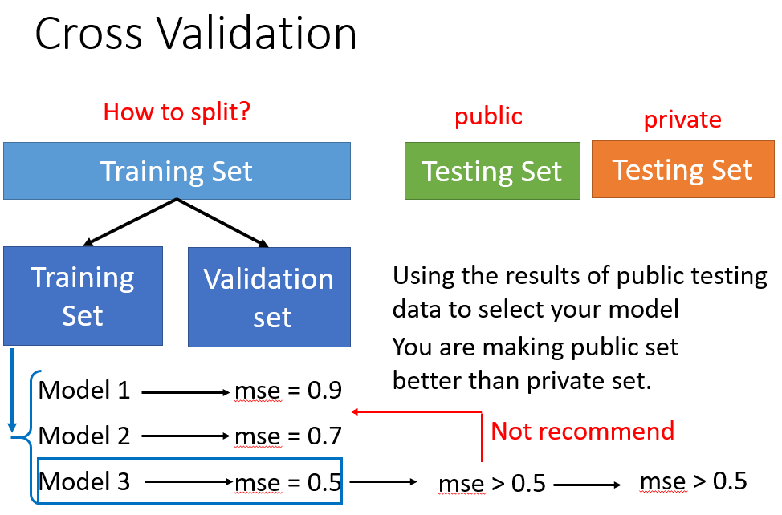

---

---

# 深度学习(李宏毅)---学习笔记

[B站:李宏毅《机器学习/深度学习》2021课程](https://www.bilibili.com/video/BV1JA411c7VT)

[原网址](https://speech.ee.ntu.edu.tw/~hylee/ml/2021-spring.html)

DL为什么要增加网络层数,而不直接用一层网络,有很多神经元,这样不是也能拟合出所有的函数吗?那么增加网络深度的好处在哪?

# 机器学习任务攻略

机器学习训练步骤

如何让训练效果更好呢:

**先看训练集的loss**,训练集的loss太大有两个原因:

1.模型复杂度不够,需重新设计模型

2.optimization做的不好,gradient decent没能找到使loss最小的参数

区分这两种可能性的方法是**比较不同的模型**

当出现optimization问题时建议**先从简单模型做起**,或是**改用其他不会出现optimization问题的方法**,比如说linear model、supprot vector machine。

如果训练集的loss小,**再看测试集**,如果测试集loss大,可能有两个原因:

1.过拟合

2.mismatch,即训练集与测试集具有不同的分布

过拟合解决方法:

1.增加训练集,可以使用data augmentation(数据增强)

2.对模型加以限制

一个不存在optimization问题的模型的loss与模型复杂度的关系应该是这样的:

但是通常我们不通过测试集来选择模型,因为如果这样做我们的模型可能在对下一组没有见过的测试集上表现很差,正确的做法是将数据集分成3组,**训练集训练模型,交叉验证集选择模型,测试集评价模型效果**.

mismatch:

# 局部最小与鞍点

Hessian是一个由二阶偏导组成的矩阵,函数的二阶导数代表了函数的凹凸,**二阶导大于0表示凹函数**,**二阶导小于0表示凸函数**

**临界点处梯度为0**,这是可以用Hessian矩阵判定该临界点是极小值/极大值还是鞍点,

Hessian矩阵**正定**(特征值全大于0):**极小值点**

Hessian矩阵**负定**(特征值全小于0):**极大值点**

Hessian矩阵(**特征值有正有负**):**鞍点**

如果训练停下来是因为saddle point ，我们可以继续看hessian 进而看出 update 的方向。**找出负的特征值**（saddle point 特征值有正有负）顺着 u 的方向更新，就可以让loss变小。

注：在实际的 implementation 里面，你几乎不会真的把hessian算出来，运算量非常非常的大。后续会谈到其他的逃离saddle point的方法 他们的运算量都要比算H小的多，之所以讲这个方法，是因为如果卡在saddle point 也许没那么可怕，至少我们还有这一招。

**saddle point 跟local minima 哪个更常见？**

先给出答案 saddle point更常见，local minima 很少很少

解释：在一维的空间好像到处都是local minima ，但是 会不会在二维空间来看他就是一个saddle point，当前维度空间看是一个local minima 但在更高维的空间中有可能就是一个saddle point。

今天我们训练一个network时候，参数往往动辄百万千万以上，我们的参数有多少就代表我们的error surface的维度有多少，既然维度这么高，会不会其实根本就有非常多的路可以走？既然有非常多的路可以走，会不会其实local minima根本就很少呢！如果你做一些实验，结果也是支持这一假设！

# 批次与动量

## 批次(batch)

将训练集分为若干个batch，一个batch算一次loss，更新(update)一次参数，训练完所有数据集一次为一次迭代(epoch)。每一个epoch的batch中的数据都不一样，会被shuffle。

小的batch size梯度下降会产生噪声，但这种噪声对结果竟然是有好处的，

在MNIST数据集和CIFAR-10数据集上进行实验，batch size越大，准确率越低：

现在假设使用所有数据集作为一个batch，那么损失函数就固定了，相对更容易陷入局部最优

而如果使用小的batch，每次做gradient decent时loss都略有不同，这样就不容易陷入局部最优

小的batch不仅在训练集表现更好，在测试集上的表现也更好：

**有没有办法兼得小batch的效果和大batch的速度呢，答案是有的，下面是一些相关研究：**

小结：

- 小的batch size：loss容易受噪声影响，产生震荡，完成一个epoch的时间慢，需要配合较小的学习率，但是噪声也使gradient decent更不容易陷入局部最优。
- 大的batch size：噪声小，loss下降更平滑，完成一个epoch的时间短，可以配合更大的学习率，但更容易陷入局部最优，训练和测试的效果都比小batch要差

## 动量(Momentum)

将现实世界中物体的惯性引入到gradient decent中，传统的gradient decent每次参数更新**只受该点梯度的影响**，引入动量概念后，gradient decent参数更新受**当前步的gradient**与**前一步更新结果**的**共同作用**

- 传统Gradient Decent

- 引入动量后的Gradient Decent

## 小结

# 优化器

[关于优化器](https://www.cnblogs.com/sun-a/p/13380084.html)

在训练过程中不仅会遇到临界点而无法更新参数的情况，也会遇到梯度下降结果在极小值附近震荡的情况，这时候就需要动态调整学习率

梯度下降快的地方学习率应该更小，梯度下降慢的地方学习率应该更大，

- **RMS**

- **RMSProp**(通常当前梯度的比重更大)

- **Adam**
- 

在一开始这个简单的 error surface 我们 train不起来，那加上 Adaptive Learning Rate 以后呢？

如下图右下角所示，快走到终点的时候发什么一些神奇的事情，因为它是把所有的 gradient 累计，初始的地方很大，后来很小，累计到一定程度后，step（左下红框部分）就变得很大，然后就暴走喷出去了。

喷出去以后没关系，有办法修正回来，因为喷出去以后就走到了gradient比较大的地方， σ 又慢慢变大，步伐就慢慢变小（左右振荡力度变小）又回到中间的峡谷。

解决的暴走的方法：Learning Rate Scheduling

Learning Rate Scheduling：让 η 与时间有关。随着时间增加 让 η 越来越小，因为越更新离终点越近。

另一个方法：Warm Up

详见paper链接

小结

# batch normalization

https://blog.csdn.net/qq_37774399/article/details/115680695

https://blog.csdn.net/Yasin0/article/details/93379629?utm_medium=distribute.pc_relevant.none-task-blog-2~default~baidujs_title~default-9.no_search_link&spm=1001.2101.3001.4242

# CNN

卷积核（filter/kernel），严格来说kernel和filter不太一样，kernel是二维的，filter可以是三维的（多了一个通道维度），filter的通道数与上层特征图通道数（个数）相等，filter的个数与下层特征图个数相等。

感受野：（Receptive Field）每一层输出的特征图（feature map）上每个像素点在**原始图像**上映射的区域大小

全连接神经网络用于图像分类问题时，如果把每个像素作为图片的一个特征，会导致参数太多，计算量太大，Convolutional Neural Network(CNN)常用于图像处理

对图像分类问题的几个观察：

- 通过一个区域的图案就可以分辨图片，而不用看整张图---通过卷积实现**局部连接**

- 同样的图案可能出现在图片不同的位置，但它们代表的是相同的意思---**参数共享**
- 对图像做下采样后不影响对图片的辨识---**池化**

**卷积主要用于特征提取，池化主要用于减小计算量**

全连接参数太多，效果不佳

**图像具有局部相关性**，局部连接减少参数

**图像的底层特征是跟具体位置无关**，参数共享进一步减少参数

需要注意的是，**高层**特征一般是与**位置有关**的（全局特征），比如 一张人脸图片，眼睛和嘴的位置不同，那么处理到高层，不同位置就需要不同的神经网络权重（参数），这时候卷积层就不能胜任了，就需要用局部全连接层和全连接层。 

整个CNN过程：

CNN不仅可以用于图像处理中，在许多具有类似图像特征的问题中也有广泛应用

- 下围棋

在下围棋中具有特性：

1.通过局部图案就可以分辨当前棋局的状态

2.相同的图案出现在棋局中意思相同

但是下围棋并不具备下采样的特征，因此alpha go并没有用池化层

- 语音处理

- 文字处理

## feature map 尺寸计算

卷积或池化后的size计算公式

> N=(W-F+2P)/S+1
>
> W:输入数据维度为W*W
>
> F:filter大小为F*F
>
> P:padding的像素数
>
> S:步长

如果结果不是整数，卷积向下取整，池化向上取整（filter如果超出图像框一般不进行运算）
